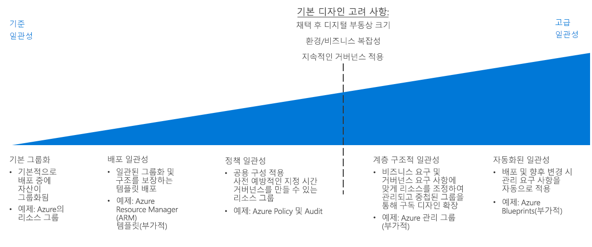

# CAF: 리소스 일관성 관련 결정 가이드

Azure [구독 디자인](../subscriptions/overview.md)에 따라 조직의 전반적인 구조와 관련하여 클라우드 자산을 구성하는 방식이 정의됩니다. 또한 구독 내에서 클라우드 리소스를 배포하고 구성하는 방법에 따라 기존 IT 관리 표준과 조직 정책 통합 방법이 달라집니다.

리소스 배포/그룹화/관리 디자인을 구현하는 데 사용할 수 있는 도구는 클라우드 플랫폼별로 다릅니다. 일반적으로 각 솔루션에는 다음과 같은 기능이 포함됩니다.

- 구독 또는 계정 수준 아래의 논리적 그룹화 메커니즘
- API를 사용해 리소스를 프로그래밍 방식으로 배포하는 기능
- 표준화된 배포 작성용 템플릿
- 구독, 계정 및 리소스 그룹 수준에서 정책 규칙을 배포하는 기능

이동: [기본 그룹](#basic-grouping) | [배포 일관성](#deployment-consistency) | [정책 일관성](#policy-consistency) | [계층적 일관성](#hierarchical-consistency) | [자동화된 일관성](#automated-consistency)

리소스 배포 및 그룹 관련 사항을 결정할 때 영향을 주는 기본 요인은 마이그레이션 후의 디지털 자산 크기, 기존 구독 디자인 방식 내에는 완전히 포함할 수 없는 복잡한 비즈니스 또는 환경 또는 리소스를 배포한 후 장기적으로 거버넌스를 적용해야 하는지 여부 등이 있습니다. 고급 리소스 그룹화 디자인의 경우에는 정확한 그룹화를 위해 작업을 추가로 수행해야 합니다. 그러면 변경 관리 및 추적에 소요되는 시간이 길어집니다.

## 기본 그룹

Azure에서 [리소스 그룹](/azure/azure-resource-manager/resource-group-overview#resource-groups)은 구독 내의 리소스를 논리적으로 그룹화하는 핵심 리소스 구성 메커니즘입니다.

리소스 그룹은 정책 또는 RBAC(역할 기반 액세스 제어) 요구 사항과 같은 공통 수명 주기 또는 공유 관리 제약 조건이 적용되는 리소스용 컨테이너로 사용됩니다. 리소스 그룹은 중첩될 수 없으며 리소스는 하나의 리소스 그룹에만 속할 수 있습니다. 일부 작업은 리소스 그룹의 모든 리소스에 작용할 수 있습니다. 예를 들어 리소스 그룹을 삭제하면 해당 그룹 내의 모든 리소스가 제거됩니다. 리소스 그룹을 만들 때 흔히 사용되는 패턴은 다음의 두 가지 범주로 구분됩니다.

- 기존 IT 워크로드: 애플리케이션 등 같은 수명 주기 내의 항목을 기준으로 그룹화되는 경우가 많습니다. 애플리케이션별 그룹화를 통해 개별 애플리케이션 관리가 가능합니다.
- Agile IT 워크로드: 외부 고객 대상 클라우드 애플리케이션을 위주로 그룹화됩니다. 이러한 리소스 그룹은 배포와 관리의 기능 계층(예: 웹 계층, 앱 계층)을 반영하는 경우가 많습니다.

## 배포 일관성

기본 리소스 그룹화 메커니즘을 기반으로 구축되는 대부분의 클라우드 플랫폼은 템플릿을 사용하여 클라우드 환경에 리소스를 배포할 수 있는 시스템을 제공합니다. 템플릿을 사용하면 워크로드를 배포할 때 일관된 구성 및 명명 규칙을 작성하여 리소스 배포 및 관리 디자인의 해당 요소를 적용할 수 있습니다.

[Azure Resource Manager 템플릿](/azure/azure-resource-manager/resource-group-overview#template-deployment)에서는 미리 정의된 구성 및 리소스 그룹 구조를 사용해 리소스를 일관된 상태로 반복 배포할 수 있습니다. Resource Manager 템플릿을 통해 배포 기준으로 표준 세트를 정의할 수 있습니다.

예를 들어 표준 템플릿을 사용해 가상 머신 2대가 포함된 웹 서버 워크로드를 서버 간 트래픽 관리를 위한 부하 분산 장치와 결합된 웹 서버로 배포할 수 있습니다. 그런 다음 이 템플릿을 재사용하여 새 웹 서버 워크로드가 필요할 때마다 관련 배포 이름 및 IP 주소만 변경하여 구조적으로 동일한 배포를 작성할 수 있습니다.

또한 프로그래밍 방식으로 이러한 템플릿을 배포하고 CI/CD 시스템과 통합할 수도 있습니다.

## 정책 일관성

리소스를 만들 때 거버넌스 정책을 적용하기 위해, 리소스 그룹화 디자인의 일부분에서는 리소스 배포 시 공통 구성을 사용합니다.

리소스 그룹과 표준화된 Resource Manager 템플릿을 함께 사용하면 배포에서 필요한 설정 및 각 리소스 그룹이나 리소스에 적용되는 [Azure Policy](/azure/governance/policy/overview) 규칙과 관련한 표준을 적용할 수 있습니다.

구독 내에서 배포되는 모든 가상 머신이 중앙 IT 팀에서 관리하는 공통 서브넷에 연결해야 한다는 요구 사항이 적용되는 경우를 예로 들어 보겠습니다. 이 경우 워크로드 VM 배포용 표준 템플릿을 만들 수 있습니다. 이 템플릿은 워크로드용으로 별도의 리소스 그룹을 만들고 필요한 VM을 해당 그룹에 배포합니다. 이 리소스 그룹에는 리소스 그룹 내의 네트워크 인터페이스만 공유 서브넷에 조인할 수 있도록 하는 정책 규칙이 포함됩니다.

클라우드 배포 내에서 정책 관련 결정 사항을 적용하는 방법의 자세한 설명은 [정책 적용](../policy-enforcement/overview.md)을 참조하세요.

## 계층적 일관성

클라우드 자산의 크기가 증가함에 따라 Azure 기업계약의 엔터프라이즈/부서/계정/구독 계층 구조를 사용하여 지원할 수 있는 더 복잡한 거버넌스 요구 사항을 지원해야 할 수도 있습니다. 리소스 그룹을 사용하면 조직 내의 추가 계층 구조 수준을 지원할 수 있으며 리소스 그룹 수준에서 Azure Policy 규칙 및 액세스 제어를 적용할 수 있습니다.

[Azure 관리 그룹](../subscriptions/overview.md#management-groups)은 기업계약 구조에 대체 계층 구조를 오버레이하는 방식을 통해 더 복잡한 조직 구조를 지원할 수 있습니다. 따라서 구독 및 구독에 포함된 리소스가 기업의 조직 요구 사항과 일치하도록 구성된 액세스 제어 및 정책 적용 메커니즘을 지원할 수 있습니다.

## 자동화된 일관성

대규모 클라우드 배포의 경우에는 전역 거버넌스의 중요성과 복잡성이 더욱 증가합니다. 그러므로 리소스를 배포할 때 거버넌스 요구 사항을 자동으로 적용해야 하며 기존 배포의 업데이트된 요구 사항도 충족해야 합니다.

[Azure Blueprints](/azure/governance/blueprints/overview)를 사용하는 조직은 Azure에서 대규모 클라우드 자산의 전역 거버넌스를 지원할 수 있습니다. Blueprints는 표준 Azure Resource Manager 템플릿에서 제공하는 것 이상의 기능을 활용하여 리소스를 배포하고 정책 규칙을 적용할 수 있는 완전한 배포 오케스트레이션을 생성합니다. 또한 버전 관리, 청사진을 사용한 모든 구독에 업데이트를 적용하는 기능, 그리고 리소스 무단 작성/수정을 방지하기 위해 배포된 구독을 잠그는 기능도 지원합니다.

IT 및 개발 팀은 이러한 배포 패키지를 통해 계속해서 변화하는 조직 정책 요구 사항을 준수하는 신규 워크로드 및 네트워킹 자산을 빠르게 배포할 수 있습니다. 또한 CI/CD 파이프라인에 Blueprints를 통합하여 배포를 업데이트할 때 수정된 거버넌스 표준을 적용할 수 있습니다.

## 다음 단계

리소스 명명 및 태그 지정 기능을 사용해 클라우드 리소스를 더 자세하게 구성하고 관리하는 방법을 알아봅니다.

> [!div class="nextstepaction"]
> [리소스 명명 및 태그 지정](../resource-tagging/overview.md)
