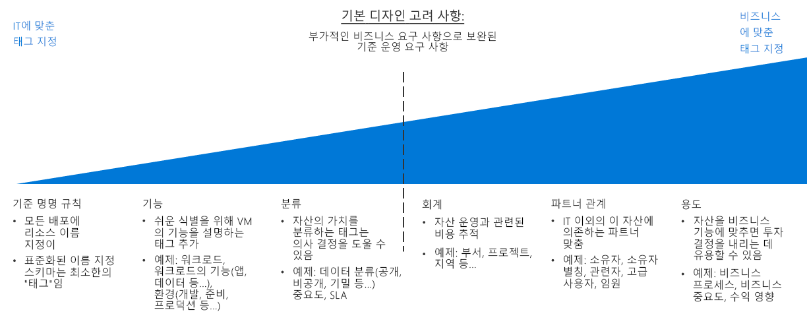

# 리소스 구성 및 태그 지정 관련 결정 가이드

배포가 매우 단순한 경우를 제외하면 클라우드 기반 리소스 구성은 IT 팀의 가장 중요한 작업 중 하나입니다. 주로 다음의 세 가지 용도를 위해 리소스 구성 작업을 진행하게 됩니다.

- **리소스 관리**. IT 팀은 특정 워크로드, 환경, 소유권 그룹 또는 기타 중요 정보와 연관된 리소스를 빠르게 찾을 수 있어야 합니다. 리소스 관리용 액세스 권한 및 조직 내 역할을 할당하려면 리소스를 구성해야 합니다.
- **작업** 리소스를 적절한 체계로 구성하면 IT 팀에서 더 쉽게 관리할 수 있을 뿐 아니라 리소스와 DevOps 작성 및 운영 모니터링의 일환으로 자동화 기능을 활용할 수 있습니다.
- **원활한 회계 업무 처리**. 비즈니스 그룹이 클라우드 리소스 사용량을 확인할 수 있도록 하려면 IT 팀은 각 워크로드와 팀에서 사용하는 리소스를 파악해야 합니다. 차지백/쇼백 회계 등의 방식을 지원하려면 소유권과 사용량을 반영하도록 클라우드 리소스를 구성해야 합니다.

## 태그 지정 관련 결정 가이드

이동: [기본 명명 규칙](#baseline-naming-conventions) | [리소스 태그 지정 패턴](#resource-tagging-patterns) | [명명 및 태그 지정 정책](#naming-and-tagging-policy) | [자세한 정보](#learn-more)

클라우드 워크로드를 관리하는 IT 팀을 중점적으로 지원하는 단순한 방식에서 기업 전체의 모든 요소와 관련된 정보를 통합하는 복잡한 방식까지 다양한 태그 지정 방식을 사용할 수 있습니다.

IT 팀 중심의 태그 지정 방식을 사용하면 복잡한 자산 모니터링 작업이 감소하며, 기능과 분류를 기준으로 하여 관리 관련 결정을 훨씬 쉽게 내릴 수 있습니다.

IT 이외 분야의 정책도 포함하는 태그 지정 체계를 사용하려는 경우에는 시간을 더 많이 투자하여 기업의 이해 관계를 반영하는 태그 지정 표준을 작성하고 장기적으로 해당 표준을 유지 관리해야 합니다. 그러나 이 프로세스를 진행하면 IT 자산의 가치와 비용을 고려하는 향상된 기능을 제공하는 태그 지정 시스템을 구축할 수 있습니다. 조직 내 IT 팀의 비용 센터 관련 인식을 바꾸는 과정에서 처음 수행하는 단계 중 하나가 이처럼 자산의 가치와 해당 운영 비용을 연결하는 작업입니다.

## 기본 명명 규칙

클라우드에서 호스트되는 리소스를 구성하려면 먼저 명명 규칙을 표준화해야 합니다. 적절한 구조의 명명 시스템이 있으면 관리 및 회계용 리소스를 빠르게 파악할 수 있습니다. 조직의 다른 부서에서 기존 IT 명명 규칙을 사용하고 있다면 클라우드 리소스 명명 규칙을 이러한 기존 규칙에 맞게 조정해야 하는지, 아니면 별도의 클라우드 기반 표준을 정해야 하는지를 고려하세요.

그리고 [명명 요구 사항](../../../best-practices/naming-conventions.md#naming-rules-and-restrictions)도 각 Azure 리소스 종류별로 다릅니다. 이러한 명명 요구 사항에 맞는 명명 규칙을 사용해야 합니다.

## 리소스 태그 지정 패턴

일관된 명명 규칙에서 제공되는 구성보다 더 정교하게 리소스를 구성하려는 경우를 위해 클라우드 플랫폼에서는 리소스에 태그를 지정하는 기능을 지원합니다.

리소스에 연결되는 메타데이터 요소인 *태그*는 키/값 문자열 쌍으로 구성됩니다. 이러한 쌍에는 원하는 값을 포함할 수 있습니다. 하지만 포괄적 명명/태그 지정 정책의 일부분으로 일관된 전역 태그 세트를 적용하는 작업은 전체 거버넌스 정책의 중요한 요소입니다.

아래에는 흔히 사용되는 태그 지정 패턴의 몇 가지 예가 나와 있습니다.

<!-- markdownlint-disable MD033 -->

| 태그 형식 | 예 | 설명 |
|-----|-----|-----|
| 기능            | app = catalogsearch1  tier = web  webserver = apache env = prod  env = staging  env = dev                 | 워크로드 내의 용도, 배포 대상 환경 또는 기타 기능 및 운영 세부 정보와 관련하여 리소스를 분류합니다.                                 |
| 분류        | confidentiality=private sla = 24hours                                 | 리소스 사용 방법 및 리소스에 적용되는 정책을 기준으로 리소스를 분류합니다.                               |
| 회계            | department = finance  project = catalogsearch  region = northamerica | 대금 청구용으로 조직 내 특정 그룹과 리소스를 연결할 수 있습니다. |
| 파트너 관계           | owner = jsmith  contactalias = catsearchowners stakeholders = user1;user2;user3                        | 리소스와 관련이 있거나 기타 방식으로 리소스의 영향을 받는 IT 팀 외부 사용자 관련 정보를 제공합니다.                      |
| 목적               | businessprocess=support businessimpact=moderate revenueimpact=high   | 투자 결정을 더욱 효율적으로 지원하기 위해 비즈니스 기능에 맞는 리소스를 설정합니다.  |

<!-- markdownlint-enable MD033 -->

## 명명 및 태그 지정 정책

명명 및 태그 지정 정책은 사용 과정에서 계속해서 개선됩니다. 하지만 클라우드 마이그레이션을 시작할 때 조직의 핵심 우선 순위를 결정해야 합니다. 구체적으로 설명하자면, 계획 프로세스의 일환으로 다음 사항을 신중하게 고려해야 합니다.

- 명명 및 태그 지정 정책을 조직 내의 기존 명명 및 구성 정책과 가장 효율적으로 통합할 수 있는 방법
- 차지백 또는 쇼백 회계 시스템 구현 여부 이 조직 구조에서 부서, 비즈니스 그룹 및 팀이 표시되는 방식
- 모든 리소스에 필요한 태그 지정 정보와 개별 팀이 구현 여부를 결정할 수 있는 태그 지정 정보
- 지정하는 태그가 리소스의 규정 준수 요구 사항과 같은 세부 정보 또는 작동 시간 요구 사항/패치 일정/보안 요구 사항 등의 운영 세부 정보를 나타내야 하는지 여부

## 자세한 정보

Azure의 명명 및 태그 지정 방식과 관련된 자세한 내용은 다음 문서를 참조하세요.

- [Azure 리소스에 대한 명명 규칙](../../../best-practices/naming-conventions.md). Azure 리소스용 권장 명명 규칙을 확인하려면 Azure 클라우드 기본 사항 사이트에서 제공되는 이 지침을 참조하세요.
- [태그를 사용하여 Azure 리소스 구성](/azure/azure-resource-manager/resource-group-using-tags?toc=/azure/billing/TOC.json). Azure에서는 리소스 그룹 및 개별 리소스 수준에서 모두 태그를 적용할 수 있으므로 적용되는 태그를 기준으로 회계 보고서의 세분성을 유연하게 조정할 수 있습니다.

## 다음 단계

클라우드 환경에서 암호화를 사용하여 데이터를 보호하는 방법을 알아봅니다.

> [!div class="nextstepaction"]
> [암호화](../encryption/overview.md)
