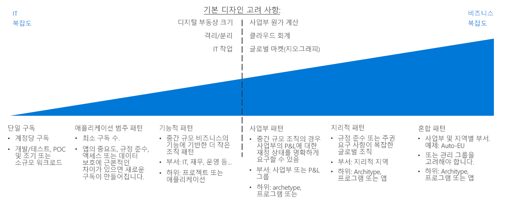
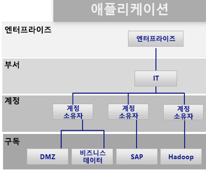
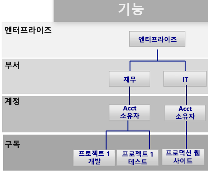
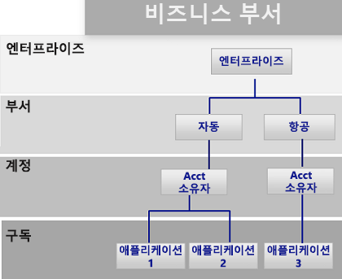
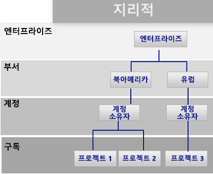

# 구독 관련 결정 가이드

모든 클라우드 플랫폼은 다양한 청구 및 리소스 관리 옵션을 조직에 제공하는 핵심 소유권 모델을 기반으로 합니다. Azure에서 사용되는 구조는 조직 계층 구조 및 그룹형 구독 소유권과 관련된 여러 지원 옵션을 포함한다는 점에서 다른 클라우드 공급자와 차별화됩니다. 하지만 일반적으로는 청구 담당자와 리소스를 관리하는 최상위 소유자로 할당된 담당자가 따로 있습니다.

이동: [구독 디자인 및 Azure 기업계약](#subscriptions-design-and-azure-enterprise-agreements) | [구독 디자인 패턴](#subscription-design-patterns) | [관리 그룹](#management-groups) | [구독 수준의 조직](#organization-at-the-subscription-level)

구독 디자인은 기업이 클라우드 채택 과정에서 구조를 설정하거나 자산을 구성하는 데 가장 흔히 사용하는 전략 중 하나입니다.

**구독 계층 구조**: *구독*은 가상 머신, SQL DB, App Services, 컨테이너 등의 Azure 서비스가 포함된 논리적 컬렉션입니다. Azure의 각 자산은 단일 구독에 배포되며, *계정* 하나가 각 구독을 소유합니다. 이 계정은 구독 전체에서 청구 및 관리 작업을 위한 액세스 권한을 제공하는 사용자 계정입니다(서비스 계정을 사용하는 것이 좋음). EA(기업계약)를 통해 Azure를 일정량만큼 사용하는 약정을 체결한 고객의 경우에는 *부서*라는 제어 수준이 더 추가됩니다. EA 포털에서는 구독, 계정 및 부서를 사용하여 청구 및 관리용 계층 구조를 만들 수 있습니다.

각 구독 디자인의 복잡도는 서로 다릅니다. 디자인 전략과 관련한 결정을 할 때는 대개 기업의 제약 조건과 IT 팀의 제약 조건을 모두 고려해야 하므로 일반적인 결정을 내릴 때와는 다른 독특한 방식을 사용하게 됩니다. 기술 관련 결정을 내리기 전에 IT 팀의 설계자와 의사 결정자는 실무 관련자 및 클라우드 전략 팀과 협의하여 적절한 클라우드 회계 방식, 사업부 내의 비용 회계 사례, 조직의 전 세계 시장 요구 사항을 파악해야 합니다.

**패턴 구분 지점**: 위 그림의 파선은 구독 디자인의 단순한 패턴과 좀 더 복잡한 패턴이 나뉘는 지점을 나타냅니다. 디지털 자산 규모와 Azure 구독 제한, 격리/분리 정책 및 IT 운영부를 기반으로 한 추가 기술 결정 요소는 대개 구독 디자인에 큰 영향을 줍니다.

**기타 고려 사항**: 구독 디자인을 선택할 때 유의해야 하는 중요한 사항은, 리소스나 배포를 그룹화할 때 구독만을 사용해야 하는 것은 아니라는 점입니다. 구독은 Azure의 초창기 버전에서 작성되었으므로 Azure Service Manager 등의 이전 Azure 솔루션과 관련된 제한을 포함합니다.

배포 구조, 자동화 및 리소스를 그룹화하는 새로운 방식이 구조 구독 디자인에 영향을 줄 수 있습니다. 구독 디자인을 최종 결정하기 전에 [리소스 일관성](../resource-consistency/overview.md) 관련 결정이 선택한 디자인에 어떤 영향을 줄 수 있는지를 고려하세요. 예를 들어 대규모 다국적 조직은 구독 관리용으로 복잡한 패턴의 사용을 먼저 고려할 수 있습니다. 하지만 관리 그룹 계층 구조를 추가하여 좀 더 단순한 사업부 패턴을 사용하는 경우에 더 많은 이점이 제공될 수도 있습니다.

## 구독 디자인과 Azure 기업계약

모든 Azure 구독은 계정 하나에 연결되며, 이 계정은 각 구독의 청구 및 최상위 액세스 제어 기능에 연결됩니다. 계정 하나가 여러 구독을 소유할 수 있으며 기본적인 구독 구성 수준을 제공할 수 있습니다.

소규모 Azure 배포의 경우에는 전체 클라우드 자산이 단일 구독이나 소규모 구독 컬렉션으로 구성될 수도 있습니다. 그러나 대규모 Azure 배포는 조직 구조를 지원하기 위해 여러 구독을 포함하므로 [구독 할당량 및 제한](/azure/azure-subscription-service-limits)을 무시할 가능성이 높습니다.

각 Azure 기업계약에서는 조직의 우선 순위를 반영하는 계층 구조로 구독과 계정을 구성하는 기능을 추가로 제공합니다. 조직의 기업계약은 계약에 따른 회사 내의 Azure 서비스 구성과 사용 방식을 정의합니다. 각 기업계약 내에서는 조직 구조에 맞게 환경을 부서, 계정, 구독으로 더 세분화할 수 있습니다.

## 구독 디자인 패턴

모든 기업은 서로 다릅니다. 따라서 Azure 기업계약 전반에 걸쳐 사용 가능한 부서/계정/구독 계층 구조를 활용해 Azure를 매우 유동적으로 구성할 수 있습니다. 청구, 리소스 관리 및 리소스 액세스에 대한 회사 요구를 반영하도록 조직 계층 구조를 모델링하는 방법은 공용 클라우드에서 디자인을 시작할 때 최우선으로 결정해야 하는 가장 중요한 사항입니다.

아래에서 설명하는 구독 패턴은 조직의 잠재적 우선 순위를 지원하기 위해 전반적으로 더욱 복잡해지는 구독 디자인을 반영합니다.

### 단일 구독

클라우드 호스트 자산을 몇 개만 배포하면 되는 조직의 경우에는 계정당 단일 구독만 사용해도 충분할 수 있습니다. 클라우드 채택 프로세스를 시작할 때는 이 구독 패턴을 처음 구현하는 경우가 많습니다. 이 패턴에서는 소규모의 실험적 배포 또는 개념 증명 배포에서 클라우드 플랫폼의 기능을 파악할 수 있습니다.

그러나 단일 구독에서 지원하는 리소스 수는 기술적으로 제한될 수 있습니다. 클라우드 자산의 규모가 증가함에 따라 단일 구독으로는 지원되지 않는 방식을 사용해 정책 및 액세스 제어를 더 효율적으로 구성할 수 있도록 리소스 구성도 지원하고자 할 가능성이 높습니다.

### 애플리케이션 범주 패턴

조직의 클라우드 공간 크기가 증가하면 구독을 여러 개 사용하게 될 가능성도 높아집니다. 이 시나리오에서는 대개 업무상의 중요도, 규정 준수 요구 사항, 액세스 제어 또는 데이터 보호 요구가 근본적으로 다른 애플리케이션을 지원하기 위해 구독이 작성됩니다. 이러한 애플리케이션 범주를 지원하는 구독과 계정은 모두 단일 부서에 구성되며, 중앙 IT 운영 담당자가 이 부서를 소유 및 관리합니다.

각 조직은 애플리케이션을 서로 다른 방식으로 분류하며 특정 애플리케이션 또는 서비스나 애플리케이션 원형 라인에 따라 구독을 구분하는 경우가 많습니다. 이 패턴을 적용할 때 별도의 구독을 사용해야 할 수 있는 워크로드는 다음과 같습니다.

- 실험적 애플리케이션 또는 위험성이 낮은 애플리케이션
- 보호된 데이터를 포함하는 애플리케이션
- 중요 업무용 워크로드
- HIPAA, FedRAMP 등의 규정 요구 사항이 적용되는 애플리케이션
- 배치 워크로드
- Hadoop 등의 빅 데이터 워크로드
- Kubernetes 등의 배포 오케스트레이터를 사용하는 컨테이너화된 워크로드
- 분석 워크로드

이 패턴은 특정 워크로드를 담당하는 여러 계정 소유자를 지원합니다. 하지만 기업계약 계층 구조의 부서 수준에서 더 복잡한 구조가 제공되지는 않으므로 이 패턴을 사용할 때는 Azure 기업계약을 구현할 필요가 없습니다.

### 기능 패턴

이 패턴은 Azure 기업계약 고객에게 제공되는 기업/부서/계정/구독 계층 구조를 사용하여 재무, 영업, IT 지원 등의 기능 라인에 구독과 계정을 구성합니다.

### 사업부 패턴

이 패턴은 Azure 기업계약 계층 구조를 사용하여 손익 범주, 사업부, 부문, 손익 센터 또는 유사한 사업 구조를 기준으로 구독과 계정을 그룹화합니다.

### 지리적 패턴

전 세계에서 사업을 운영하는 조직의 경우 이 패턴은 Azure 기업계약 계층 구조를 사용해 지역을 기준으로 구독과 계정을 그룹화합니다.

### 혼합 패턴

이 패턴에서는 엔터프라이즈/부서/계정/구독 계층 구조가 모두 사용됩니다. 그러나 회사 내의 더 복잡한 청구 및 조직 구조를 반영하도록 지역, 사업부 등의 패턴을 결합할 수 있습니다. 또한 [리소스 일관성 디자인](../resource-consistency/overview.md)을 통해 구독 디자인의 거버넌스 및 조직 구조를 추가로 확장할 수도 있습니다.

다음 섹션에 설명되어 있는 관리 그룹을 활용하면 더 복잡한 조직 구조를 지원할 수 있습니다.

다음 섹션에 설명되어 있는 관리 그룹을 활용하면 더 복잡한 조직 구조를 지원할 수 있습니다.

## 관리 그룹

기업계약을 통해 제공되는 부서 및 조직 구조 외에도, [Azure 관리 그룹](/azure/governance/management-groups/index)을 사용하면 여러 구독에서 정책, 액세스 제어 및 규정 준수를 더욱 유동적으로 구성할 수 있습니다. 관리 그룹은 6개 수준까지 중첩할 수 있으므로 청구 계층 구조와는 별도의 계층 구조를 만들 수 있습니다. 이 계층 구조는 효율적인 리소스 관리 전용으로 사용할 수 있습니다.

관리 그룹은 청구 계층 구조를 반영할 수 있으며, 대다수 기업의 경우 처음에는 이러한 방식으로 관리 그룹을 활용하는 경우가 많습니다. 그러나 관련 구독(청구 계층 구조 내의 위치는 관계없음)이 함께 그룹화되며, 정책 및 이니셔티브와 함께 공통 역할도 할당해야 하는 조직을 모델링할 때 관리 그룹을 사용하면 매우 효율적입니다.

다음은 이러한 템플릿의 예입니다.

- 프로덕션/비프로덕션: 일부 기업은 해당 프로덕션 및 비프로덕션 구독을 식별하기 위해 관리 그룹을 만듭니다. 관리 그룹을 사용하면 이러한 고객은 역할 및 정책을 보다 쉽게 관리할 수 있습니다. 예를 들어, 비프로덕션 구독에서는 개발자가 “참가자” 액세스 권한을 받을 수 있지만, 프로덕션 환경에서는 “읽기 권한자” 액세스 권한만 받을 수 있습니다.
- 내부 서비스/외부 서비스: 프로덕션/비프로덕션의 경우와 마찬가지로, 기업의 내부 서비스와 고객 관련 외부 서비스의 요구 사항/정책/역할은 서로 다른 경우가 많습니다.

## 구독 수준의 조직

부서 및 계정이나 관리 그룹을 결정할 때는 기본적으로 조직과 일치하도록 Azure 환경을 구분할 방법을 결정해야 합니다. 그러나 구독은 실제 작업이 수행되는 위치이므로 이러한 결정 사항은 보안, 확장성 및 청구에 영향을 주게 됩니다.

결정 시에는 다음의 참조용 패턴을 고려하세요.

- **애플리케이션/서비스**: 구독은 애플리케이션 또는 서비스(애플리케이션의 포트폴리오)를 나타냅니다.

- **수명 주기**: 구독은 프로덕션 또는 개발과 같은 서비스 수명 주기를 나타냅니다.

- **부서**: 구독은 조직의 부서를 나타냅니다.

처음 두 패턴이 가장 일반적으로 사용되며, 대부분의 경우에는 이 두 패턴을 사용하는 것이 좋습니다. 수명 주기 방식은 대부분의 조직에 적합합니다. 이 방식을 사용하는 경우에는 일반적으로 기본 구독 2개(프로덕션/비프로덕션)를 사용한 후 리소스 그룹을 사용해 환경을 추가로 구분하는 것이 좋습니다.

Azure 구독과 리소스 그룹을 사용해 리소스를 그룹화하고 관리하는 방법과 관련한 일반 설명은 [Azure에서 리소스 액세스 관리](../../getting-started/azure-resource-access.md)를 참조하세요.

## 다음 단계

클라우드에서 액세스 제어 및 관리에 ID 서비스를 사용하는 방법을 알아봅니다.

> [!div class="nextstepaction"]
> [ID](../identity/overview.md)
