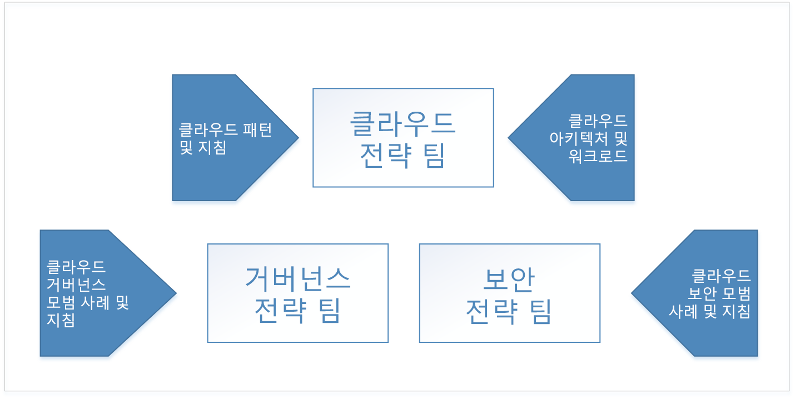
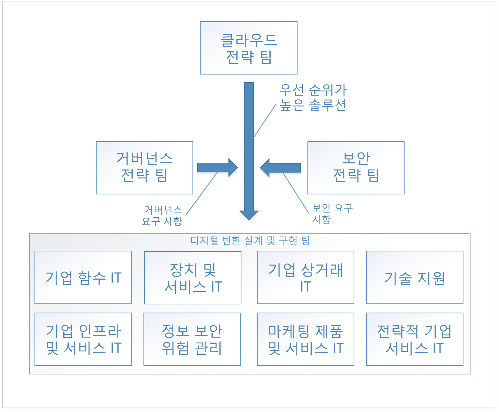

# 엔터프라이즈 클라우드 채택: 시작 

클라우드 컴퓨팅으로의 **디지털 변환**은 온-프레미스 운영에서 클라우드 운영으로 전환을 나타냅니다. 이러한 변환에는 비즈니스를 수행하는 새로운 방식이 포함되어 있습니다. 예를 들어 디지털 변환은 소프트웨어 및 데이터 센터 하드웨어에 대한 자본 지출에서 클라우드 리소스의 사용량에 대한 운영 지출으로 전환됩니다. 

## 디지털 변환: 프로세스

클라우드 채택에 성공하기 위해서 기업은 해당 조직, 사용자 및 프로세스가 디지털 변환을 준비하도록 준비해야 합니다. 모든 조직의 준비 구조가 다르므로 모든 조직 준비 상황에 보편적으로 적용할 수 있는 방식은 없습니다. 이 문서에서는 기업이 준비하기 위해 수행할 수 있는 대략적인 단계를 간략하게 설명합니다. 조직은 각 나열된 단계를 수행하는 세부 계획을 개발하는 데 시간을 투자해야 합니다.

디지털 변환을 위한 대략적인 프로세스는 다음과 같습니다.

1. 클라우드 전략 팀을 만듭니다. 이 팀은 디지털 변환을 이끄는 작업을 담당합니다. 이 단계에서는 디지털 변환을 위해 거버넌스 팀 및 보안 팀을 구성하는 것도 중요합니다.
2. 클라우드 전략 팀의 멤버는 클라우드 기술에 대한 새로운 기능 및 다른 기능을 알아봅니다.  
3. 클라우드 전략 팀은 디지털 변환을 위한 비즈니스 사례를 빌드하여 기업이 준비하도록 합니다. 비즈니스 전략에서 현재의 모든 간격을 열거하고, 제거하기 위한 대략적인 솔루션을 결정합니다.
4. 비즈니스 그룹과 대략적인 솔루션을 정렬합니다. 각 솔루션에 대한 디자인 및 구현을 소유하는 각 비즈니스 그룹의 관련자를 식별합니다.
5. 클라우드 역할, 기술 및 프로세스를 포함하는 기존 역할, 기술 및 프로세스를 변환합니다.  
<!--6. Develop processes for operating in the cloud to make solutions more robust in terms of availability, resiliency, and security. 
7. Optimize solutions for performance, scalability, and cost efficiency.-->

## 1단계: 클라우드 전략 팀 만들기

기업 디지털 변환의 첫 번째 단계는 조직 전체에서 비즈니스 리더들이 참여하여 CST(클라우드 전략 팀)를 만드는 것입니다. 이 팀은 재무, IT 인프라 및 애플리케이션 그룹의 비즈니스 리더로 구성됩니다. 이러한 팀은 클라우드 분석 및 실험 단계에서 도움이 됩니다.

예를 들어 클라우드 전략 팀은 CTO에 의해 결정되고, 기업 아키텍처 팀, IT 재무, 다양한 IT 애플리케이션 그룹(HR, 재무 등)의 선임 기술자 및 인프라, 보안 및 네트워킹 팀의 리더로 구성될 수 있습니다.  

거버넌스 팀 및 보안 팀이라는 대략적인 두 팀을 구성하는 것도 중요합니다. 이러한 팀은 기업 거버넌스 및 보안 정책을 디자인하고, 구현하고, 지속적으로 감사하는 일을 담당합니다. 거버넌스 팀에는 자산 보호, 비용 관리, 그룹 정책 및 관련된 토픽으로 작업한 경험이 있는 멤버가 필요합니다. 보안 팀에는 기업의 보안 요구 사항뿐만 아니라 현재 산업 보안 표준에 익숙한 멤버가 필요합니다.

거버넌스 팀은 클라우드에서 기업 거버넌스 모델을 디자인하고 구현할 뿐만 아니라 디지털 변환의 일부인 공유 인프라 자산을 배포하고 유지 관리하는 일을 담당합니다. 이러한 자산에는 클라우드의 가상 네트워킹에 온-프레미스 네트워크를 연결하는 데 필요한 하드웨어, 소프트웨어 및 클라우드 리소스가 표함됩니다.

보안 팀은 거버넌스 팀과 긴밀하게 협력하여 클라우드에서 기업 보안 정책을 디자인하고 구현하는 일을 담당합니다. 보안 팀은 클라우드에서 가상 네트워킹을 포함하는 온-프레미스 네트워크의 보안 경계 확장을 소유합니다. 클라우드 가상 네트워크의 인바운드 및 아웃바운드 방화벽을 소유하고 유지 관리할 뿐만 아니라 도구 및 정책이 인증되지 않은 리소스의 배포를 방지하도록 보장하는 형식이 될 수 있습니다.

## 2단계: 클라우드의 새로운 기능 알아보기
 
기업 디지털 변환의 다음 단계는 클라우드 전략 팀의 멤버가 클라우드 기술이 기업의 비즈니스를 수행 방식을 변경하는 방법에 대해 알아보려는 경우입니다. 비즈니스, 사용자 및 기술에 대한 변경 내용을 준비하고 계획합니다. 클라우드 전략 팀의 멤버가 클라우드에서 새로운 기능 및 다른 기능을 온-프레미스와 비교하여 이해하는 데 필요합니다.

클라우드를 이해하는 시작점은 대략적인 [Azure 작동 방식](what-is-azure.md)을 알아보는 것입니다. 다음으로, [리소스 액세스 관리를 이해](azure-resource-access.md)하기 위한 준비 과정으로 [Azure의 거버넌스](what-is-governance.md) 기본 사항에 대해 알아봅니다.

고급 학습의 경우 거버넌스 팀은 목차의 거버넌스 섹션에서 개념 및 디자인 가이드를 검토해야 합니다. 인프라 및 워크로드 섹션은 클라우드에서 일반적인 아키텍처 및 워크로드에 대한 학습에 유용합니다.

## 3단계: 비즈니스 전략의 차이 식별

다음 단계는 클라우드 전략 팀이 디지털 변환 솔루션을 필요로 하는 비즈니스 문제를 열거하는 경우입니다. 예를 들어 기업에는 교체해야 하는 수명 종료 하드웨어를 포함한 기존 온-프레미스 데이터 센터가 있을 수 있습니다. 또 다른 예로 기업이 새로운 기능 및 서비스에 대한 출시 시간에 문제가 발생할 수 있고 경쟁에서 뒤쳐질 수 있습니다. 이러한 간격은 기업 디지털 변환의 *목표*를 나타냅니다.

비즈니스 전략의 차이는 다음 범주로 분류할 수 있습니다.

|Category|설명|
|-----|-----|
|비용 관리|기술에 대한 기업 지불 방식의 간격을 나타냅니다.|
|거버넌스|비용 초과, 보안 문제 또는 규정 준수 문제를 일으킬 수 있는 부적절한 사용으로부터 해당 자산을 보호하기 위해 기업에서 사용하는 프로세스의 간격을 나타냅니다. | 
|규정 준수|기업이 고유한 내부 프로세스 및 정책뿐만 아니라 외부 법률, 규정 및 표준을 준수하는 방식의 간격을 나타냅니다. |
|보안|기업이 외부 위협으로부터 해당 기술 및 데이터 자산을 보호하는 방식의 간격을 나타냅니다. |
|데이터 거버넌스|기업이 데이터, 특히 고객 데이터를 관리하는 방식의 간격을 나타냅니다. 예를 들어 유럽 연합의 새 GDPR(일반 데이터 보호 규정)에는 고객 데이터의 보호를 위한 엄격한 요구 사항이 있으며 여기에는 새 하드웨어 및 소프트웨어가 필요할 수 있습니다.|    

기업이 모든 비즈니스 전략 간격을 이러한 범주로 분류하면 다음 단계에서는 각 문제에 대한 대략적인 솔루션을 결정합니다.

다음 표에서는 여러 예제를 보여줍니다.

|비즈니스 전략 간격|범주 &nbsp; &nbsp; &nbsp; &nbsp; &nbsp;|솔루션 &nbsp;&nbsp;&nbsp;&nbsp;&nbsp;&nbsp;&nbsp;&nbsp;&nbsp;&nbsp;&nbsp;&nbsp;&nbsp;&nbsp;|
|-----|-----|-----|
| 사용량의 약 10%인 최대 수요 시간 동안 가용성, 복원력 및 확장성과 관련된 온-프레미스 환경 문제에서 현재 호스팅되는 서비스 온-프레미스 데이터 센터의 서버는 수명이 종료됩니다. 기업 IT는 데이터 센터에 대해 최대 수요를 처리하는 사양을 가진 새로운 온-프레미스 하드웨어를 구매하도록 권장합니다.| 비용 관리 | 클라우드에서 영향을 받는 기존 온-프레미스 워크로드를 확장 가능한 리소스로 마이그레이션하고 사용한 만큼 요금을 지불합니다. |
| 외부 데이터 관리 법률 및 규정에서는 기업이 미사용 데이터 암호화를 요구하는 표준 제어 집합을 준수해야 합니다. 여기에는 새 하드웨어 및 소프트웨어가 필요합니다. | 데이터 거버넌스 | 미사용 데이터에 대한 Azure Storage 서비스 암호화로 데이터를 이동합니다. |
| 온-프레미스 데이터 센터에서 호스팅되는 서비스에는 공용 웹 서비스에서 DDoS(distributed denial of service) 공격이 발생했습니다. 공격을 완화하기는 어려우며, 새 하드웨어, 소프트웨어 및 보안 담당자를 효과적으로 다루어야 합니다. | 보안 | 서비스를 Azure로 마이그레이션하고 Azure DDoS protection을 활용합니다.|

모든 비즈니스 전략의 간격을 열거하고 대략적인 솔루션을 결정하면 우선 순위를 지정합니다. 각 범주에서 기업의 단기 및 장기 목표와 비즈니스 전략 간격을 맞춰서 이 목록의 우선 순위를 지정할 수 있습니다. 예를 들어 기업에 다음 두 회계 분기에서 IT 비용을 감소하려는 단기 목표가 있는 경우 *비용 관리* 범주의 비스니스 간격은 각각 연결된 예상 비용 절감에 의해 우선 순위가 지정될 수 있습니다.

이 프로세스의 출력은 비즈니스 범주로 정렬된 대략적인 솔루션의 스택 순위 목록입니다. 

## 4단계: 비즈니스 그룹으로 대략적인 솔루션을 정렬하여 솔루션 디자인 

이제 디지털 변환의 목표가 열거되고, 우선 순위가 지정되고, 대략적인 솔루션이 제안되었으므로 다음 단계는 클라우드 전략 팀이 각 비즈니스 그룹의 디자인 및 구현 팀에게 대략적인 솔루션을 각각 정렬하는 것입니다. 

팀은 우선 순위가 지정된 목록을 가져오고 각 솔루션 디자인하기 위해 대략적인 솔루션을 각각 수행합니다. 디자인 프로세스에는 새 인프라 및 새 워크로드의 사양이 포함됩니다. 수행한 사용자 역할 및 프로세스를 변경할 수도 있습니다. 이 단계에서는 디자인 팀이 각각 디자인을 검토하기 위해 거버넌스 및 보안 팀을 모두 포함하는 것도 매우 중요합니다. 각 디자인은 거버넌스 및 보안 팀에서 정의된 정책 및 프로시저 내에서 설정되어야 하고, 이러한 팀은 각 디자인의 최종 로그인에 포함되어야 합니다.

각 솔루션의 디자인은 특수 작업이므로 디자인이 생성될 때 다른 팀의 다른 솔루션 디자인이라는 컨텍스트에서 고려되어야 합니다. 예를 들어 몇몇 디자인이 기존 온-프레미스 애플리케이션 및 서비스를 클라우드로 마이그레이션하는 결과가 발생한 경우 이러한 작업을 함께 그룹화하고 전체 마이그레이션 전략을 디자인하는 것이 더 효율적일 수 있습니다. 또 다른 예로, 일부 기존 온-프레미스 애플리케이션 및 서비스를 마이그레이션할 수 없을 수 있습니다. 그러면 솔루션은 새 개발 또는 타사 서비스로 교체하는 것일 수 있습니다. 이 경우에 이러한 작업을 함께 그룹화하고 서로 겹치는지 확인하여 둘 이상의 솔루션에 대한 타사 서비스를 사용할지를 결정하는 것이 보다 효과적일 수 있습니다.

솔루션의 디자인이 완료되면 팀은 각 디자인에 대한 구현 단계로 이동합니다. 표준 프로젝트 관리 프로세스를 사용하여 각 솔루션 디자인에 대한 구현 단계를 실행할 수 있습니다.

## 5단계: 클라우드에 대한 기존 역할, 기술 및 프로세스 변환

IT 업계 역사의 진화 단계에서 가장 두드러진 업계의 변화는 직원 역할의 변경에서 일어납니다. 메인프레임에서 클라이언트/서버 모델로의 전환 중에 컴퓨터 연산자의 역할은 거의 사라지고 시스템 관리자에 의해 대체됩니다. 가상화 시대가 되면 물리적 서버를 사용하는 개인에 대한 요구 사항이 감소하고 가상화 전문가에 대한 필요로 대체됩니다. 마찬가지로 기관이 클라우드 컴퓨팅으로 전환하면 역할도 다시 변경될 가능성이 높습니다. 예를 들어 데이터 센터 전문가는 클라우드 재무 분석가로 바뀔 수 있습니다. IT 직책이 변경되지 않은 경우에도 일상 작업 역할이 크게 발전했습니다. 

IT 직원 멤버는 클라우드 솔루션 지원을 위해 다양한 기술이 필요하다는 것을 깨닫고 자신의 역할과 위치에 대해 우려할 수 있습니다. 하지만 새 클라우드 기술을 탐색하고 학습하는 민첩한 직원은 이런 두려움을 갖지 않아도 됩니다. 클라우드 서비스를 채택하도록 이끌고 조직이 관련된 변경 내용을 이해하고 수용하는 데 도움을 줄 수 있습니다. 

### 고민 캡처

디지털 변환 중에 각 팀에서는 직원의 고민이 발생하는 대로 캡처해야 합니다. 고민을 캡처할 때 다음을 식별합니다. 
* 고민 형식 예를 들어 작업자가 디지털 변환을 수반하는 직무의 변경에 대한 반발이 있을 수 있습니다.
* 고민이 해결되지 않는 경우 영향 예를 들어 디지털 변환에 대한 반발로 인해 작업자가 필요한 변경 내용을 느리게 실행하는 결과가 발생할 수 있습니다. 
* 고민을 해결하기 위해 필요한 영역 예를 들어 IT 부서의 작업자가 새로운 기술을 획득하는 데 주저하는 경우 이 고민을 해결하기 위해 IT 관련자 영역이 가장 필요합니다. 영역을 식별하면 일부 고민을 명확하게 할 수 있으며 이러한 경우에 경영진으로 진급해야 할 수 있습니다. 

### 간격 식별

기업 디지털 변환과 관련된 문제를 해결하는 또 다른 측면은 **간격**을 식별하는 것입니다. 간격은 기업에 현재 존재하지 않는 디지털 변환에 필요한 역할, 기술, 또는 프로세스입니다. 

디지털 변환을 수반하는 새 책임을 열거하기 시작합니다. 새로운 책임 및 현재 책임에 대한 강조는 사라집니다. 각 책임에 정렬된 영역을 식별합니다. 새 책임의 경우 영역과 밀접하게 정렬된 정도를 확인합니다. 일부 책임은 여러 영역에 걸쳐 있을 수 있습니다. 따라서 고민으로 캡처해야 하는 내용을 보다 잘 정렬해야 합니다. 책임 있는 영역이 식별되지 않는 경우 이를 간격으로 캡처합니다.

다음으로, 책임을 지원하는 데 필요한 기술을 식별합니다. 기업에 이러한 기술을 포함하는 기존 리소스가 있는지를 확인합니다. 기존 리소스가 없는 경우 교육 프로그램 또는 인재 취득을 반드시 결정해야 합니다. 디지털 변환이 진행되도록 지원해야 하는 책임을 기준으로 시간 프레임을 결정합니다.

마지막으로, 이러한 기술을 실행하는 역할을 식별합니다. 일부 직원은 기존 역할을 일부 담당하고 다른 경우, 완전히 새로운 역할이 필요할 수 있습니다. 

### 팀의 파트너

조직 디지털 변환의 간격을 채우는 데 필요한 기술은 일반적으로 단일 역할 또는 단일 부서로 제한될 필요가 없습니다. 기술에는 단일 역할 또는 여러 역할에 걸쳐 있을 수 있는 관계 및 종속성이 포함되고, 해당 역할은 여러 부서에 존재할 수 있습니다. 예를 들어 워크로드 소유자는 구독 및 리소스 그룹과 같은 핵심 리소스를 프로비전할 IT 역할의 사용자가 필요할 수 있습니다.

이러한 종속성은 조직이 역할 간에 워크플로를 관리하기 위해 구현하게 될 새로운 프로세스를 나타냅니다. 위의 예제에는 워크로드 소유자 및 IT 역할 간에 관계를 지원할 수 있는 여러 다른 형식의 프로세스가 있습니다. 예를 들어 프로세스를 관리하는 워크플로 도구를 만들 수 있습니다. 또는 간단한 이메일 템플릿을 사용할 수 있습니다.

이러한 종속성을 추적하고, 지원하는 프로세스 및 프로세스가 현재 존재하는지 여부를 기록합니다. 도구를 필요로 하는 프로세스의 경우 도구를 배포하는 타임라인이 전체 디지털 변환 일정에 맞는지 확인합니다.

## 다음 단계

디지털 변환은 반복 프로세스이며 각 반복에 참여하는 팀이 보다 효율적입니다. 

> [!div class="nextstepaction"]
> [Azure의 작동 방식 이해](what-is-azure.md)