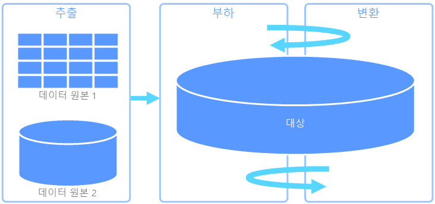
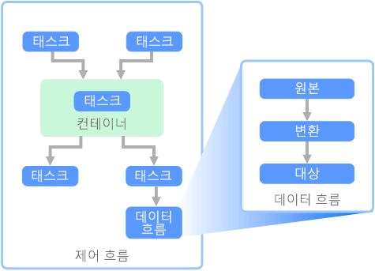

# ETL(추출, 변환 및 로드)

조직이 일반적으로 직면하는 문제는 여러 원본의 데이터를 여러 형식으로 수집한 후 하나 이상의 데이터 저장소로 이동하는 방법에 대한 것입니다. 대상은 원본과 동일한 유형의 데이터 저장소가 아닐 수 있으며, 종종 형식이 다르거나, 데이터를 최종 대상으로 로드하기 전에 셰이핑 또는 정리해야 합니다.

이러한 문제를 해결하기 위해 수년에 걸쳐 다양한 도구, 서비스 및 프로세스 개발되었습니다. 사용되는 프로세스에 관계없이, 일반적으로 작업을 조정하고 데이터 파이프라인 내에서 일정 수준의 데이터 변환을 적용할 필요가 있습니다. 다음 섹션에서는 이러한 작업을 수행하는 데 사용되는 일반적인 방법을 강조해서 설명합니다.

## ETL(추출, 변환 및 로드) 프로세스

ETL(추출, 변환 및 로드)은 다양한 원본에서 데이터를 수집하고, 비즈니스 규칙에 따라 데이터를 변환하고, 대상 데이터 저장소로 로드하는 데 사용되는 데이터 파이프라인입니다. ETL의 변환 작업은 특수한 엔진에서 진행되며, 종종 변환 중인 데이터가 준비 테이블에서 임시로 보유되었다가 결과적으로 대상에 로드됩니다.

일반적으로 발생하는 데이터 변환에는 필터링, 정렬, 집계, 데이터 조인, 데이터 정리, 중복 제거 및 데이터 유효성 검사 등의 다양한 작업이 포함됩니다.

종종 시간 절약을 위해 3가지 ETL 단계가 동시에 실행됩니다. 예를 들어, 데이터의 전체 추출이 완료될 때까지 기다리지 않고, 데이터가 추출되는 동안 이미 수신된 데이터가 변환되면서 로드 준비가 진행되고, 준비된 데이터에 대해 로드 프로세스가 시작될 수 있습니다.

관련 Azure 서비스:

- [Azure Data Factory v2](https://azure.microsoft.com/services/data-factory/)

기타 도구:

- [SSIS(SQL Server Integration Services)](/sql/integration-services/sql-server-integration-services)

## ELT(추출, 로드, 변환)

ELT(추출, 로드, 변환)는 변환이 수행되는 위치만 ETL과 다릅니다. ELT 파이프라인에서는 대상 데이터 저장소에서 변환이 발생합니다. 별도 변환 엔진을 사용하는 대신, 대상 데이터 저장소의 처리 기능을 사용하여 데이터를 변환합니다. 따라서 파이프라인에서 변환 엔진이 제거되므로 아키텍처가 단순해집니다. 이 방식의 또 다른 이점은 대상 데이터 저장소의 크기를 조정하면 ELT 파이프라인 성능도 조정된다는 것입니다. 그러나 ELT는 대상 시스템이 데이터를 효율적으로 변환할 수 있을 만큼 강력할 때만 효과적입니다.

ELT의 일반적인 사용 사례는 빅 데이터 영역에 포함합니다. 예를 들어, 먼저 모든 원본 데이터를 HDFS(Hadoop 분산 파일 시스템) 또는 Azure Data Lake Store 같은 확장 가능한 저장소의 플랫 파일로 추출할 수 있습니다. 그런 후 Spark, Hive 또는 PolyBase와 같은 기술을 사용하여 원본 데이터를 쿼리하기만 하면 됩니다. ELT의 중요한 점은 변형을 수행하는 데 사용된 동일한 데이터 저장소에서 궁극적으로 데이터가 사용된다는 것입니다. 이 데이터 저장소는 자체 전용 저장소에 데이터를 로드하지 않고, 확장 가능한 저장소에서 직접 데이터를 읽습니다. 이 방법은 큰 데이터 집합을 사용할 경우 시간이 많이 소요될 수 있는 ETL의 데이터 복사 단계를 건너뜁니다.

실제로, 대상 데이터 저장소는 실제로 Hadoop 클러스터(Hive 또는 Spark 사용) 또는 SQL Data Warehouse를 사용하는 [데이터 웨어하우스](./data-warehousing.md)입니다. 일반적으로 스키마는 쿼리 타임에 플랫 파일 데이터에 중첩되고 테이블로 저장되므로 데이터 저장소의 다른 테이블처럼 데이터를 쿼리할 수 있습니다. 데이터가 데이터 저장소 자체에서 관리하는 저장소에 있지 않고 확장 가능한 외부 저장소에 있으므로 이러한 테이블을 외부 테이블이라고 합니다.

데이터 저장소는 데이터의 스키마만 관리하고 읽기 시 스키마를 적용합니다. 예를 들어, Hive를 사용하는 Hadoop 클러스터는 데이터 원본이 결과적으로 HDFS의 파일 집합에 대한 경로가 되는 Hive 테이블을 기술합니다. SQL Data Warehouse에서 PolyBase는 동일한 결과를 얻을 수 있습니다. 즉, 외부 데이터베이스 자체에 외부적으로 저장되는 데이터 테이블이 만들어집니다. 원본 데이터가 로드되면 데이터 저장소의 기능을 사용하여 외부 테이블에 있는 데이터를 처리할 수 있습니다. 따라서 빅 데이터 시나리오에서는 데이터 저장소가 데이터를 좀 더 작은 청크로 분할하고 여러 컴퓨터에서 병렬로 청크 처리를 분산하는 MPP(Massively Parallel Processing) 기능을 갖추어야 합니다.

ELT 파이프라인의 최종 단계는 일반적으로 지원해야 하는 쿼리 형식에 좀 더 효율적인 최종 형식으로 원본 데이터를 변환하는 것입니다. 예를 들어 데이터는 분할될 수 있습니다. 또한 ELT는 행 기반 데이터를 칼럼 방식으로 저장 하 고 최적화 된 인덱싱과 제공 하는 Parquet과 같은 최적화 된 저장소 형식을 사용할 수 있습니다.

관련 Azure 서비스:

- [Azure SQL Data Warehouse](/azure/sql-data-warehouse/sql-data-warehouse-overview-what-is)
- [HDInsight(Hive 포함)](/azure/hdinsight/hadoop/hdinsight-use-hive)
- [Azure Data Factory v2](https://azure.microsoft.com/services/data-factory/)
- [HDInsight의 Oozie](/azure/hdinsight/hdinsight-use-oozie-linux-mac)

기타 도구:

- [SSIS(SQL Server Integration Services)](/sql/integration-services/sql-server-integration-services)

## 데이터 흐름 및 제어 흐름

데이터 파이프라인의 컨텍스트에서 제어 흐름은 태스크 집합이 순서대로 처리되도록 합니다. 이러한 태스크의 올바른 처리 순서를 적용하기 위해 선행 제약 조건이 사용됩니다. 아래 그림에 나와 있는 것처럼, 이러한 제약 조건을 워크플로 다이어그램의 연결선으로 생각할 수 있습니다. 각 태스크에는 성공, 실패 또는 완료와 같은 결과가 있습니다. 선행 작업이 이러한 결과 중 하나로 완료되어야만 후속 태스크의 처리가 시작됩니다.

제어 흐름은 데이터 흐름을 하나의 태스크로 실행합니다. 데이터 흐름 태스크에서 데이터는 원본에서 추출되고, 변형되고, 데이터 저장소에 로드됩니다. 하나의 데이터 흐름 태스크의 출력에는 다음 데이터 흐름 태스크에 대 한 입력 수 및 데이터 흐름이 병렬로 실행할 수 있습니다. 제어 흐름과 달리, 데이터 흐름의 태스크 간에는 제약 조건을 추가할 수 없습니다. 그러나 각 태스크에서 처리되는 데이터를 관찰하기 위해 데이터 뷰어를 추가할 수는 있습니다.

위의 다이어그램에는 제어 흐름 내의 여러 태스크가 나와 있습니다. 이중 하나가 데이터 흐름 태스크입니다. 태스크 중 하나가 컨테이너 내에 중첩되어 있습니다. 컨테이너는 태스크에 구조를 제공하는 데 사용될 수 있으며 작업 단위를 제공합니다. 이러한 예제 중 하나는 폴더 또는 데이터베이스 문의 파일처럼 컬렉션 내에서 요소를 반복하는 경우입니다.

관련 Azure 서비스:

- [Azure Data Factory v2](https://azure.microsoft.com/services/data-factory/)

기타 도구:

- [SSIS(SQL Server Integration Services)](/sql/integration-services/sql-server-integration-services)

## 기술 선택

- [OLTP(온라인 트랜잭션 처리) 데이터 저장소](./online-transaction-processing.md#oltp-in-azure)
- [OLAP(온라인 분석 처리) 데이터 저장소](./online-analytical-processing.md#olap-in-azure)
- [데이터 웨어하우스](./data-warehousing.md)
- [파이프라인 오케스트레이션](../technology-choices/pipeline-orchestration-data-movement.md)

## 다음 단계

다음 참조 아키텍처는 Azure의 엔드투엔드 ELT 파이프라인을 보여줍니다.

- [SQL Data Warehouse를 사용하는 Azure의 Enterprise BI](../../reference-architectures/data/enterprise-bi-sqldw.md)
- [SQL Data Warehouse 및 Azure Data Factory를 사용하는 자동화된 Enterprise BI](../../reference-architectures/data/enterprise-bi-adf.md)