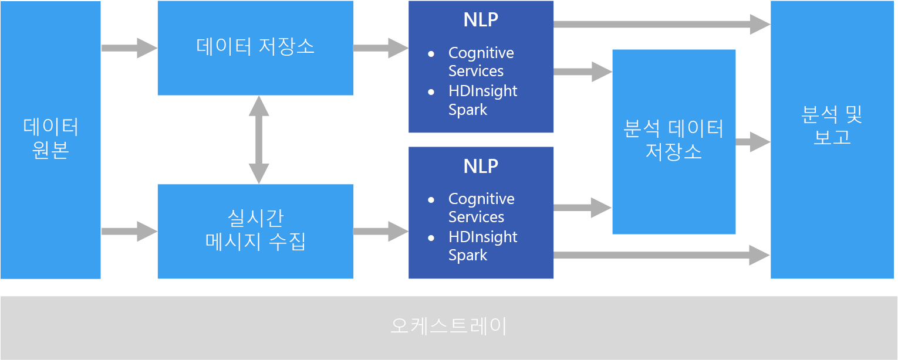

# 자연어 처리Natural language processing

NLP(자연어 처리)는 감성 분석, 토픽 감지, 언어 감지, 핵심 구 추출 및 문서 분류 등의 태스크에 사용됩니다.Natural language processing (NLP) is used for tasks such as sentiment analysis, topic detection, language detection, key phrase extraction, and document categorization.

## 이 솔루션을 사용해야 하는 경우When to use this solution

NLP는 문서에 중요 또는 스팸으로 레이블을 지정하는 것과 같이 문서를 분류하는 데 사용될 수 있습니다.NLP can be use to classify documents, such as labeling documents as sensitive or spam. NLP의 출력은 후속 처리 또는 검색에 사용될 수 있습니다.The output of NLP can be used for subsequent processing or search. NLP의 다른 용도는 문서의 엔터티를 식별하여 텍스트를 요약하는 것입니다.Another use for NLP is to summarize text by identifying the entities present in the document. 이러한 엔터티는 문서에 키워드를 태그로 지정하는 데도 사용할 수 있습니다. 이렇게 하면 콘텐츠에 따라 검색을 수행할 수 있습니다.These entities can also be used to tag documents with keywords, which enables search and retrieval based on content. 엔터티를 토픽과 결합하고, 각 문서의 중요 토픽을 설명하는 요약을 함께 표시할 수 있습니다.Entities might be combined into topics, with summaries that describe the important topics present in each document. 감지된 토픽은 탐색을 위해 문서를 분류하거나, 선택한 토픽에 대해 관련 문서를 열거하는 데 사용될 수 있습니다.The detected topics may be used to categorize the documents for navigation, or to enumerate related documents given a selected topic. NLP의 또 다른 용도는 텍스트의 감정 점수를 매겨서 문서가 긍정적인 어조인지 부정적인 어조인지 평가하는 것입니다.Another use for NLP is to score text for sentiment, to assess the positive or negative tone of a document. 이러한 방식에서는 다음과 같은 자연어 처리의 많은 기술이 사용됩니다.These approaches use many techniques from natural language processing, such as: 

- **토크나이저**.**Tokenizer**. 텍스트를 단어 또는 구로 분할합니다.Splitting the text into words or phrases.
- **형태소 분석 및 기본형 분석**.**Stemming and lemmatization**. 다른 형태가 같은 의미의 정식 단어에 매핑되도록 단어 정규화.Normalizing words so that that different forms map to the canonical word with the same meaning. 예: "running" 및 "ran"은 "run"에 매핑됩니다.For example, "running" and "ran" map to "run." 
- **엔터티 추출**.**Entity extraction**. 텍스트에서 주체 식별Identifying subjects in the text.
- **품사 감지**.**Part of speech detection**. 텍스트를 동사, 명사, 분사, 동사구 등으로 식별Identifying text as a verb, noun, participle, verb phrase, and so on.
- **문장 경계 감지**.**Sentence boundary detection**. 텍스트 구 내에서 완전한 문장 감지Detecting complete sentences within paragraphs of text.

NLP를 사용하여 자유 형식 텍스트에서 정보를 추출할 때는 일반적으로 AAzure Storage 서비스 또는 Azure Data Lake Store와 같은 개체 저장소에 저장된 원시 문서에서 시작합니다.When using NLP to extract information and insight from free-form text, the starting point is typically the raw documents stored in object storage such as Azure Storage or Azure Data Lake Store. 

## 과제Challenges

- 자유 형식 텍스트 문서 컬렉션의 처리는 일반적으로 시간이 오래 걸릴 뿐만 아니라 계산 리소스도 많이 소비됩니다.Processing a collection of free-form text documents is typically computationally resource intensive, as well as being time intensive.
- 표준화된 문서 형식이 없는 경우, 자유 형식 텍스트 처리를 사용하여 문서에서 특정 팩트는 추출함으로써 일관되게 정확한 결과를 얻는 것이 매울 어려울 수 있습니다.Without a standardized document format, it can be very difficult to achieve consistently accurate results using free-form text processing to extract specific facts from a document. 예를 들어, 청구서에 표시되는 텍스트를 생각해 보세요. 공급업체 번호에 포함되어 있는 송장 번호와 송장 날짜를 올바르게 추출하는 프로세스를 빌드하는 것은 어려울 수 있습니다.For example, think of a text representation of an invoice&mdash;it can be difficult to build a process that correctly extracts the invoice number and invoice date for invoices across any number of vendors.

## 아키텍처Architecture

NLP 솔루션에서는 텍스트 단락이 포함된 문서에 대해 자유 형식 텍스트 처리가 수행됩니다.In an NLP solution, free-form text processing is performed against documents containing paragraphs of text. 전체 아키텍처는 [일괄 처리](../big-data/batch-processing.md) 또는 [실시간 스트림 처리](../big-data/real-time-processing.md) 아키텍처일 수 있습니다.The overall architecture can be a [batch processing](../big-data/batch-processing.md) or [real-time stream processing](../big-data/real-time-processing.md) architecture.

실제 처리는 원하는 결과에 따라 다르지만, 파이프라인의 관점에서 볼 때 NLP를 일괄로 또는 실시간 방식으로 적용할 수 있습니다.The actual processing varies based on the desired outcome, but in terms of the pipeline, NLP may be applied in a batch or real-time fashion. 예를 들어 텍스트 블록에 대해 감정 분석에 사용하여 감정 점수를 생성할 수 있습니다.For example, sentiment analysis can be used against blocks of text to produce a sentiment score. 이 작업은 저장소의 데이터에 대해 일괄 처리 프로세스를 실행하여 또는 메시지 서비스를 통해 흐르는 데이터의 보다 작은 청크를 사용하여 실시간으로 수행할 수 있습니다.This can could be done by running a batch process against data in storage, or in real time using smaller chunks of data flowing through a messaging service.

## 기술 선택Technology choices

- [자연어 처리Natural language processing](../technology-choices/natural-language-processing.md)