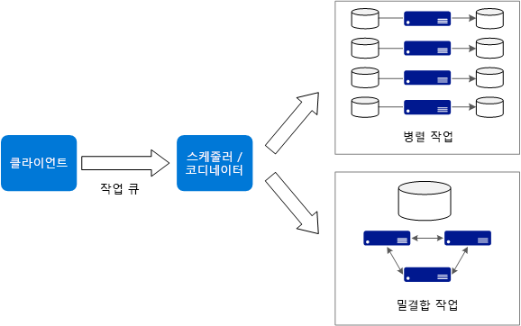
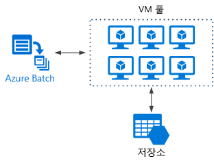

# 빅 컴퓨팅 아키텍처 스타일Big compute architecture style

*큰 계산*이라는 용어는 수백 또는 수천 개의 번호 매기기 등 코어 수를 많이 요구하는 대규모 워크로드를 설명합니다.The term *big compute* describes large-scale workloads that require a large number of cores, often numbering in the hundreds or thousands. 시나리오에는 이미지 렌더링, 유체 역학, 재무 위험 모델링, 석유 탐색, 약 디자인 및 스트레스 분석 엔지니어링이 포함됩니다.Scenarios include image rendering, fluid dynamics, financial risk modeling, oil exploration, drug design, and engineering stress analysis, among others.

빅 컴퓨팅 애플리케이션의 몇 가지 일반적인 특성은 다음과 같습니다.Here are some typical characteristics of big compute applications:

- 작업은 동시에 여러 코어에서 실행될 수 있는 개별 작업으로 분할될 수 있습니다.The work can be split into discrete tasks, which can be run across many cores simultaneously.
- 각 작업은 한정됩니다.Each task is finite. 일부 입력을 사용하고, 일부 처리를 수행하고, 출력을 생성합니다.It takes some input, does some processing, and produces output. 전체 애플리케이션은 제한된 양의 시간(몇 분, 몇 일) 동안 실행됩니다.The entire application runs for a finite amount of time (minutes to days). 일반적인 패턴에서는 갑자기 많은 수의 코어를 프로비전하고 애플리케이션이 완료되면 0으로 스핀 다운합니다.A common pattern is to provision a large number of cores in a burst, and then spin down to zero once the application completes.
- 애플리케이션을 일주일 내내 사용하지 않아도 됩니다.The application does not need to stay up 24/7. 그러나 시스템은 노드 오류 또는 애플리케이션 충돌을 처리해야 합니다.However, the system must handle node failures or application crashes.
- 일부 애플리케이션의 경우 작업이 독립적이며 병렬로 실행할 수 있습니다.For some applications, tasks are independent and can run in parallel. 다른 경우에 작업은 밀접하게 연결됩니다. 즉, 중간 결과와 상호 작용하거나 교환해야 합니다.In other cases, tasks are tightly coupled, meaning they must interact or exchange intermediate results. 이 경우에 InfiniBand 및 RDMA(원격 직접 메모리 액세스)와 같은 고속 네트워킹 기술을 사용하는 것이 좋습니다.In that case, consider using high-speed networking technologies such as InfiniBand and remote direct memory access (RDMA).
- 워크로드에 따라 계산 집약적인 VM 크기(H16r, H16mr 및 A9)를 사용할 수 있습니다.Depending on your workload, you might use compute-intensive VM sizes (H16r, H16mr, and A9).

## 이 아키텍처를 사용하는 경우When to use this architecture

- 시뮬레이션 및 숫자 고속 처리와 같은 계산 집약적인 작업Computationally intensive operations such as simulation and number crunching.
- 계산 집약적이고 여러 컴퓨터(10~1000대)에서 CPU에 분할되어야 하는 시뮬레이션Simulations that are computationally intensive and must be split across CPUs in multiple computers (10-1000s).
- 한 대의 컴퓨터에 메모리가 너무 많이 필요하고 여러 컴퓨터 간에 분할되야 하는 시뮬레이션Simulations that require too much memory for one computer, and must be split across multiple computers.
- 단일 컴퓨터에서 완료되는 시간이 너무 오래 걸리는 장기 실행 계산Long-running computations that would take too long to complete on a single computer.
- Monte Carlo 시뮬레이션과 같이 100번 또는 1000번 실행해야 하는 더 작은 계산Smaller computations that must be run 100s or 1000s of times, such as Monte Carlo simulations.

## 이점Benefits

- "[병렬][embarrassingly-parallel]" 처리가 적합한 고성능High performance with "[embarrassingly parallel][embarrassingly-parallel]" processing.
- 큰 문제를 더 빠르게 해결하도록 수백 또는 수천 개의 컴퓨터 코어를 활용할 수 있습니다.Can harness hundreds or thousands of computer cores to solve large problems faster.
- 빠른 전용 InfiniBand 네트워크를 사용하여 특수한 고성능 하드웨어에 액세스합니다.Access to specialized high-performance hardware, with dedicated high-speed InfiniBand networks.
- 작업을 수행하고 종료하는 데 필요한 만큼 VM을 프로비전할 수 있습니다.You can provision VMs as needed to do work, and then tear them down.

## 과제Challenges

- VM 인프라 관리Managing the VM infrastructure.
- 숫자 고속 처리의 볼륨 관리Managing the volume of number crunching
- 적절하게 수천 개의 코어 프로비전Provisioning thousands of cores in a timely manner.
- 밀접하게 연결된 작업의 경우 더 많은 코어를 추가하면 반환을 줄일 수 있습니다.For tightly coupled tasks, adding more cores can have diminishing returns. 최적의 코어 수를 찾기 위해 실험이 필요할 수 있습니다.You may need to experiment to find the optimum number of cores.

## Azure Batch를 사용하는 빅 컴퓨팅Big compute using Azure Batch

[Azure Batch][batch]는 대규모 HPC(고성능 컴퓨팅) 애플리케이션을 실행하기 위한 관리 서비스입니다.[Azure Batch][batch] is a managed service for running large-scale high-performance computing (HPC) applications.

Azure Batch를 사용하여 VM 풀을 구성하고, 애플리케이션 및 데이터 파일을 업로드합니다.Using Azure Batch, you configure a VM pool, and upload the applications and data files. Batch 서비스는 VM을 프로비전하고, VM에 작업을 할당하고, 작업을 실행하고, 진행 상황을 모니터링합니다.Then the Batch service provisions the VMs, assign tasks to the VMs, runs the tasks, and monitors the progress. Batch는 워크로드에 따라 VM을 자동으로 스케일 아웃할 수 있습니다.Batch can automatically scale out the VMs in response to the workload. 또한 Batch는 작업 예약 기능을 제공합니다.Batch also provides job scheduling.

## Virtual Machines에서 실행되는 빅 컴퓨팅Big compute running on Virtual Machines

[Microsoft HPC Pack][hpc-pack]을 사용하여 VM의 클러스터를 관리하고 HPC 작업을 예약하고 모니터링할 수 있습니다.You can use [Microsoft HPC Pack][hpc-pack] to administer a cluster of VMs, and schedule and monitor HPC jobs. 이 접근 방식으로 VM 및 네트워크 인프라를 프로비전하고 관리해야 합니다.With this approach, you must provision and manage the VMs and network infrastructure. 기존 HPC 워크로드가 있고 그 중 일부 또는 모두를 Azure로 이동하려면 이 방법을 고려하세요.Consider this approach if you have existing HPC workloads and want to move some or all it to Azure. 전체 HPC 클러스터를 Azure로 이동하거나 HPC 클러스터 온-프레미스를 유지하면서 버스트 용량에 Azure를 사용할 수 있습니다.You can move the entire HPC cluster to Azure, or keep your HPC cluster on-premises but use Azure for burst capacity. 자세한 내용은 [대규모 컴퓨팅 워크로드를 위한 Batch 및 HPC 솔루션][batch-hpc-solutions]을 참조하세요.For more information, see [Batch and HPC solutions for large-scale computing workloads][batch-hpc-solutions].

### Azure에 배포된 HPC PackHPC Pack deployed to Azure

이 시나리오에서 HPC 클러스터는 Azure 내에서 완전히 생성됩니다.In this scenario, the HPC cluster is created entirely within Azure.

헤드 노드는 클러스터에 대한 관리 및 작업 예약 서비스를 제공합니다.The head node provides management and job scheduling services to the cluster. 밀접하게 연결된 작업의 경우 VM 간에 매우 높은 대역폭으로 대기 시간이 짧은 통신을 제공하는 RDMA 네트워크를 사용합니다.For tightly coupled tasks, use an RDMA network that provides very high bandwidth, low latency communication between VMs. 자세한 내용은 [Azure에서 HPC Pack 2016 클러스터 배포][deploy-hpc-azure]를 참조하세요.For more information see [Deploy an HPC Pack 2016 cluster in Azure][deploy-hpc-azure].

### HPC 클러스터를 Azure로 버스트Burst an HPC cluster to Azure

이 시나리오에서 조직은 HPC Pack 온-프레미스를 실행하고 버스트 용량에 대해 Azure VM을 사용합니다.In this scenario, an organization is running HPC Pack on-premises, and uses Azure VMs for burst capacity. 클러스터 헤드 노드는 온-프레미스입니다.The cluster head node is on-premises. ExpressRoute 또는 VPN Gateway는 온-프레미스 네트워크를 Azure VNet에 연결합니다.ExpressRoute or VPN Gateway connects the on-premises network to the Azure VNet.

<!-- links -->

[batch]: /azure/batch/
[batch-hpc-solutions]: /azure/batch/batch-hpc-solutions
[deploy-hpc-azure]: /azure/virtual-machines/windows/hpcpack-2016-cluster
[embarrassingly-parallel]: https://en.wikipedia.org/wiki/Embarrassingly_parallel
[hpc-pack]: https://technet.microsoft.com/library/cc514029
