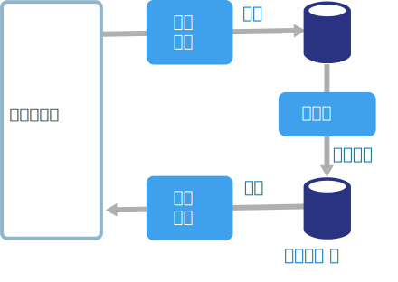
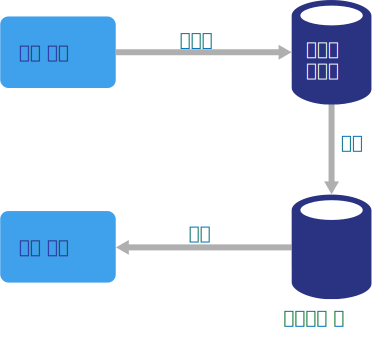
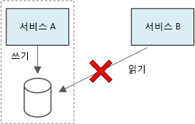
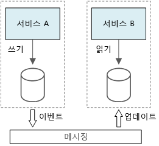

# CQRS 아키텍처 스타일

CQRS(명령 및 쿼리 책임 분리)는 쓰기 작업에서 읽기 작업을 구분하는 아키텍처 스타일입니다.

기존 아키텍처에서 데이터베이스를 쿼리하고 업데이트하는 데 동일한 데이터 모델을 사용합니다. 그러면 간단하고 기본적인 CRUD 작업에 적합합니다. 그러나 더 복잡한 애플리케이션에서는 이 방법을 사용하기 어려울 수 있습니다. 예를 들어 애플리케이션은 읽기 쪽에서 다른 쿼리를 수행할 수 있습니다. 그러면 모양이 다른 DTO(데이터 전송 개체)를 반환합니다. 개체 매핑이 복잡해 질 수 있습니다. 모델은 쓰기 쪽에서 복잡한 유효성 검사 및 비즈니스 논리를 구현할 수 있습니다. 따라서 너무 많은 작업을 수행하는 과도하게 복잡한 모델이 될 수 있습니다.

읽기 및 쓰기 워크로드는 매우 다른 성능 및 확장성 요구 사항을 포함하여 비대칭이라는 점이 또 다른 잠재적인 문제입니다.

CQRS는 읽기 및 쓰기를 구분된 모델로 구분하여 이러한 문제를 해결합니다. 이 때 데이터를 업데이트하는 **명령** 및 데이터를 읽는 **쿼리**를 사용합니다.

- 명령은 데이터 중심이 아닌 작업을 기반으로 해야 합니다. ("ReservationStatus를 Reserved로 설정"하지 않고 "호텔 객실 예약")명령은 동기적으로 처리되지 않고 비동기 처리를 위해 큐에 배치될 수 있습니다.

- 쿼리는 데이터베이스를 수정하지 않습니다. 쿼리는 도메인 정보를 캡슐화하지 않는 DTO를 반환합니다.

더 높은 격리 수준을 위해 쓰기 데이터에서 읽기 데이터를 물리적으로 구분할 수 있습니다. 이 경우에 읽기 데이터베이스는 쿼리에 대해 최적화된 고유한 데이터 스키마를 사용할 수 있습니다. 예를 들어 복잡한 조인이나 복잡한 O/RM 매핑을 방지하기 위해 데이터의 [구체화된 뷰][materialized-view]를 저장할 수 있습니다. 다른 유형의 데이터 저장소도 사용할 수 있습니다. 예를 들어 쓰기 데이터베이스가 관계형일 수 있는 반면 읽기 데이터베이스는 문서 데이터베이스입니다.

별도 읽기 및 쓰기 데이터베이스를 사용하는 경우 동기화를 유지해야 합니다. 일반적으로 데이터베이스를 업데이트할 때마다 쓰기 모델에서 이벤트를 게시함으로써 수행됩니다. 데이터베이스를 업데이트하고 이벤트를 게시하는 작업은 단일 트랜잭션에서 이루어져야 합니다.

CQRS의 일부 구현에서는 [이벤트 소싱 패턴][event-sourcing]을 사용합니다. 이러한 패턴에서 애플리케이션 상태는 이벤트의 시퀀스로 저장됩니다. 각 이벤트는 데이터에 대한 변경 집합을 나타냅니다. 현재 상태는 이벤트를 재생함으로써 구축됩니다. CQRS 컨텍스트에서 이벤트 소싱의 이점 중 하나는 다른 구성 요소 &mdash;를 알리는 데 동일한 이벤트를 사용할 수 있다는 점입니다. 특히 읽기 모델에 알립니다. 읽기 모델은 현재 상태의 스냅숏을 만드는 데 이벤트를 사용합니다. 이것이 쿼리에 보다 효과적입니다. 그러나 이벤트 소싱은 디자인에 복잡성을 추가합니다.

## 이 아키텍처를 사용하는 경우

읽기 및 쓰기 워크로드가 비대칭인 경우에 특히 많은 사용자가 동일한 데이터에 액세스하는 공동 작업 도메인에 CQRS를 사용하는 것이 좋습니다.

CQRS는 전체 시스템에 적용되는 최상위 아키텍처가 아닙니다. 읽기 및 쓰기를 구분하는 명확한 값이 있는 해당 하위 시스템에만 CQRS를 적용합니다. 그렇지 않으면 아무 이점 없이 복잡성만 추가하게 됩니다.

## 이점

- **독립적인 크기 조정** CQRS를 통해 읽기 및 쓰기 워크로드를 독립적으로 확장하고 더 적은 수의 잠금 경합이 발생할 수 있습니다.
- **최적화된 데이터 스키마**. 읽기 쪽에서는 쿼리에 최적화된 스키마를 사용하는 반면 쓰기 쪽에서는 업데이트에 최적화된 스키마를 사용할 수 있습니다.
- **보안**. 올바른 도메인 엔터티만 데이터에서 쓰기를 수행할 수 있는지 쉽게 확인할 수 있습니다.
- **문제 구분** 읽기 및 쓰기 쪽을 구분하면 유지 가능하고 유연한 모델을 생성할 수 있습니다. 대부분의 복잡한 비즈니스 논리는 쓰기 모델로 이동합니다. 읽기 모델은 상대적으로 간단할 수 있습니다.
- **단순한 쿼리** 읽기 데이터베이스에서 구체화된 뷰를 저장하여 쿼리할 때 애플리케이션은 복잡한 조인을 방지할 수 있습니다.

## 과제

- **복잡성**. CQRS의 기본 개념은 간단합니다. 하지만 이벤트 소싱 패턴을 포함하는 경우에 특히 더 복잡한 애플리케이션 디자인을 만들 수 있습니다.

- **메시징** CQRS에 메시징이 필요하지 않지만 명령을 처리하고 업데이트 이벤트를 게시하는 데 공통적으로 메시징을 사용합니다. 이 경우에 애플리케이션은 메시지 오류 또는 중복 메시지를 처리해야 합니다.

- **결과적 일관성** 읽기 및 쓰기 데이터베이스를 구분하는 경우 읽기 데이터는 기한이 경과되었을 수 있습니다.

## 모범 사례

- CQRS 구현에 대한 자세한 내용은 [CQRS 패턴][cqrs-pattern]을 참조하세요.

- [이벤트 소싱][event-sourcing] 패턴을 사용하여 업데이트 충돌을 방지하는 것이 좋습니다.

- 쿼리의 스키마를 최적화하기 위해 읽기 모델에 [구체화된 뷰 패턴][materialized-view]을 사용하는 것이 좋습니다.

## 마이크로 서비스의 CQRS

CQRS는 [마이크로 서비스 아키텍처][microservices]에서 특히 유용합니다. 마이크로 서비스의 원리 중 하나는 서비스가 다른 서비스의 데이터 저장소에 직접 액세스할 수 없다는 점입니다.

다음 다이어그램에서 서비스 A는 데이터 저장소에 기록하고 서비스 B는 데이터의 구체화된 뷰를 유지합니다. 서비스 A는 데이터 저장소에 기록할 때마다 이벤트를 게시합니다. 서비스 B는 이벤트를 구독합니다.

<!-- links -->

[cqrs-pattern]: ../../patterns/cqrs.md
[event-sourcing]: ../../patterns/event-sourcing.md
[materialized-view]: ../../patterns/materialized-view.md
[microservices]: ./microservices.md
