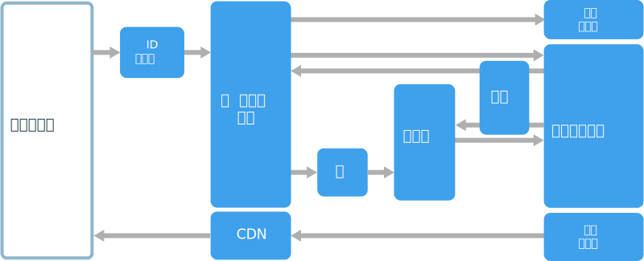
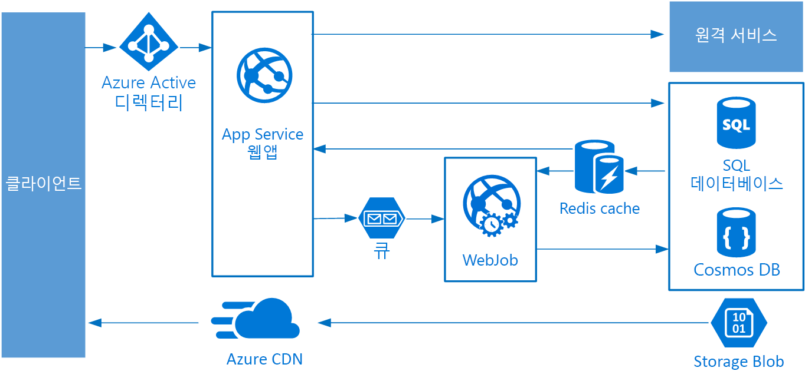

# 웹 큐 작업자 아키텍처 스타일Web-Queue-Worker architecture style

이 아키텍처의 핵심 구성 요소는 클라이언트 요청을 처리하는 **웹 프런트 엔드**와 리소스 집약적 작업, 장기 실행 워크플로 또는 일괄 처리 작업을 수행하는 **작업자**입니다.The core components of this architecture are a **web front end** that serves client requests, and a **worker** that performs resource-intensive tasks, long-running workflows, or batch jobs.  웹 프런트 엔드는 **메시지 큐**를 통해 작업자와 통신합니다.The web front end communicates with the worker through a **message queue**.

이 아키텍처에 공통적으로 통합되는 기타 구성 요소는 다음과 같습니다.Other components that are commonly incorporated into this architecture include:

- 하나 이상의 데이터베이스One or more databases.
- 빠른 읽기를 위해 데이터베이스의 값을 저장하는 캐시A cache to store values from the database for quick reads.
- 정적 콘텐츠를 제공하기 위한 CDNCDN to serve static content
- 원격 서비스(예: 전자 메일 또는 SMS 서비스)Remote services, such as email or SMS service. 종종 이러한 서비스는 타사에서 제공합니다.Often these are provided by third parties.
- 인증을 위한 ID 공급자Identity provider for authentication.

웹 및 작업자는 둘 다 상태 비저장입니다.The web and worker are both stateless. 세션 상태는 분산된 캐시에 저장할 수 있습니다.Session state can be stored in a distributed cache. 모든 장기 실행 작업은 작업자에 의해 비동기적으로 수행됩니다.Any long-running work is done asynchronously by the worker. 작업자는 큐의 메시지에 의해 트리거되거나, 일괄 처리 일정에 따라 실행될 수 있습니다.The worker can be triggered by messages on the queue, or run on a schedule for batch processing. 작업자는 선택적 구성 요소입니다.The worker is an optional component. 장기 실행 작업이 없는 경우 작업자를 생략할 수 있습니다.If there are no long-running operations, the worker can be omitted.

프런트 엔드는 웹 API로 구성될 수 있습니다.The front end might consist of a web API. 클라이언트 쪽에서 웹 API는 AJAX 호출을 하는 단일 페이지 애플리케이션 또는 네이티브 클라이언트 애플리케이션에서 사용될 수 있습니다.On the client side, the web API can be consumed by a single-page application that makes AJAX calls, or by a native client application.

## 이 아키텍처를 사용하는 경우When to use this architecture

일반적으로 웹 큐 작업자 아키텍처는 관리되는 컴퓨팅 서비스(Azure App Service 또는 Azure Cloud Services)를 사용하여 구현됩니다.The Web-Queue-Worker architecture is typically implemented using managed compute services, either Azure App Service or Azure Cloud Services.

다음과 같은 경우 이 아키텍처 스타일을 고려합니다.Consider this architecture style for:

- 비교적 간단한 도메인이 있는 애플리케이션Applications with a relatively simple domain.
- 장기 실행 워크플로 또는 일괄 처리 작업을 일부 포함하는 애플리케이션Applications with some long-running workflows or batch operations.
- IaaS(Infrastructure as a Service)가 아닌 관리되는 서비스를 사용하려는 경우When you want to use managed services, rather than infrastructure as a service (IaaS).

## 이점Benefits

- 이해하기 쉬운 비교적 간단한 아키텍처입니다.Relatively simple architecture that is easy to understand.
- 쉽게 배포 및 관리할 수 있습니다.Easy to deploy and manage.
- 문제가 명확히 구분됩니다.Clear separation of concerns.
- 프런트 엔드는 비동기 메시징을 사용하여 작업자에서 분리됩니다.The front end is decoupled from the worker using asynchronous messaging.
- 프런트 엔드 및 작업자 크기는 독립적으로 조정됩니다.The front end and the worker can be scaled independently.

## 과제Challenges

- 주의깊게 디자인하지 않으면 프런트 엔드 및 작업자가 유지 관리 및 업데이트가 어려운 한 덩어리의 커다란 구성 요소로 변할 수 있습니다.Without careful design, the front end and the worker can become large, monolithic components that are difficult to maintain and update.
- 프런트 엔드 및 작업자가 데이터 스키마 또는 코드 모듈을 공유하는 경우 숨겨진 종속성이 있을 수 있습니다.There may be hidden dependencies, if the front end and worker share data schemas or code modules.

## 모범 사례Best practices

- 클라이언트에 잘 디자인된 API를 노출합니다.Expose a well-designed API to the client. [API 디자인 모범 사례][api-design]를 참조하세요.See [API design best practices][api-design].
- 부하 변경을 처리하도록 자동으로 크기가 조정됩니다.Autoscale to handle changes in load. [자동 크기 조정 모범 사례][autoscaling]를 참조하세요.See [Autoscaling best practices][autoscaling].
- 반정적 데이터를 캐시합니다.Cache semi-static data. [캐싱 모범 사례][caching]를 참조하세요.See [Caching best practices][caching].
- CDN을 사용하여 정적 콘텐츠를 호스트합니다.Use a CDN to host static content. [CDN 모범 사례][cdn]를 참조하세요.See [CDN best practices][cdn].
- 적절한 경우 polyglot 지속성을 사용합니다.Use polyglot persistence when appropriate. [작업에 가장 적합한 데이터 저장소 사용][polyglot]을 참조하세요.See [Use the best data store for the job][polyglot].
- 데이터를 분할하여 확장성을 향상시키고 경합을 줄여 성능을 최적화합니다.Partition data to improve scalability, reduce contention, and optimize performance. [데이터 분할 모범 사례][data-partition]를 참조하세요.See [Data partitioning best practices][data-partition].

## Azure App Service의 웹 큐 작업자Web-Queue-Worker on Azure App Service

이 섹션에서는 Azure App Service를 사용하는 권장 웹 큐 작업자 아키텍처에 대해 설명합니다.This section describes a recommended Web-Queue-Worker architecture that uses Azure App Service.

프런트 엔드는 Azure App Service 웹앱으로 구현되고, 작업자는 웹 작업으로 구현됩니다.The front end is implemented as an Azure App Service web app, and the worker is implemented as a WebJob. 웹앱과 웹 작업은 둘 다 VM 인스턴스를 제공하는 App Service 계획에 연결되어 있습니다.The web app and the WebJob are both associated with an App Service plan that provides the VM instances.

메시지 큐에 대해 Azure Service Bus 또는 Azure Atorage 큐를 사용할 수 있습니다.You can use either Azure Service Bus or Azure Storage queues for the message queue. (이 다이어그램은 Azure Storage 큐를 보여 줍니다.)(The diagram shows an Azure Storage queue.)

Azure Redis Cache는 낮은 대기 시간 액세스가 필요한 기타 데이터 및 세션 상태를 저장합니다.Azure Redis Cache stores session state and other data that needs low latency access.

Azure CDN은 이미지, CSS 또는 HTML과 같은 정적 콘텐츠를 캐시하는 데 사용됩니다.Azure CDN is used to cache static content such as images, CSS, or HTML.

저장소의 경우, 애플리케이션의 요구에 가장 잘 맞는 저장소 기술을 선택합니다.For storage, choose the storage technologies that best fit the needs of the application. 여러 저장소 기술(polyglot 지속성)을 사용할 수 있습니다.You might use multiple storage technologies (polyglot persistence). 이 아이디어를 설명하기 위해 이 다이어그램은 Azure SQL Database 및 Azure Cosmos DB를 보여 줍니다.To illustrate this idea, the diagram shows Azure SQL Database and Azure Cosmos DB.

자세한 내용은 [App Service 웹 애플리케이션 참조 아키텍처][scalable-web-app]를 참조하세요.For more details, see [App Service web application reference architecture][scalable-web-app].

### 추가 고려 사항Additional considerations

- 모든 트랜잭션이 큐 및 작업자를 거쳐 저장소로 이동해야 하는 것은 아닙니다.Not every transaction has to go through the queue and worker to storage. 웹 프런트 엔드는 간단한 읽기/쓰기 작업을 직접 수행할 수 있습니다.The web front end can perform simple read/write operations directly. 작업자는 리소스 집약적인 작업 또는 장기 실행 워크플로를 위해 디자인되었습니다.Workers are designed for resource-intensive tasks or long-running workflows. 경우에 따라 작업자가 전혀 필요하지 않을 수도 있습니다.In some cases, you might not need a worker at all.

- App Service의 기본 제공 자동 크기 조정 기능을 사용하여 VM 인스턴스 수를 스케일 아웃합니다.Use the built-in autoscale feature of App Service to scale out the number of VM instances. 애플리케이션의 부하가 예측 가능한 패턴을 따를 경우 일정 기반 자동 크기 조정을 사용합니다.If the load on the application follows predictable patterns, use schedule-based autoscale. 부하를 예측할 수 없는 경우 메트릭 기반 자동 크기 조정 규칙을 사용합니다.If the load is unpredictable, use metrics-based autoscaling rules.

- 웹앱 및 웹 작업을 별도의 App Service 계획에 포함하는 것이 좋습니다.Consider putting the web app and the WebJob into separate App Service plans. 이런 방식으로 이러한 항목이 별도 VM 인스턴스에 호스트되고, 독립적으로 크기가 조정될 수 있습니다.That way, they are hosted on separate VM instances and can be scaled independently.

- 프로덕션 및 테스트에 대해 별도 App Service 계획을 사용합니다.Use separate App Service plans for production and testing. 그렇지 않고 프로덕션 및 테스트에 동일한 계획을 사용하는 것은 프로덕션 VM에서 테스트를 실행하는 것을 의미합니다.Otherwise, if you use the same plan for production and testing, it means your tests are running on your production VMs.

- 배포 슬롯을 사용하여 배포를 관리합니다.Use deployment slots to manage deployments. 이렇게 하면 업데이트된 버전을 스테이징 슬롯에 배포한 다음 새 버전으로 교체할 수 있습니다.This lets you to deploy an updated version to a staging slot, then swap over to the new version. 또한 업데이트에 문제가 발생하면 이전 버전으로 다시 교체할 수 있습니다.It also lets you swap back to the previous version, if there was a problem with the update.

<!-- links -->

[api-design]: ../../best-practices/api-design.md
[autoscaling]: ../../best-practices/auto-scaling.md
[caching]: ../../best-practices/caching.md
[cdn]: ../../best-practices/cdn.md
[data-partition]: ../../best-practices/data-partitioning.md
[polyglot]: ../design-principles/use-the-best-data-store.md
[scalable-web-app]: ../../reference-architectures/app-service-web-app/scalable-web-app.md