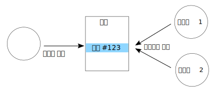

# 조정 최소화

## 확장성을 위해 애플리케이션 서비스 간의 조정 최소화

대부분의 클라우드 애플리케이션은 웹 프런트 엔드, 데이터베이스, 비즈니스 프로세스, 보고 및 분석 등 여러 애플리케이션 서비스 &mdash;로 구성됩니다. 확장성 및 안정성을 얻으려면 이러한 각 서비스가 여러 인스턴스에서 실행되어야 합니다.

두 인스턴스가 일부 공유 상태에 영향을 주는 작업을 동시에 수행하려고 하면 어떻게 될까요? ACID 보장 유지 등을 위해 노드 간에 조정이 필요한 경우도 있습니다. 이 다이어그램에서 `Node2`는 `Node1`에서 데이터베이스 잠금을 해제할 때까지 대기 중입니다.

조정은 수평적 확장의 혜택을 제한하고 병목 상태를 만듭니다. 이 예제에서는 애플리케이션을 확장하고 인스턴스를 추가함에 따라 잠금 경합이 증가합니다. 최악의 경우 프론트 엔드 인스턴스가 잠금을 기다리는 데 대부분의 시간을 허비합니다.

"정확히 한 번" 의미 체계도 조정이 자주 발생하는 원인 중 하나입니다. 예를 들어 주문이 정확히 한 번 처리되어야 합니다. 두 명의 작업자가 새 주문을 수신 대기 중입니다. `Worker1`이 처리를 위해 주문을 선택합니다. 애플리케이션에서 `Worker2`가 작업을 중복하지 않고, `Worker1` 작동이 중단될 경우 주문이 삭제되지 않도록 해야 합니다.

[Scheduler 에이전트 감독자][sas-pattern] 등의 패턴을 사용하여 작업자 간에 조정할 수 있지만, 이 경우 작업을 분할하는 것이 더 나을 수 있습니다. 각 작업자에게 특정 범위의 주문(가령, 청구 지역별)이 할당됩니다. 작업자 작동이 중단될 경우 새 인스턴스에서 이전 인스턴스가 중단된 지점을 선택하지만 여러 인스턴스가 경합하지는 않습니다.

## 권장 사항

**결과적 일관성 보장**. 데이터가 분산된 경우 강력한 일관성 보장을 적용하려면 조정이 필요합니다. 예를 들어 한 작업에서 두 데이터베이스를 업데이트한다고 가정할 경우, 이 작업을 단일 트랜잭션 범위에 넣는 대신 시스템이 실패 후 논리적으로 롤백하기 위해 [보상 트랜잭션][compensating-transaction] 패턴을 사용하여 결과적 일관성을 수용할 수 있다면 더 나을 것입니다.

**도메인 이벤트를 사용하여 상태 동기화**. [도메인 이벤트][domain-event]는 도메인 내에서 중요한 사항이 발생할 때 기록되는 이벤트입니다. 글로벌 트랜잭션을 사용하여 여러 서비스 간에 조정하는 대신 관심 있는 서비스가 이벤트를 수신 대기할 수 있습니다. 이 접근 방법을 사용할 경우 시스템이 결과적 일관성(이전 항목 참조)을 허용해야 합니다.

**CQRS, 이벤트 소싱 등의 패턴 고려**. 이러한 두 패턴은 읽기 워크로드와 쓰기 워크로드 간의 경합을 줄이는 데 도움이 됩니다.

- [CQRS 패턴][cqrs-pattern]은 읽기 작업과 쓰기 작업을 구분합니다. 일부 구현에서는 데이터 읽기와 데이터 쓰기가 물리적으로 분리됩니다.

- [이벤트 소싱 패턴][event-sourcing]에서는 상태 변경이 추가 전용 데이터 저장소에 일련의 이벤트로 기록됩니다. 스트림에 이벤트 추가가 최소 잠금이 필요한 원자성 작업이 됩니다.

이러한 두 패턴은 서로 보완됩니다. CQRS의 쓰기 전용 저장소가 이벤트 소싱을 사용하는 경우 읽기 전용 저장소는 동일한 이벤트를 수신 대기하여 쿼리에 최적화된 현재 상태의 읽기 가능 스냅숏을 만들 수 있습니다. 그러나 CQRS 또는 이벤트 소싱을 채택하기 전에 이 접근 방법의 과제를 알고 있어야 합니다. 자세한 내용은 [CQRS 아키텍처 스타일][cqrs-style]을 참조하세요.

**데이터 분할**.  여러 애플리케이션 서비스에서 공유되는 하나의 데이터 스키마에 데이터를 모두 넣지 않도록 합니다. 마이크로 서비스 아키텍처는 각 서비스가 자체 데이터 저장소를 담당하도록 하여 이 원칙을 적용합니다. 단일 데이터베이스 내에서 데이터를 분할된 데이터베이스로 분할하면 특정 분할된 데이터베이스에 쓰는 서비스가 다른 분할된 데이터베이스에 쓰는 서비스에 영향을 주지 않으므로 동시성이 향상될 수 있습니다.

**멱등적 작업 디자인**. 가능할 경우 작업을 멱등적으로 디자인합니다. 이렇게 하면 최소 한 번 의미 체계를 사용하여 작업을 처리할 수 있습니다. 예를 들어 작업 항목을 큐에 넣을 수 있습니다. 작업 도중 작업자 작동이 중단될 경우 다른 작업자가 작업 항목을 선택하면 됩니다.

**비동기 병렬 처리 사용**. 작업에 비동기적으로 수행되는 여러 단계가 필요한 경우(예: 원격 서비스 호출) 병렬로 호출한 다음 결과를 집계할 수 있습니다. 이 접근 방법에서는 각 단계가 이전 단계의 결과에 따라 달라지지 않는다고 가정합니다.

**가능한 경우 낙관적 동시성 사용**. 비관적 동시성 제어는 데이터베이스 잠금을 사용하여 충돌을 방지합니다. 이로 인해 성능이 저하되고 가용성이 감소할 수 있습니다. 낙관적 동시성 제어를 사용하여 각 트랜잭션이 데이터 복사본 또는 스냅숏을 수정합니다. 트랜잭션이 커밋되면 데이터베이스 엔진이 트랜잭션의 유효성을 검사하고 데이터베이스 일관성에 영향을 주는 트랜잭션을 거부합니다.

Azure SQL Database 및 SQL Server는 [스냅숏 격리][sql-snapshot-isolation]를 통해 낙관적 동시성을 지원합니다. [Azure Cosmos DB][cosmosdb-faq] 및 [Azure Storage][storage-concurrency]를 비롯한 일부 Azure Storage 서비스는 Etags를 사용하여 낙관적 동시성을 지원합니다.

**MapReduce 또는 기타 병렬 분산 알고리즘 고려**. 수행할 작업 유형과 데이터에 따라 병렬로 작동하는 여러 노드에서 수행할 수 있는 독립 태스크로 작업을 분할할 수 있습니다. [큰 계산 아키텍처 스타일][big-compute]을 참조하세요.

**조정을 위해 리더 선택 사용**. 작업을 조정해야 하는 경우 코디네이터가 애플리케이션의 단일 실패 지점이 되지 않도록 합니다. [리더 선택 패턴][leader-election]을 사용하면 언제든지 한 인스턴스가 리더가 되어 코디네이터 역할을 합니다. 리더가 실패하면 새 인스턴스가 리더로 선택됩니다.

<!-- links -->

[big-compute]: ../architecture-styles/big-compute.md
[compensating-transaction]: ../../patterns/compensating-transaction.md
[cqrs-style]: ../architecture-styles/cqrs.md
[cqrs-pattern]: ../../patterns/cqrs.md
[cosmosdb-faq]: /azure/cosmos-db/faq
[domain-event]: https://martinfowler.com/eaaDev/DomainEvent.html
[event-sourcing]: ../../patterns/event-sourcing.md
[leader-election]: ../../patterns/leader-election.md
[sas-pattern]: ../../patterns/scheduler-agent-supervisor.md
[sql-snapshot-isolation]: /sql/t-sql/statements/set-transaction-isolation-level-transact-sql
[storage-concurrency]: https://azure.microsoft.com/blog/managing-concurrency-in-microsoft-azure-storage-2/