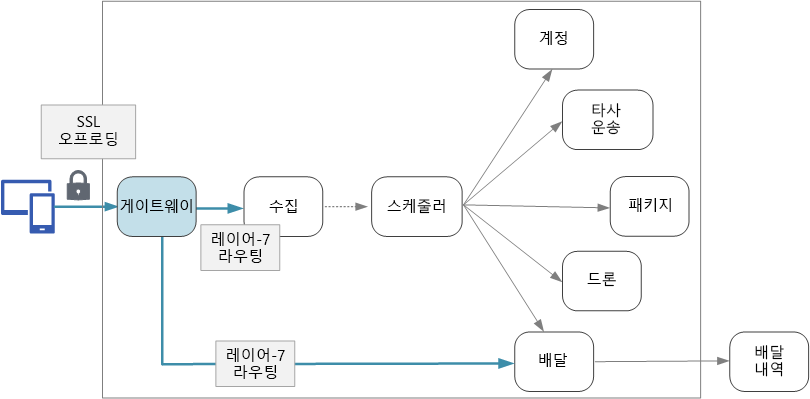

# 마이크로 서비스 디자인: API 게이트웨이

마이크로 서비스 아키텍처에서 클라이언트는 둘 이상의 프런트 엔드 서비스와 상호 작용할 수 있습니다. 이 사실을 감안할 때 클라이언트가 호출할 엔드포인트를 어떻게 알 수 있나요? 새 서비스가 도입되거나 기존 서비스가 리팩터링되면 어떻게 되나요? 서비스에서 SSL 종료, 인증 및 기타 고려 사항을 어떻게 처리하나요? *API 게이트웨이*는 이러한 도전 과제를 처리하는 데 도움이 됩니다. 

## API 게이트웨이란?

API 게이트웨이는 클라이언트와 서비스 사이에 배치합니다. 역방향 프록시로 작동하면서 클라이언트에서 서비스로 요청을 라우팅합니다. 또한 인증, SSL 종료 및 속도 제한과 같은 다양한 교차 작업을 수행할 수도 있습니다. 게이트웨이를 배포하지 않으면 클라이언트는 프런트 엔드 서비스로 직접 요청을 보내야 합니다. 단, 서비스를 클라이언트에 직접 노출하는 데에는 몇 가지 잠재적인 문제가 있습니다.

- 클라이언트 코드가 복잡해질 수 있습니다. 클라이언트는 여러 엔드포인트를 추적해야 하고 복원성 있는 방식으로 오류를 처리해야 합니다. 
- 클라이언트와 백 엔드 간의 결합을 만듭니다. 클라이언트는 개별 서비스가 분해되는 방식을 알아야 합니다. 따라서 클라이언트 유지 관리가 어렵고 서비스를 리팩터링하는 것도 더 어렵습니다.
- 단일 작업에 여러 서비스에 대한 호출이 필요할 수 있습니다. 이로 인해 클라이언트와 서버 사이에 다수의 네트워크 왕복이 발생하여 상당한 대기 시간이 추가될 수 있습니다. 
- 각각의 공용 서비스는 인증, SSL 및 클라이언트 속도 제한 등의 문제를 처리해야 합니다. 
- 서비스는 HTTP나 WebSocket과 같은 클라이언트 친화적인 프로토콜을 노출해야 합니다. 이로 인해 [통신 프로토콜](./interservice-communication.md) 선택이 제한됩니다. 
- 공용 엔드포인트가 있는 서비스는 잠재적으로 공격에 대한 취약성이며 강화되어야 합니다.

게이트웨이는 서비스에서 클라이언트를 분리하여 이러한 문제를 해결하는 데 도움이 됩니다. 게이트웨이는 다양한 기능을 수행할 수 있으며 이러한 기능이 모두 필요하지 않을 수 있습니다. 함수는 다음과 같은 디자인 패턴으로 그룹화할 수 있습니다.

[게이트웨이 라우팅](../patterns/gateway-routing.md). 계층 7 라우팅을 사용하여 게이트웨이를 역방향 프록시로 사용하여 하나 이상의 백 엔드 서비스로 요청을 라우팅합니다. 게이트웨이는 클라이언트용 단일 엔드포인트를 제공하고 서비스에서 클라이언트를 분리하는 데 도움이 됩니다. 

[게이트웨이 집계](../patterns/gateway-aggregation.md). 게이트웨이를 사용하여 여러 개별 요청을 단일 요청으로 집계합니다. 이 패턴은 단일 작업에 여러 백엔드 서비스에 대한 호출이 필요한 경우에 적용됩니다. 클라이언트는 하나의 요청을 게이트웨이로 전송합니다. 게이트웨이는 다양한 백 엔드 서비스에 요청을 발송한 다음 결과를 집계하여 클라이언트에 다시 보냅니다. 이렇게 하면 클라이언트와 백 엔드 사이에 전송량을 줄이는 데 도움이 됩니다. 

[게이트웨이 오프로딩](../patterns/gateway-offloading.md). 게이트웨이를 사용하여 개별 서비스의 기능, 특히 교차 작업을 게이트웨이로 오프로드 할 수 있습니다. 이러한 기능을 모든 서비스가 구현하도록 하는 대신 한 곳에 통합하는 것이 유용할 수 있습니다. 인증 및 권한 부여와 같이 올바르게 구현해야 하는 특수 기술이 필요한 기능의 경우 특히 그렇습니다. 

다음은 게이트웨이에 오프로드할 수 있는 기능의 몇 가지 예입니다.

- SSL 종료
- 인증
- IP 허용 목록
- 클라이언트 속도 제한(제한)
- 로깅 및 모니터링
- 응답 캐싱
- 웹 애플리케이션 방화벽
- GZIP 압축
- 정적 콘텐츠 서비스

## 게이트웨이 기술 선택

다음은 응용 프로그램에 API 게이트웨이를 구현하는 몇 가지 옵션입니다.

- **역방향 프록시 서버**. Nginx 및 HAProxy는 많이 사용되는 역방향 프록시 서버이며 부하 분산, SSL 및 계층 7 라우팅과 같은 기능을 지원합니다. 두 가지 모두 무료 오픈 소스 제품이며 추가 기능과 지원 옵션을 제공하는 유료 버전이 있습니다. Nginx 및 HAProxy 모두 다양한 기능 집합이 있는 고성능의 완성도 높은 제품입니다. 타사 모듈을 사용하거나 Lua에 사용자 지정 스크립트를 작성하여 확장할 수 있습니다. Nginx는 NginScript라는 JavaScript 기반 스크립팅 모듈을 지원합니다.

- **서비스 메시 수신 컨트롤러**. linkerd 또는 Istio와 같은 서비스 메시를 사용하는 경우에는 해당 서비스 메시에 대해 수신 컨트롤러가 제공하는 기능을 고려합니다. 예를 들어 Istio 수신 컨트롤러는 계층 7 라우팅, HTTP 리디렉션, 다시 시도 및 기타 기능을 지원합니다. 

- [Azure Application Gateway](/azure/application-gateway/). Application Gateway는 계층 7 라우팅과 SSL 종료를 수행할 수 있는 관리되는 부하 분산 서비스입니다. WAF(웹 응용 프로그램 방화벽)도 제공합니다.

- [Azure API Management](/azure/api-management/). API Management는 외부 및 내부 소비자에게 API를 게시하기 위한 턴키 방식 솔루션입니다. Azure Active Directory나 기타 ID 공급자를 사용하여 속도 제한, IP 허용 목록 및 인증을 비롯한 공용 API를 관리하는 데 유용한 기능을 제공합니다. API Management는 부하 분산을 수행하지 않기 때문에 Application Gateway나 역방향 프록시와 같은 부하 분산 장치와 결합하여 사용해야 합니다. Application Gateway에서 API Management를 사용하는 방법에 대한 자세한 내용은 [내부 VNET에서 Application Gateway와 API Management 통합](/azure/api-management/api-management-howto-integrate-internal-vnet-appgateway)을 참조하세요.

게이트웨이 기술을 선택할 때 다음 사항을 고려하십시오.

**기능**. 위에 나열된 옵션은 모두 계층 7 라우팅을 지원하지만 다른 기능에 대한 지원은 다양합니다. 필요한 기능에 따라 둘 이상의 게이트웨이를 배포할 수 있습니다. 

**배포**. Azure Application Gateway와 API Management는 관리되는 서비스입니다. Nginx 및 HAProxy는 일반적으로 클러스터 내부의 컨테이너에서 실행되지만 클러스터 외부의 전용 VM에도 배포할 수 있습니다. 이렇게 하면 게이트웨이가 워크로드의 나머지 부분과 격리되지만 관리 오버헤드가 더 높아집니다.

**관리**. 서비스가 업데이트되거나 새 서비스가 추가되면 게이트웨이 라우팅 규칙을 업데이트해야 할 수 있습니다. 이 프로세스를 어떻게 관리할지 고려해야 합니다. SSL 인증서, IP 허용 목록 및 기타 구성 측면을 관리하는 경우에도 비슷한 고려 사항이 적용됩니다.

## Kubernetes에 Nginx 또는 HAProxy 배포

Nginx 또는 HAProxy를 Nginx 또는 HAProxy 컨테이너 이미지를 지정하는 [ReplicaSet](https://kubernetes.io/docs/concepts/workloads/controllers/replicaset/) 또는[DaemonSet](https://kubernetes.io/docs/concepts/workloads/controllers/daemonset/)으로 Kubernetes에 배포할 수 있습니다. ConfigMap을 사용하여 프록시에 대한 구성 파일을 저장하고 ConfigMap을 볼륨으로 탑재합니다. Azure Load Balancer를 통해 게이트웨이를 노출하려면 LoadBalancer 유형의 서비스를 만듭니다. 

대안은 수신 컨트롤러를 만드는 것입니다. 수신 컨트롤러는 부하 분산 장치 또는 역방향 프록시 서버를 배포하는 Kubernetes 리소스입니다. Nginx와 HAProxy를 비롯한 여러 가지 구현이 존재합니다. Ingress라는 별도의 리소스는 라우팅 규칙 및 TLS 인증서와 같은 수신 컨트롤러에 대한 설정을 정의합니다. 이렇게 하면 특정 프록시 서버 기술과 관련된 복잡한 구성 파일을 관리할 필요가 없습니다.

게이트웨이는 잠재적인 병목 현상 또는 시스템의 SPOF이기 때문에 고가용성을 위해 항상 두 개 이상의 복제본 배포하십시오. 부하에 따라 복제본을 더 확장해야 할 수도 있습니다. 

또한 클러스터의 전용 노드 집합에서 게이트웨이를 실행하는 것도 좋습니다. 이 방법의 이점은 다음과 같습니다.

- 격리. 모든 인바운드 트래픽은 백 엔드 서비스와 격리될 수 있는 고정된 노드 집합으로 이동합니다.

- 안정적인 구성. 게이트웨이를 잘못 구성하면 전체 응용 프로그램을 사용할 수 없게 될 수 있습니다. 

- 성능. 성능상의 이유로 특정 VM 구성을 게이트웨이에 사용할 수 있습니다.

> [!div class="nextstepaction"]
> [로깅 및 모니터링](./logging-monitoring.md)
