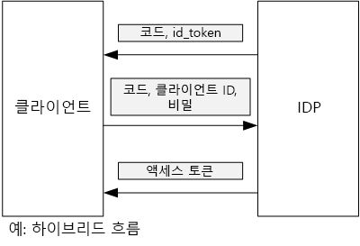

# <a name="use-client-assertion-to-get-access-tokens-from-azure-ad"></a><span data-ttu-id="a9f22-103">Azure AD에서 액세스 토큰을 가져오는 데 클라이언트 어설션 사용</span><span class="sxs-lookup"><span data-stu-id="a9f22-103">Use client assertion to get access tokens from Azure AD</span></span>

<span data-ttu-id="a9f22-104">[ 샘플 코드][sample application]</span><span class="sxs-lookup"><span data-stu-id="a9f22-104">[ Sample code][sample application]</span></span>

## <a name="background"></a><span data-ttu-id="a9f22-105">백그라운드</span><span class="sxs-lookup"><span data-stu-id="a9f22-105">Background</span></span>
<span data-ttu-id="a9f22-106">OpenID Connect에서 인증 코드 흐름 또는 하이브리드 흐름을 사용하는 경우 클라이언트는 액세스 토큰에 대한 인증 코드를 교환합니다.</span><span class="sxs-lookup"><span data-stu-id="a9f22-106">When using authorization code flow or hybrid flow in OpenID Connect, the client exchanges an authorization code for an access token.</span></span> <span data-ttu-id="a9f22-107">이 단계에서 클라이언트는 서버에 자신을 인증해야 합니다.</span><span class="sxs-lookup"><span data-stu-id="a9f22-107">During this step, the client has to authenticate itself to the server.</span></span>



<span data-ttu-id="a9f22-109">클라이언트를 인증하는 한 가지 방법은 클라이언트 암호를 사용하는 것입니다.</span><span class="sxs-lookup"><span data-stu-id="a9f22-109">One way to authenticate the client is by using a client secret.</span></span> <span data-ttu-id="a9f22-110">기본적으로 [Tailspin 설문 조사][Surveys] 애플리케이션은 이러한 방식으로 구성됩니다.</span><span class="sxs-lookup"><span data-stu-id="a9f22-110">That's how the [Tailspin Surveys][Surveys] application is configured by default.</span></span>

<span data-ttu-id="a9f22-111">다음은 IDP에 액세스 토큰을 요청하는 클라이언트 요청의 예입니다.</span><span class="sxs-lookup"><span data-stu-id="a9f22-111">Here is an example request from the client to the IDP, requesting an access token.</span></span> <span data-ttu-id="a9f22-112">`client_secret` 매개 변수에 주목하세요.</span><span class="sxs-lookup"><span data-stu-id="a9f22-112">Note the `client_secret` parameter.</span></span>

```
POST https://login.microsoftonline.com/b9bd2162xxx/oauth2/token HTTP/1.1
Content-Type: application/x-www-form-urlencoded

resource=https://tailspin.onmicrosoft.com/surveys.webapi
  &client_id=87df91dc-63de-4765-8701-b59cc8bd9e11
  &client_secret=i3Bf12Dn...
  &grant_type=authorization_code
  &code=PG8wJG6Y...
```

<span data-ttu-id="a9f22-113">암호는 문자열일 뿐이므로 값을 유출해서는 안 됩니다.</span><span class="sxs-lookup"><span data-stu-id="a9f22-113">The secret is just a string, so you have to make sure not to leak the value.</span></span> <span data-ttu-id="a9f22-114">클라이언트 암호를 소스 제어에서 분리하는 것이 가장 좋습니다.</span><span class="sxs-lookup"><span data-stu-id="a9f22-114">The best practice is to keep the client secret out of source control.</span></span> <span data-ttu-id="a9f22-115">Azure에 배포하는 경우 암호를 [앱 설정][configure-web-app]에 저장합니다.</span><span class="sxs-lookup"><span data-stu-id="a9f22-115">When you deploy to Azure, store the secret in an [app setting][configure-web-app].</span></span>

<span data-ttu-id="a9f22-116">그러나 Azure 구독에 액세스할 수 있는 모든 사람이 앱 설정을 볼 수 있습니다.</span><span class="sxs-lookup"><span data-stu-id="a9f22-116">However, anyone with access to the Azure subscription can view the app settings.</span></span> <span data-ttu-id="a9f22-117">또한 암호를 소스 제어(예: 배포 스크립트)로 체크 인하고 전자 메일 등으로 공유하려는 유혹이 항상 있습니다.</span><span class="sxs-lookup"><span data-stu-id="a9f22-117">Further, there is always a temptation to check secrets into source control (e.g., in deployment scripts), share them by email, and so on.</span></span>

<span data-ttu-id="a9f22-118">보안을 강화하기 위해 클라이언트 암호 대신 [클라이언트 어설션] 을 사용할 수 있습니다.</span><span class="sxs-lookup"><span data-stu-id="a9f22-118">For additional security, you can use [client assertion] instead of a client secret.</span></span> <span data-ttu-id="a9f22-119">클라이언트 어설션을 사용하는 경우 클라이언트는 X.509 인증서를 사용하여 토큰 요청을 증명합니다.</span><span class="sxs-lookup"><span data-stu-id="a9f22-119">With client assertion, the client uses an X.509 certificate to prove the token request came from the client.</span></span> <span data-ttu-id="a9f22-120">클라이언트 인증서는 웹 서버에 설치됩니다.</span><span class="sxs-lookup"><span data-stu-id="a9f22-120">The client certificate is installed on the web server.</span></span> <span data-ttu-id="a9f22-121">일반적으로 누구도 클라이언트 암호를 고의로 노출하지 못하도록 하는 것보다 인증서에 대한 액세스를 제한하는 것이 더 쉽습니다.</span><span class="sxs-lookup"><span data-stu-id="a9f22-121">Generally, it will be easier to restrict access to the certificate, than to ensure that nobody inadvertently reveals a client secret.</span></span> <span data-ttu-id="a9f22-122">웹앱에서 인증서를 구성하는 방법에 대한 자세한 내용은 [Azure 웹 사이트 애플리케이션에서 인증서 사용][using-certs-in-websites]을 참조하세요.</span><span class="sxs-lookup"><span data-stu-id="a9f22-122">For more information about configuring certificates in a web app, see [Using Certificates in Azure Websites Applications][using-certs-in-websites]</span></span>

<span data-ttu-id="a9f22-123">다음은 클라이언트 어설션을 사용한 토큰 요청입니다.</span><span class="sxs-lookup"><span data-stu-id="a9f22-123">Here is a token request using client assertion:</span></span>

```
POST https://login.microsoftonline.com/b9bd2162xxx/oauth2/token HTTP/1.1
Content-Type: application/x-www-form-urlencoded

resource=https://tailspin.onmicrosoft.com/surveys.webapi
  &client_id=87df91dc-63de-4765-8701-b59cc8bd9e11
  &client_assertion_type=urn:ietf:params:oauth:client-assertion-type:jwt-bearer
  &client_assertion=eyJhbGci...
  &grant_type=authorization_code
  &code= PG8wJG6Y...
```

<span data-ttu-id="a9f22-124">`client_secret` 매개 변수는 더 이상 사용되지 않습니다.</span><span class="sxs-lookup"><span data-stu-id="a9f22-124">Notice that the `client_secret` parameter is no longer used.</span></span> <span data-ttu-id="a9f22-125">대신 `client_assertion` 매개 변수에 클라이언트 인증서를 사용하여 서명된 JWT 토큰이 포함되어 있습니다.</span><span class="sxs-lookup"><span data-stu-id="a9f22-125">Instead, the `client_assertion` parameter contains a JWT token that was signed using the client certificate.</span></span> <span data-ttu-id="a9f22-126">`client_assertion_type` 매개 변수는 어설션의 형식(이 경우 JWT 토큰)을 지정합니다.</span><span class="sxs-lookup"><span data-stu-id="a9f22-126">The `client_assertion_type` parameter specifies the type of assertion &mdash; in this case, JWT token.</span></span> <span data-ttu-id="a9f22-127">서버는 JWT 토큰의 유효성을 검사합니다.</span><span class="sxs-lookup"><span data-stu-id="a9f22-127">The server validates the JWT token.</span></span> <span data-ttu-id="a9f22-128">JWT 토큰이 유효하지 않은 경우 토큰 요청에서 오류가 반환됩니다.</span><span class="sxs-lookup"><span data-stu-id="a9f22-128">If the JWT token is invalid, the token request returns an error.</span></span>

> [!NOTE]
> <span data-ttu-id="a9f22-129">X.509 인증서는 클라이언트 어설션의 유일한 형식이 아닙니다. 그렇지만 Azure AD에서 지원되므로 여기서는 이 인증서를 중점적으로 다룹니다.</span><span class="sxs-lookup"><span data-stu-id="a9f22-129">X.509 certificates are not the only form of client assertion; we focus on it here because it is supported by Azure AD.</span></span>
> 
> 

<span data-ttu-id="a9f22-130">웹 애플리케이션은 런타임에 인증서 저장소에서 인증서를 읽습니다.</span><span class="sxs-lookup"><span data-stu-id="a9f22-130">At run time, the web application reads the certificate from the certificate store.</span></span> <span data-ttu-id="a9f22-131">웹앱과 동일한 컴퓨터에 인증서를 설치해야 합니다.</span><span class="sxs-lookup"><span data-stu-id="a9f22-131">The certificate must be installed on the same machine as the web app.</span></span>

<span data-ttu-id="a9f22-132">설문 조사 애플리케이션에는 Azure AD에서 토큰을 획득하기 위해 [AuthenticationContext.AcquireTokenSilentAsync](/dotnet/api/microsoft.identitymodel.clients.activedirectory.authenticationcontext.acquiretokensilentasync) 메서드에 전달할 수 있는 [ClientAssertionCertificate](/dotnet/api/microsoft.identitymodel.clients.activedirectory.clientassertioncertificate)를 만드는 도우미 클래스가 포함되어 있습니다.</span><span class="sxs-lookup"><span data-stu-id="a9f22-132">The Surveys application includes a helper class that creates a [ClientAssertionCertificate](/dotnet/api/microsoft.identitymodel.clients.activedirectory.clientassertioncertificate) that you can pass to the [AuthenticationContext.AcquireTokenSilentAsync](/dotnet/api/microsoft.identitymodel.clients.activedirectory.authenticationcontext.acquiretokensilentasync) method to acquire a token from Azure AD.</span></span>

```csharp
public class CertificateCredentialService : ICredentialService
{
    private Lazy<Task<AdalCredential>> _credential;

    public CertificateCredentialService(IOptions<ConfigurationOptions> options)
    {
        var aadOptions = options.Value?.AzureAd;
        _credential = new Lazy<Task<AdalCredential>>(() =>
        {
            X509Certificate2 cert = CertificateUtility.FindCertificateByThumbprint(
                aadOptions.Asymmetric.StoreName,
                aadOptions.Asymmetric.StoreLocation,
                aadOptions.Asymmetric.CertificateThumbprint,
                aadOptions.Asymmetric.ValidationRequired);
            string password = null;
            var certBytes = CertificateUtility.ExportCertificateWithPrivateKey(cert, out password);
            return Task.FromResult(new AdalCredential(new ClientAssertionCertificate(aadOptions.ClientId, new X509Certificate2(certBytes, password))));
        });
    }

    public async Task<AdalCredential> GetCredentialsAsync()
    {
        return await _credential.Value;
    }
}
```

<span data-ttu-id="a9f22-133">설문 조사 애플리케이션에서 클라이언트 어설션을 설정하는 방법에 대한 내용은 [Azure Key Vault를 사용하여 애플리케이션 암호 보호][key vault]를 참조하세요.</span><span class="sxs-lookup"><span data-stu-id="a9f22-133">For information about setting up client assertion in the Surveys application, see [Use Azure Key Vault to protect application secrets ][key vault].</span></span>

<span data-ttu-id="a9f22-134">[**다음**][key vault]</span><span class="sxs-lookup"><span data-stu-id="a9f22-134">[**Next**][key vault]</span></span>

<!-- Links -->
[configure-web-app]: /azure/app-service-web/web-sites-configure/
[azure-management-portal]: https://portal.azure.com
[클라이언트 어설션]: https://tools.ietf.org/html/rfc7521
[client assertion]: https://tools.ietf.org/html/rfc7521
[key vault]: key-vault.md
[Setup-KeyVault]: https://github.com/mspnp/multitenant-saas-guidance/blob/master/scripts/Setup-KeyVault.ps1
[Surveys]: tailspin.md
[using-certs-in-websites]: https://azure.microsoft.com/blog/using-certificates-in-azure-websites-applications/

[sample application]: https://github.com/mspnp/multitenant-saas-guidance
