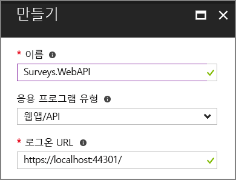
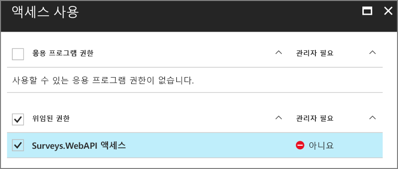
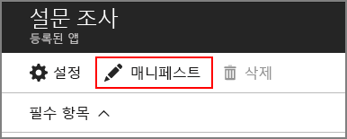
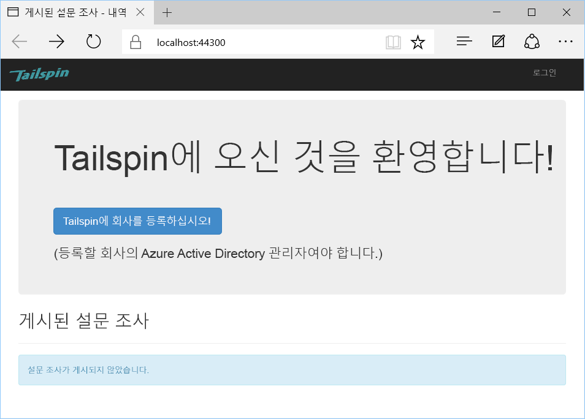
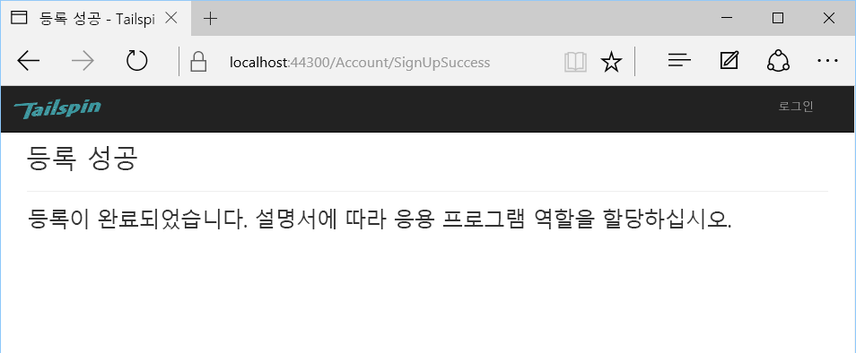

# <a name="run-the-surveys-application"></a><span data-ttu-id="44e90-103">설문 조사 응용 프로그램 실행</span><span class="sxs-lookup"><span data-stu-id="44e90-103">Run the Surveys application</span></span>

<span data-ttu-id="44e90-104">이 문서에서는 Visual Studio에서 [Tailspin 설문 조사](./tailspin.md) 응용 프로그램을 로컬로 실행하는 방법을 설명합니다.</span><span class="sxs-lookup"><span data-stu-id="44e90-104">This article describes how to run the [Tailspin Surveys](./tailspin.md) application locally, from Visual Studio.</span></span> <span data-ttu-id="44e90-105">이 단계에서는 Azure에 응용 프로그램을 배포하지 않습니다.</span><span class="sxs-lookup"><span data-stu-id="44e90-105">In these steps, you won't deploy the application to Azure.</span></span> <span data-ttu-id="44e90-106">그러나 Azure AD(Azure Active Directory) 디렉터리 및 Redis Cache와 같은 Azure 리소스를 만들어야 합니다.</span><span class="sxs-lookup"><span data-stu-id="44e90-106">However, you will need to create some Azure resources &mdash; an Azure Active Directory (Azure AD) directory and a Redis cache.</span></span>

<span data-ttu-id="44e90-107">다음은 단계에 대한 요약입니다.</span><span class="sxs-lookup"><span data-stu-id="44e90-107">Here is a summary of the steps:</span></span>

1. <span data-ttu-id="44e90-108">가상의 Tailspin 회사에 대한 Azure AD 디렉터리(테넌트)를 만듭니다.</span><span class="sxs-lookup"><span data-stu-id="44e90-108">Create an Azure AD directory (tenant) for the fictitious Tailspin company.</span></span>
2. <span data-ttu-id="44e90-109">Azure AD를 사용하여 설문 조사 응용 프로그램과 백 엔드 웹 API를 등록합니다.</span><span class="sxs-lookup"><span data-stu-id="44e90-109">Register the Surveys application and the backend web API with Azure AD.</span></span>
3. <span data-ttu-id="44e90-110">Azure Redis Cache 인스턴스를 만듭니다.</span><span class="sxs-lookup"><span data-stu-id="44e90-110">Create an Azure Redis Cache instance.</span></span>
4. <span data-ttu-id="44e90-111">응용 프로그램 설정을 구성하고 로컬 데이터베이스를 만듭니다.</span><span class="sxs-lookup"><span data-stu-id="44e90-111">Configure application settings and create a local database.</span></span>
5. <span data-ttu-id="44e90-112">응용 프로그램을 실행하고 새 테넌트를 등록합니다.</span><span class="sxs-lookup"><span data-stu-id="44e90-112">Run the application and sign up a new tenant.</span></span>
6. <span data-ttu-id="44e90-113">사용자에게 응용 프로그램 역할을 추가합니다.</span><span class="sxs-lookup"><span data-stu-id="44e90-113">Add application roles to users.</span></span>

## <a name="prerequisites"></a><span data-ttu-id="44e90-114">필수 조건</span><span class="sxs-lookup"><span data-stu-id="44e90-114">Prerequisites</span></span>
-   <span data-ttu-id="44e90-115">[Visual Studio 2017][VS2017]</span><span class="sxs-lookup"><span data-stu-id="44e90-115">[Visual Studio 2017][VS2017]</span></span>
-   <span data-ttu-id="44e90-116">[Microsoft Azure](https://azure.microsoft.com) 계정</span><span class="sxs-lookup"><span data-stu-id="44e90-116">[Microsoft Azure](https://azure.microsoft.com) account</span></span>

## <a name="create-the-tailspin-tenant"></a><span data-ttu-id="44e90-117">Tailspin 테넌트 만들기</span><span class="sxs-lookup"><span data-stu-id="44e90-117">Create the Tailspin tenant</span></span>

<span data-ttu-id="44e90-118">Tailspin은 설문 조사 응용 프로그램을 호스트하는 가상의 회사입니다.</span><span class="sxs-lookup"><span data-stu-id="44e90-118">Tailspin is the fictitious company that hosts the Surveys application.</span></span> <span data-ttu-id="44e90-119">Tailspin은 Azure AD를 사용하여 다른 테넌트가 앱에 등록할 수 있게 합니다.</span><span class="sxs-lookup"><span data-stu-id="44e90-119">Tailspin uses Azure AD to enable other tenants to register with the app.</span></span> <span data-ttu-id="44e90-120">그런 다음 고객은 Azure AD 자격 증명을 사용하여 앱에 로그인할 수 있습니다.</span><span class="sxs-lookup"><span data-stu-id="44e90-120">Those customers can then use their Azure AD credentials to sign into the app.</span></span>

<span data-ttu-id="44e90-121">이 단계에서는 Tailspin용 Azure AD 디렉터리를 만듭니다.</span><span class="sxs-lookup"><span data-stu-id="44e90-121">In this step, you'll create an Azure AD directory for Tailspin.</span></span>

1. <span data-ttu-id="44e90-122">[Azure Portal][portal]에 로그인합니다.</span><span class="sxs-lookup"><span data-stu-id="44e90-122">Sign into the [Azure portal][portal].</span></span>

2. <span data-ttu-id="44e90-123">**새로 만들기** > **보안 + ID** > **Azure Active Directory**를 클릭합니다.</span><span class="sxs-lookup"><span data-stu-id="44e90-123">Click **New** > **Security + Identity** > **Azure Active Directory**.</span></span>

3. <span data-ttu-id="44e90-124">조직 이름으로 `Tailspin`을 입력하고 도메인 이름을 입력합니다.</span><span class="sxs-lookup"><span data-stu-id="44e90-124">Enter `Tailspin` for the organization name, and enter a domain name.</span></span> <span data-ttu-id="44e90-125">도메인 이름은 `xxxx.onmicrosoft.com` 형식이며 전역적으로 고유해야 합니다.</span><span class="sxs-lookup"><span data-stu-id="44e90-125">The domain name will have the form `xxxx.onmicrosoft.com` and must be globally unique.</span></span> 

    

4. <span data-ttu-id="44e90-126">**만들기**를 클릭합니다.</span><span class="sxs-lookup"><span data-stu-id="44e90-126">Click **Create**.</span></span> <span data-ttu-id="44e90-127">새 디렉터리를 만드는 데 몇 분이 걸릴 수 있습니다.</span><span class="sxs-lookup"><span data-stu-id="44e90-127">It may take a few minutes to create the new directory.</span></span>

<span data-ttu-id="44e90-128">종단 간 시나리오를 완료하려면 응용 프로그램에 등록한 고객을 나타내는 두 번째 Azure AD 디렉터리가 필요합니다.</span><span class="sxs-lookup"><span data-stu-id="44e90-128">To complete the end-to-end scenario, you'll need a second Azure AD directory to represent a customer that signs up for the application.</span></span> <span data-ttu-id="44e90-129">기본 Azure AD 디렉터리(Tailspin 아님)를 사용하거나 이 용도를 위해 새 디렉터리를 만들 수 있습니다.</span><span class="sxs-lookup"><span data-stu-id="44e90-129">You can use your default Azure AD directory (not Tailspin), or create a new directory for this purpose.</span></span> <span data-ttu-id="44e90-130">이 예제에서는 Contoso를 가상의 고객으로 사용합니다.</span><span class="sxs-lookup"><span data-stu-id="44e90-130">In the examples, we use Contoso as the fictitious customer.</span></span>

## <a name="register-the-surveys-web-api"></a><span data-ttu-id="44e90-131">설문 조사 웹 API 등록</span><span class="sxs-lookup"><span data-stu-id="44e90-131">Register the Surveys web API</span></span> 

1. <span data-ttu-id="44e90-132">[Azure Portal][portal]의 오른쪽 상단에서 계정을 선택하여 새 Tailspin 디렉터리로 전환합니다.</span><span class="sxs-lookup"><span data-stu-id="44e90-132">In the [Azure portal][portal], switch to the new Tailspin directory by selecting your account in the top right corner of the portal.</span></span>

2. <span data-ttu-id="44e90-133">왼쪽 탐색 창에서 **Azure Active Directory**를 선택합니다.</span><span class="sxs-lookup"><span data-stu-id="44e90-133">In the left-hand navigation pane, choose **Azure Active Directory**.</span></span> 

3. <span data-ttu-id="44e90-134">**앱 등록** > **새 응용 프로그램 등록**을 클릭합니다.</span><span class="sxs-lookup"><span data-stu-id="44e90-134">Click **App registrations** > **New application registration**.</span></span>

4. <span data-ttu-id="44e90-135">**만들기** 블레이드에서 다음 정보를 입력합니다.</span><span class="sxs-lookup"><span data-stu-id="44e90-135">In the **Create** blade, enter the following information:</span></span>

   - <span data-ttu-id="44e90-136">**이름**: `Surveys.WebAPI`</span><span class="sxs-lookup"><span data-stu-id="44e90-136">**Name**: `Surveys.WebAPI`</span></span>

   - <span data-ttu-id="44e90-137">**응용 프로그램 형식**: `Web app / API`</span><span class="sxs-lookup"><span data-stu-id="44e90-137">**Application type**: `Web app / API`</span></span>

   - <span data-ttu-id="44e90-138">**로그온 URL**: `https://localhost:44301/`</span><span class="sxs-lookup"><span data-stu-id="44e90-138">**Sign-on URL**: `https://localhost:44301/`</span></span>
   
    

5. <span data-ttu-id="44e90-139">**만들기**를 클릭합니다.</span><span class="sxs-lookup"><span data-stu-id="44e90-139">Click **Create**.</span></span>

6. <span data-ttu-id="44e90-140">**앱 등록** 블레이드에서 새 **Surveys.WebAPI** 응용 프로그램을 선택합니다.</span><span class="sxs-lookup"><span data-stu-id="44e90-140">In the **App registrations** blade, select the new **Surveys.WebAPI** application.</span></span>
 
7. <span data-ttu-id="44e90-141">**속성**을 클릭합니다.</span><span class="sxs-lookup"><span data-stu-id="44e90-141">Click **Properties**.</span></span>

8. <span data-ttu-id="44e90-142">**앱 ID URI** 편집 상자에 `https://<domain>/surveys.webapi`를 입력합니다. 여기서 `<domain>`은 디렉터리의 도메인 이름입니다.</span><span class="sxs-lookup"><span data-stu-id="44e90-142">In the **App ID URI** edit box, enter `https://<domain>/surveys.webapi`, where `<domain>` is the domain name of the directory.</span></span> <span data-ttu-id="44e90-143">예: `https://tailspin.onmicrosoft.com/surveys.webapi`</span><span class="sxs-lookup"><span data-stu-id="44e90-143">For example: `https://tailspin.onmicrosoft.com/surveys.webapi`</span></span>

    

9. <span data-ttu-id="44e90-145">**다중 테넌트**를 **예**로 설정합니다.</span><span class="sxs-lookup"><span data-stu-id="44e90-145">Set **Multi-tenanted** to **YES**.</span></span>

10. <span data-ttu-id="44e90-146">**저장**을 클릭합니다.</span><span class="sxs-lookup"><span data-stu-id="44e90-146">Click **Save**.</span></span>

## <a name="register-the-surveys-web-app"></a><span data-ttu-id="44e90-147">설문 조사 웹앱 등록</span><span class="sxs-lookup"><span data-stu-id="44e90-147">Register the Surveys web app</span></span> 

1. <span data-ttu-id="44e90-148">**앱 등록** 블레이드로 다시 이동하여 **새 응용 프로그램 등록**을 클릭합니다.</span><span class="sxs-lookup"><span data-stu-id="44e90-148">Navigate back to the **App registrations** blade, and click **New application registration**.</span></span>

2. <span data-ttu-id="44e90-149">**만들기** 블레이드에서 다음 정보를 입력합니다.</span><span class="sxs-lookup"><span data-stu-id="44e90-149">In the **Create** blade, enter the following information:</span></span>

   - <span data-ttu-id="44e90-150">**이름**: `Surveys`</span><span class="sxs-lookup"><span data-stu-id="44e90-150">**Name**: `Surveys`</span></span>
   - <span data-ttu-id="44e90-151">**응용 프로그램 형식**: `Web app / API`</span><span class="sxs-lookup"><span data-stu-id="44e90-151">**Application type**: `Web app / API`</span></span>
   - <span data-ttu-id="44e90-152">**로그온 URL**: `https://localhost:44300/`</span><span class="sxs-lookup"><span data-stu-id="44e90-152">**Sign-on URL**: `https://localhost:44300/`</span></span>
   
   <span data-ttu-id="44e90-153">로그온 URL에 이전 단계의 `Surveys.WebAPI` 앱과 다른 포트 번호가 있는지 확인합니다.</span><span class="sxs-lookup"><span data-stu-id="44e90-153">Notice that the sign-on URL has a different port number from the `Surveys.WebAPI` app in the previous step.</span></span>

3. <span data-ttu-id="44e90-154">**만들기**를 클릭합니다.</span><span class="sxs-lookup"><span data-stu-id="44e90-154">Click **Create**.</span></span>
 
4. <span data-ttu-id="44e90-155">**앱 등록** 블레이드에서 새 **설문 조사** 응용 프로그램을 선택합니다.</span><span class="sxs-lookup"><span data-stu-id="44e90-155">In the **App registrations** blade, select the new **Surveys** application.</span></span>
 
5. <span data-ttu-id="44e90-156">응용 프로그램 ID를 복사합니다.</span><span class="sxs-lookup"><span data-stu-id="44e90-156">Copy the application ID.</span></span> <span data-ttu-id="44e90-157">이 ID는 나중에 필요합니다.</span><span class="sxs-lookup"><span data-stu-id="44e90-157">You will need this later.</span></span>

    

6. <span data-ttu-id="44e90-158">**속성**을 클릭합니다.</span><span class="sxs-lookup"><span data-stu-id="44e90-158">Click **Properties**.</span></span>

7. <span data-ttu-id="44e90-159">**앱 ID URI** 편집 상자에 `https://<domain>/surveys`를 입력합니다. 여기서 `<domain>`은 디렉터리의 도메인 이름입니다.</span><span class="sxs-lookup"><span data-stu-id="44e90-159">In the **App ID URI** edit box, enter `https://<domain>/surveys`, where `<domain>` is the domain name of the directory.</span></span> 

    

8. <span data-ttu-id="44e90-161">**다중 테넌트**를 **예**로 설정합니다.</span><span class="sxs-lookup"><span data-stu-id="44e90-161">Set **Multi-tenanted** to **YES**.</span></span>

9. <span data-ttu-id="44e90-162">**저장**을 클릭합니다.</span><span class="sxs-lookup"><span data-stu-id="44e90-162">Click **Save**.</span></span>

10. <span data-ttu-id="44e90-163">**설정** 블레이드에서 **회신 URL**을 클릭합니다.</span><span class="sxs-lookup"><span data-stu-id="44e90-163">In the **Settings** blade, click **Reply URLs**.</span></span>
 
11. <span data-ttu-id="44e90-164">회신 URL `https://localhost:44300/signin-oidc`를 입력합니다.</span><span class="sxs-lookup"><span data-stu-id="44e90-164">Add the following reply URL: `https://localhost:44300/signin-oidc`.</span></span>

12. <span data-ttu-id="44e90-165">**저장**을 클릭합니다.</span><span class="sxs-lookup"><span data-stu-id="44e90-165">Click **Save**.</span></span>

13. <span data-ttu-id="44e90-166">**API 액세스**에서 **키**를 클릭합니다.</span><span class="sxs-lookup"><span data-stu-id="44e90-166">Under **API ACCESS**, click **Keys**.</span></span>

14. <span data-ttu-id="44e90-167">`client secret`과 같은 설명을 입력합니다.</span><span class="sxs-lookup"><span data-stu-id="44e90-167">Enter a description, such as `client secret`.</span></span>

15. <span data-ttu-id="44e90-168">**기간 선택** 드롭다운에서 **1년**을 선택합니다.</span><span class="sxs-lookup"><span data-stu-id="44e90-168">In the **Select Duration** dropdown, select **1 year**.</span></span> 

16. <span data-ttu-id="44e90-169">**저장**을 클릭합니다.</span><span class="sxs-lookup"><span data-stu-id="44e90-169">Click **Save**.</span></span> <span data-ttu-id="44e90-170">저장하면 키가 생성됩니다.</span><span class="sxs-lookup"><span data-stu-id="44e90-170">The key will be generated when you save.</span></span>

17. <span data-ttu-id="44e90-171">이 블레이드에서 벗어나기 전에 키 값을 복사합니다.</span><span class="sxs-lookup"><span data-stu-id="44e90-171">Before you navigate away from this blade, copy the value of the key.</span></span>

    > [!NOTE] 
    > <span data-ttu-id="44e90-172">블레이드에서 다른 곳으로 이동하면 키가 다시 표시되지 않습니다.</span><span class="sxs-lookup"><span data-stu-id="44e90-172">The key won't be visible again after you navigate away from the blade.</span></span> 

18. <span data-ttu-id="44e90-173">**API 액세스**에서 **필요한 권한**을 클릭합니다.</span><span class="sxs-lookup"><span data-stu-id="44e90-173">Under **API ACCESS**, click **Required permissions**.</span></span>

19. <span data-ttu-id="44e90-174">**추가** > **API 선택**을 클릭합니다.</span><span class="sxs-lookup"><span data-stu-id="44e90-174">Click **Add** > **Select an API**.</span></span>

20. <span data-ttu-id="44e90-175">검색 상자에서 `Surveys.WebAPI`를 검색합니다.</span><span class="sxs-lookup"><span data-stu-id="44e90-175">In the search box, search for `Surveys.WebAPI`.</span></span>

    

21. <span data-ttu-id="44e90-177">`Surveys.WebAPI`를 선택하고 **선택**을 클릭합니다.</span><span class="sxs-lookup"><span data-stu-id="44e90-177">Select `Surveys.WebAPI` and click **Select**.</span></span>

22. <span data-ttu-id="44e90-178">**위임된 권한**에서 **Surveys.WebAPI 액세스**를 선택합니다.</span><span class="sxs-lookup"><span data-stu-id="44e90-178">Under **Delegated Permissions**, check **Access Surveys.WebAPI**.</span></span>

    

23. <span data-ttu-id="44e90-180">**선택** > **완료**를 클릭합니다.</span><span class="sxs-lookup"><span data-stu-id="44e90-180">Click **Select** > **Done**.</span></span>


## <a name="update-the-application-manifests"></a><span data-ttu-id="44e90-181">응용 프로그램 매니페스트 업데이트</span><span class="sxs-lookup"><span data-stu-id="44e90-181">Update the application manifests</span></span>

1. <span data-ttu-id="44e90-182">`Surveys.WebAPI` 앱의 **설정** 블레이드로 다시 이동합니다.</span><span class="sxs-lookup"><span data-stu-id="44e90-182">Navigate back to the **Settings** blade for the `Surveys.WebAPI` app.</span></span>

2. <span data-ttu-id="44e90-183">**매니페스트** > **편집**을 클릭합니다.</span><span class="sxs-lookup"><span data-stu-id="44e90-183">Click **Manifest** > **Edit**.</span></span>

    
 
3. <span data-ttu-id="44e90-184">`appRoles` 요소에 다음 JSON을 추가합니다.</span><span class="sxs-lookup"><span data-stu-id="44e90-184">Add the following JSON to the `appRoles` element.</span></span> <span data-ttu-id="44e90-185">`id` 속성에 대한 새 GUID를 생성합니다.</span><span class="sxs-lookup"><span data-stu-id="44e90-185">Generate new GUIDs for the `id` properties.</span></span>

   ```json
   {
     "allowedMemberTypes": ["User"],
     "description": "Creators can create surveys",
     "displayName": "SurveyCreator",
     "id": "<Generate a new GUID. Example: 1b4f816e-5eaf-48b9-8613-7923830595ad>",
     "isEnabled": true,
     "value": "SurveyCreator"
   },
   {
     "allowedMemberTypes": ["User"],
     "description": "Administrators can manage the surveys in their tenant",
     "displayName": "SurveyAdmin",
     "id": "<Generate a new GUID>",  
     "isEnabled": true,
     "value": "SurveyAdmin"
   }
   ```

4. <span data-ttu-id="44e90-186">이전에 설문 조사 응용 프로그램을 등록할 때 얻은 설문 조사 웹 응용 프로그램의 응용 프로그램 ID를 `knownClientApplications` 속성에 추가합니다.</span><span class="sxs-lookup"><span data-stu-id="44e90-186">In the `knownClientApplications` property, add the application ID for the Surveys web application, which you got when you registered the Surveys application earlier.</span></span> <span data-ttu-id="44e90-187">예: </span><span class="sxs-lookup"><span data-stu-id="44e90-187">For example:</span></span>

   ```json
   "knownClientApplications": ["be2cea23-aa0e-4e98-8b21-2963d494912e"],
   ```

   <span data-ttu-id="44e90-188">이 설정은 웹 API 호출 권한이 있는 클라이언트 목록에 설문 조사 앱을 추가합니다.</span><span class="sxs-lookup"><span data-stu-id="44e90-188">This setting adds the Surveys app to the list of clients authorized to call the web API.</span></span>

5. <span data-ttu-id="44e90-189">**저장**을 클릭합니다.</span><span class="sxs-lookup"><span data-stu-id="44e90-189">Click **Save**.</span></span>

<span data-ttu-id="44e90-190">이제 설문 조사 앱에 대해 동일한 단계를 반복합니다. 단, `knownClientApplications`에 대한 항목은 추가하지 않습니다.</span><span class="sxs-lookup"><span data-stu-id="44e90-190">Now repeat the same steps for the Surveys app, except do not add an entry for `knownClientApplications`.</span></span> <span data-ttu-id="44e90-191">동일한 역할 정의를 사용하고 ID에 대한 새 GUID를 생성합니다.</span><span class="sxs-lookup"><span data-stu-id="44e90-191">Use the same role definitions, but generate new GUIDs for the IDs.</span></span>

## <a name="create-a-new-redis-cache-instance"></a><span data-ttu-id="44e90-192">새 Redis Cache 인스턴스 만들기</span><span class="sxs-lookup"><span data-stu-id="44e90-192">Create a new Redis Cache instance</span></span>

<span data-ttu-id="44e90-193">설문 조사 응용 프로그램은 Redis를 사용하여 OAuth 2 액세스 토큰을 캐시합니다.</span><span class="sxs-lookup"><span data-stu-id="44e90-193">The Surveys application uses Redis to cache OAuth 2 access tokens.</span></span> <span data-ttu-id="44e90-194">캐시를 만들려면:</span><span class="sxs-lookup"><span data-stu-id="44e90-194">To create the cache:</span></span>

1.  <span data-ttu-id="44e90-195">[Azure Portal](https://portal.azure.com)로 이동하여 **새로 만들기** > **데이터베이스** > **Redis Cache**를 클릭합니다.</span><span class="sxs-lookup"><span data-stu-id="44e90-195">Go to [Azure Portal](https://portal.azure.com) and click **New** > **Databases** > **Redis Cache**.</span></span>

2.  <span data-ttu-id="44e90-196">DNS 이름, 리소스 그룹, 위치 및 가격 책정 계층을 포함하여 필수 정보를 입력합니다.</span><span class="sxs-lookup"><span data-stu-id="44e90-196">Fill in the required information, including DNS name, resource group, location, and pricing tier.</span></span> <span data-ttu-id="44e90-197">새 리소스 그룹을 만들거나 기존 리소스 그룹을 사용할 수 있습니다.</span><span class="sxs-lookup"><span data-stu-id="44e90-197">You can create a new resource group or use an existing resource group.</span></span>

3. <span data-ttu-id="44e90-198">**만들기**를 클릭합니다.</span><span class="sxs-lookup"><span data-stu-id="44e90-198">Click **Create**.</span></span>

4. <span data-ttu-id="44e90-199">Redis Cache를 만든 후 포털의 리소스로 이동합니다.</span><span class="sxs-lookup"><span data-stu-id="44e90-199">After the Resis cache is created, navigate to the resource in the portal.</span></span>

5. <span data-ttu-id="44e90-200">**액세스 키**를 클릭하고 기본 키를 복사합니다.</span><span class="sxs-lookup"><span data-stu-id="44e90-200">Click **Access keys** and copy the primary key.</span></span>

<span data-ttu-id="44e90-201">Redis Cache 생성에 대한 자세한 내용은 [Azure Redis Cache 사용 방법](/azure/redis-cache/cache-dotnet-how-to-use-azure-redis-cache)을 참조하세요.</span><span class="sxs-lookup"><span data-stu-id="44e90-201">For more information about creating a Redis cache, see [How to Use Azure Redis Cache](/azure/redis-cache/cache-dotnet-how-to-use-azure-redis-cache).</span></span>

## <a name="set-application-secrets"></a><span data-ttu-id="44e90-202">응용 프로그램 암호 설정</span><span class="sxs-lookup"><span data-stu-id="44e90-202">Set application secrets</span></span>

1.  <span data-ttu-id="44e90-203">Visual Studio에서 Tailspin.Surveys 솔루션을 엽니다.</span><span class="sxs-lookup"><span data-stu-id="44e90-203">Open the Tailspin.Surveys solution in Visual Studio.</span></span>

2.  <span data-ttu-id="44e90-204">솔루션 탐색기에서 Tailspin.Surveys.Web 프로젝트를 마우스 오른쪽 단추로 클릭하고 **사용자 암호 관리**를 선택합니다.</span><span class="sxs-lookup"><span data-stu-id="44e90-204">In Solution Explorer, right-click the Tailspin.Surveys.Web project and select **Manage User Secrets**.</span></span>

3.  <span data-ttu-id="44e90-205">secrets.json 파일에 다음을 붙여넣습니다.</span><span class="sxs-lookup"><span data-stu-id="44e90-205">In the secrets.json file, paste in the following:</span></span>
    
    ```json
    {
      "AzureAd": {
        "ClientId": "<Surveys application ID>",
        "ClientSecret": "<Surveys app client secret>",
        "PostLogoutRedirectUri": "https://localhost:44300/",
        "WebApiResourceId": "<Surveys.WebAPI app ID URI>"
      },
      "Redis": {
        "Configuration": "<Redis DNS name>.redis.cache.windows.net,password=<Redis primary key>,ssl=true"
      }
    }
    ```
   
    <span data-ttu-id="44e90-206">다음과 같이 꺾쇠 괄호 안에 표시된 항목을 바꿉니다.</span><span class="sxs-lookup"><span data-stu-id="44e90-206">Replace the items shown in angle brackets, as follows:</span></span>

    - <span data-ttu-id="44e90-207">`AzureAd:ClientId`: 설문 조사 앱의 응용 프로그램 ID입니다.</span><span class="sxs-lookup"><span data-stu-id="44e90-207">`AzureAd:ClientId`: The application ID of the Surveys app.</span></span>
    - <span data-ttu-id="44e90-208">`AzureAd:ClientSecret`: Azure AD에 Surveys 응용 프로그램을 등록할 때 생성된 키입니다.</span><span class="sxs-lookup"><span data-stu-id="44e90-208">`AzureAd:ClientSecret`: The key that you generated when you registered the Surveys application in Azure AD.</span></span>
    - <span data-ttu-id="44e90-209">`AzureAd:WebApiResourceId`: Azure AD에서 Surveys.WebAPI 응용 프로그램을 만들 때 지정한 앱 ID URI입니다.</span><span class="sxs-lookup"><span data-stu-id="44e90-209">`AzureAd:WebApiResourceId`: The App ID URI that you specified when you created the Surveys.WebAPI application in Azure AD.</span></span> <span data-ttu-id="44e90-210">`https://<directory>.onmicrosoft.com/surveys.webapi` 형식이어야 합니다.</span><span class="sxs-lookup"><span data-stu-id="44e90-210">It should have the form `https://<directory>.onmicrosoft.com/surveys.webapi`</span></span>
    - <span data-ttu-id="44e90-211">`Redis:Configuration`: Redis Cache 및 기본 액세스 키의 DNS 이름에서 이 문자열을 작성합니다.</span><span class="sxs-lookup"><span data-stu-id="44e90-211">`Redis:Configuration`: Build this string from the DNS name of the Redis cache and the primary access key.</span></span> <span data-ttu-id="44e90-212">예를 들어 "tailspin.redis.cache.windows.net,password=2h5tBxxx,ssl=true"로 작성합니다.</span><span class="sxs-lookup"><span data-stu-id="44e90-212">For example, "tailspin.redis.cache.windows.net,password=2h5tBxxx,ssl=true".</span></span>

4.  <span data-ttu-id="44e90-213">업데이트된 secrets.json 파일을 저장합니다.</span><span class="sxs-lookup"><span data-stu-id="44e90-213">Save the updated secrets.json file.</span></span>

5.  <span data-ttu-id="44e90-214">Tailspin.Surveys.WebAPI 프로젝트에 대해 이 단계를 반복하고 다음을 secrets.json에 붙여넣습니다.</span><span class="sxs-lookup"><span data-stu-id="44e90-214">Repeat these steps for the Tailspin.Surveys.WebAPI project, but paste the following into secrets.json.</span></span> <span data-ttu-id="44e90-215">앞에서 설명한 것처럼 꺾쇠 괄호 안의 항목을 대체합니다.</span><span class="sxs-lookup"><span data-stu-id="44e90-215">Replace the items in angle brackets, as before.</span></span>

    ```json
    {
      "AzureAd": {
        "WebApiResourceId": "<Surveys.WebAPI app ID URI>"
      },
      "Redis": {
        "Configuration": "<Redis DNS name>.redis.cache.windows.net,password=<Redis primary key>,ssl=true"
      }
    }
    ```

## <a name="initialize-the-database"></a><span data-ttu-id="44e90-216">데이터베이스 초기화</span><span class="sxs-lookup"><span data-stu-id="44e90-216">Initialize the database</span></span>

<span data-ttu-id="44e90-217">이 단계에서는 Entity Framework 7을 사용하여 LocalDB를 통해 로컬 SQL 데이터베이스를 만듭니다.</span><span class="sxs-lookup"><span data-stu-id="44e90-217">In this step, you will use Entity Framework 7 to create a local SQL database, using LocalDB.</span></span>

1.  <span data-ttu-id="44e90-218">명령 창 열기</span><span class="sxs-lookup"><span data-stu-id="44e90-218">Open a command window</span></span>

2.  <span data-ttu-id="44e90-219">Tailspin.Surveys.Data 프로젝트로 이동합니다.</span><span class="sxs-lookup"><span data-stu-id="44e90-219">Navigate to the Tailspin.Surveys.Data project.</span></span>

3.  <span data-ttu-id="44e90-220">다음 명령 실행:</span><span class="sxs-lookup"><span data-stu-id="44e90-220">Run the following command:</span></span>

    ```
    dotnet ef database update --startup-project ..\Tailspin.Surveys.Web
    ```
    
## <a name="run-the-application"></a><span data-ttu-id="44e90-221">응용 프로그램 실행</span><span class="sxs-lookup"><span data-stu-id="44e90-221">Run the application</span></span>

<span data-ttu-id="44e90-222">응용 프로그램을 실행하려면 Tailspin.Surveys.Web 및 Tailspin.Surveys.WebAPI 프로젝트를 시작합니다.</span><span class="sxs-lookup"><span data-stu-id="44e90-222">To run the application, start both the Tailspin.Surveys.Web and Tailspin.Surveys.WebAPI projects.</span></span>

<span data-ttu-id="44e90-223">다음과 같이 두 프로젝트를 F5에서 자동으로 실행하도록 Visual Studio를 설정할 수 있습니다.</span><span class="sxs-lookup"><span data-stu-id="44e90-223">You can set Visual Studio to run both projects automatically on F5, as follows:</span></span>

1.  <span data-ttu-id="44e90-224">솔루션 탐색기에서 솔루션을 마우스 오른쪽 단추로 클릭하고 **시작 프로젝트 설정**을 클릭합니다.</span><span class="sxs-lookup"><span data-stu-id="44e90-224">In Solution Explorer, right-click the solution and click **Set Startup Projects**.</span></span>
2.  <span data-ttu-id="44e90-225">**여러 시작 프로젝트**를 선택합니다.</span><span class="sxs-lookup"><span data-stu-id="44e90-225">Select **Multiple startup projects**.</span></span>
3.  <span data-ttu-id="44e90-226">Tailspin.Surveys.Web 및 Tailspin.Surveys.WebAPI 프로젝트에 대한 **작업** = **시작**을 설정합니다.</span><span class="sxs-lookup"><span data-stu-id="44e90-226">Set **Action** = **Start** for the Tailspin.Surveys.Web and Tailspin.Surveys.WebAPI projects.</span></span>

## <a name="sign-up-a-new-tenant"></a><span data-ttu-id="44e90-227">새 테넌트 등록</span><span class="sxs-lookup"><span data-stu-id="44e90-227">Sign up a new tenant</span></span>

<span data-ttu-id="44e90-228">응용 프로그램이 시작되면 로그인하지 않았으므로 시작 페이지가 표시됩니다.</span><span class="sxs-lookup"><span data-stu-id="44e90-228">When the application starts, you are not signed in, so you see the welcome page:</span></span>



<span data-ttu-id="44e90-230">조직을 등록하려면:</span><span class="sxs-lookup"><span data-stu-id="44e90-230">To sign up an organization:</span></span>

1. <span data-ttu-id="44e90-231">**Enroll your company in Tailspin**(Tailspin에서 회사 등록)을 클릭합니다.</span><span class="sxs-lookup"><span data-stu-id="44e90-231">Click **Enroll your company in Tailspin**.</span></span>
2. <span data-ttu-id="44e90-232">설문 조사 앱을 사용하여 조직을 나타내는 Azure AD 디렉터리에 로그인합니다.</span><span class="sxs-lookup"><span data-stu-id="44e90-232">Sign in to the Azure AD directory that represents the organization using the Surveys app.</span></span> <span data-ttu-id="44e90-233">관리자 권한으로 로그인해야 합니다.</span><span class="sxs-lookup"><span data-stu-id="44e90-233">You must sign in as an admin user.</span></span>
3. <span data-ttu-id="44e90-234">동의 확인 프롬프트에 동의합니다.</span><span class="sxs-lookup"><span data-stu-id="44e90-234">Accept the consent prompt.</span></span>

<span data-ttu-id="44e90-235">응용 프로그램이 테넌트를 등록하면 사용자가 로그아웃됩니다. 앱에서 로그아웃되는 이유는 응용 프로그램을 사용하기 전에 Azure AD에서 응용 프로그램 역할을 설정해야 하기 때문입니다.</span><span class="sxs-lookup"><span data-stu-id="44e90-235">The application registers the tenant, and then signs you out. The app signs you out because you need to set up the application roles in Azure AD, before using the application.</span></span>



## <a name="assign-application-roles"></a><span data-ttu-id="44e90-237">응용 프로그램 역할 할당</span><span class="sxs-lookup"><span data-stu-id="44e90-237">Assign application roles</span></span>

<span data-ttu-id="44e90-238">테넌트를 등록할 때 테넌트의 AD 관리자는 사용자에게 응용 프로그램 역할을 할당해야 합니다.</span><span class="sxs-lookup"><span data-stu-id="44e90-238">When a tenant signs up, an AD admin for the tenant must assign application roles to users.</span></span>


1. <span data-ttu-id="44e90-239">[Azure Portal][portal]에서 설문 조사 앱에 등록하는 데 사용한 Azure AD 디렉터리로 전환합니다.</span><span class="sxs-lookup"><span data-stu-id="44e90-239">In the [Azure portal][portal], switch to the Azure AD directory that you used to sign up for the Surveys app.</span></span> 

2. <span data-ttu-id="44e90-240">왼쪽 탐색 창에서 **Azure Active Directory**를 선택합니다.</span><span class="sxs-lookup"><span data-stu-id="44e90-240">In the left-hand navigation pane, choose **Azure Active Directory**.</span></span> 

3. <span data-ttu-id="44e90-241">**Enterprise 응용 프로그램** > **모든 응용 프로그램**을 클릭합니다.</span><span class="sxs-lookup"><span data-stu-id="44e90-241">Click **Enterprise applications** > **All applications**.</span></span> <span data-ttu-id="44e90-242">포털에 `Survey` 및 `Survey.WebAPI`가 나열됩니다.</span><span class="sxs-lookup"><span data-stu-id="44e90-242">The portal will list `Survey` and `Survey.WebAPI`.</span></span> <span data-ttu-id="44e90-243">그렇지 않은 경우 등록 프로세스를 완료했는지 확인합니다.</span><span class="sxs-lookup"><span data-stu-id="44e90-243">If not, make sure that you completed the sign up process.</span></span>

4.  <span data-ttu-id="44e90-244">설문 조사 응용 프로그램을 클릭합니다.</span><span class="sxs-lookup"><span data-stu-id="44e90-244">Click on the Surveys application.</span></span>

5.  <span data-ttu-id="44e90-245">**사용자 및 그룹**을 클릭합니다.</span><span class="sxs-lookup"><span data-stu-id="44e90-245">Click **Users and Groups**.</span></span>

4.  <span data-ttu-id="44e90-246">**사용자 추가**를 클릭합니다.</span><span class="sxs-lookup"><span data-stu-id="44e90-246">Click **Add user**.</span></span>

5.  <span data-ttu-id="44e90-247">Azure AD Premium을 사용하는 경우 **사용자 및 그룹**을 클릭합니다.</span><span class="sxs-lookup"><span data-stu-id="44e90-247">If you have Azure AD Premium, click **Users and groups**.</span></span> <span data-ttu-id="44e90-248">또는 **사용자**를 클릭합니다.</span><span class="sxs-lookup"><span data-stu-id="44e90-248">Otherwise, click **Users**.</span></span> <span data-ttu-id="44e90-249">그룹에 역할을 할당하려면 Azure AD Premium이 필요합니다.</span><span class="sxs-lookup"><span data-stu-id="44e90-249">(Assigning a role to a group requires Azure AD Premium.)</span></span>

6. <span data-ttu-id="44e90-250">하나 이상의 사용자를 선택하고 **선택**을 클릭합니다.</span><span class="sxs-lookup"><span data-stu-id="44e90-250">Select one or more users and click **Select**.</span></span>

    

6.  <span data-ttu-id="44e90-252">역할을 선택하고 **선택**을 클릭합니다.</span><span class="sxs-lookup"><span data-stu-id="44e90-252">Select the role and click **Select**.</span></span>

    

7.  <span data-ttu-id="44e90-254">**할당**을 클릭합니다.</span><span class="sxs-lookup"><span data-stu-id="44e90-254">Click **Assign**.</span></span>

<span data-ttu-id="44e90-255">동일한 단계를 반복하여 Survey.WebAPI 응용 프로그램에 대한 역할을 할당합니다.</span><span class="sxs-lookup"><span data-stu-id="44e90-255">Repeat the same steps to assign roles for the Survey.WebAPI application.</span></span>

> <span data-ttu-id="44e90-256">중요: 설문 조사와 Survey.WebAPI에서 사용자의 역할은 항상 동일해야 합니다.</span><span class="sxs-lookup"><span data-stu-id="44e90-256">Important: A user should always have the same roles in both Survey and Survey.WebAPI.</span></span> <span data-ttu-id="44e90-257">그렇지 않으면 사용자의 권한이 일치하지 않아 Web API에서 403(사용할 수 없음) 오류가 발생할 수 있습니다.</span><span class="sxs-lookup"><span data-stu-id="44e90-257">Otherwise, the user will have inconsistent permissions, which may lead to 403 (Forbidden) errors from the Web API.</span></span>

<span data-ttu-id="44e90-258">이제 앱으로 돌아가서 다시 로그인합니다.</span><span class="sxs-lookup"><span data-stu-id="44e90-258">Now go back to the app and sign in again.</span></span> <span data-ttu-id="44e90-259">**내 설문 조사**를 클릭합니다.</span><span class="sxs-lookup"><span data-stu-id="44e90-259">Click **My Surveys**.</span></span> <span data-ttu-id="44e90-260">사용자가 SurveyAdmin 또는 SurveyCreator 역할에 할당되면 **설문 조사 만들기** 단추가 표시되어 사용자가 새 설문 조사를 만들 권한이 있음을 나타냅니다.</span><span class="sxs-lookup"><span data-stu-id="44e90-260">If the user is assigned to the SurveyAdmin or SurveyCreator role, you will see a **Create Survey** button, indicating that the user has permissions to create a new survey.</span></span>


<!-- links -->

[portal]: https://portal.azure.com
[VS2017]: https://www.visualstudio.com/vs/
