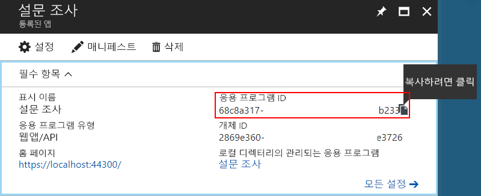
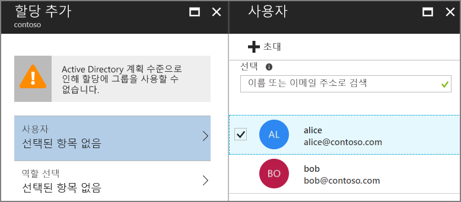
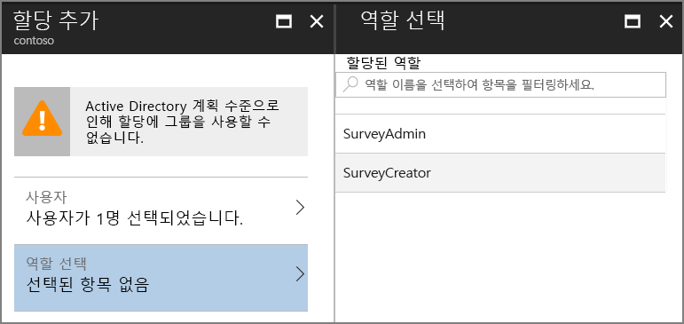

# <a name="run-the-surveys-application"></a>설문 조사 애플리케이션 실행

이 문서에서는 Visual Studio에서 [Tailspin 설문 조사](./tailspin.md) 애플리케이션을 로컬로 실행하는 방법을 설명합니다. 이 단계에서는 Azure에 애플리케이션을 배포하지 않습니다. 그러나 Azure AD(Azure Active Directory) 디렉터리 및 Redis Cache와 같은 Azure 리소스를 만들어야 합니다.

다음은 단계에 대한 요약입니다.

1. 가상의 Tailspin 회사에 대한 Azure AD 디렉터리(테넌트)를 만듭니다.
2. Azure AD를 사용하여 설문 조사 애플리케이션과 백 엔드 웹 API를 등록합니다.
3. Azure Redis Cache 인스턴스를 만듭니다.
4. 애플리케이션 설정을 구성하고 로컬 데이터베이스를 만듭니다.
5. 애플리케이션을 실행하고 새 테넌트를 등록합니다.
6. 사용자에게 애플리케이션 역할을 추가합니다.

## <a name="prerequisites"></a>필수 조건

- [ASP.NET 및 웹 개발 워크로드](https://visualstudio.microsoft.com/vs/support/selecting-workloads-visual-studio-2017)가 설치되어 있는 [Visual Studio 2017][VS2017]
- [Microsoft Azure](https://azure.microsoft.com) 계정

## <a name="create-the-tailspin-tenant"></a>Tailspin 테넌트 만들기

Tailspin은 설문 조사 애플리케이션을 호스트하는 가상의 회사입니다. Tailspin은 Azure AD를 사용하여 다른 테넌트가 앱에 등록할 수 있게 합니다. 그런 다음 고객은 Azure AD 자격 증명을 사용하여 앱에 로그인할 수 있습니다.

이 단계에서는 Tailspin용 Azure AD 디렉터리를 만듭니다.

1. [Azure Portal][portal]에 로그인합니다.

2. **+ 리소스 만들기** > **ID** > **Azure Active Directory**를 클릭합니다.

3. 조직 이름으로 `Tailspin`을 입력하고 도메인 이름을 입력합니다. 도메인 이름은 `xxxx.onmicrosoft.com` 형식이며 전역적으로 고유해야 합니다.

    

4. **만들기**를 클릭합니다. 새 디렉터리를 만드는 데 몇 분이 걸릴 수 있습니다.

종단 간 시나리오를 완료하려면 애플리케이션에 등록한 고객을 나타내는 두 번째 Azure AD 디렉터리가 필요합니다. 기본 Azure AD 디렉터리(Tailspin 아님)를 사용하거나 이 용도를 위해 새 디렉터리를 만들 수 있습니다. 이 예제에서는 Contoso를 가상의 고객으로 사용합니다.

## <a name="register-the-surveys-web-api"></a>설문 조사 웹 API 등록

1. [Azure Portal][portal]의 오른쪽 상단에서 계정을 선택하여 새 Tailspin 디렉터리로 전환합니다.

2. 왼쪽 탐색 창에서 **Azure Active Directory**를 선택합니다.

3. **앱 등록** > **새 애플리케이션 등록**을 클릭합니다.

4. **만들기** 블레이드에서 다음 정보를 입력합니다.

   - **이름**: `Surveys.WebAPI`

   - **애플리케이션 형식**: `Web app / API`

   - **로그온 URL**: `https://localhost:44301/`

   

5. **만들기**를 클릭합니다.

6. **앱 등록** 블레이드에서 새 **Surveys.WebAPI** 애플리케이션을 선택합니다.

7. **설정** > **속성**을 클릭합니다.

8. **앱 ID URI** 편집 상자에 `https://<domain>/surveys.webapi`를 입력합니다. 여기서 `<domain>`은 디렉터리의 도메인 이름입니다. 예: `https://tailspin.onmicrosoft.com/surveys.webapi`

    

9. **다중 테넌트**를 **예**로 설정합니다.

10. **저장**을 클릭합니다.

## <a name="register-the-surveys-web-app"></a>설문 조사 웹앱 등록

1. **앱 등록** 블레이드로 다시 이동하여 **새 애플리케이션 등록**을 클릭합니다.

2. **만들기** 블레이드에서 다음 정보를 입력합니다.

    - **이름**: `Surveys`
    - **애플리케이션 형식**: `Web app / API`
    - **로그온 URL**: `https://localhost:44300/`

    로그온 URL에 이전 단계의 `Surveys.WebAPI` 앱과 다른 포트 번호가 있는지 확인합니다.

3. **만들기**를 클릭합니다.

4. **앱 등록** 블레이드에서 새 **설문 조사** 애플리케이션을 선택합니다.

5. 애플리케이션 ID를 복사합니다. 이 ID는 나중에 필요합니다.

    

6. **속성**을 클릭합니다.

7. **앱 ID URI** 편집 상자에 `https://<domain>/surveys`를 입력합니다. 여기서 `<domain>`은 디렉터리의 도메인 이름입니다.

    

8. **다중 테넌트**를 **예**로 설정합니다.

9. **저장**을 클릭합니다.

10. **설정** 블레이드에서 **회신 URL**을 클릭합니다.

11. 회신 URL `https://localhost:44300/signin-oidc`를 입력합니다.

12. **저장**을 클릭합니다.

13. **API 액세스**에서 **키**를 클릭합니다.

14. `client secret`과 같은 설명을 입력합니다.

15. **기간 선택** 드롭다운에서 **1년**을 선택합니다.

16. **저장**을 클릭합니다. 저장하면 키가 생성됩니다.

17. 이 블레이드에서 벗어나기 전에 키 값을 복사합니다.

    > [!NOTE]
    > 블레이드에서 다른 곳으로 이동하면 키가 다시 표시되지 않습니다.

18. **API 액세스**에서 **필요한 권한**을 클릭합니다.

19. **추가** > **API 선택**을 클릭합니다.

20. 검색 상자에서 `Surveys.WebAPI`를 검색합니다.

    

21. `Surveys.WebAPI`를 선택하고 **선택**을 클릭합니다.

22. **위임된 권한**에서 **Surveys.WebAPI 액세스**를 선택합니다.

    

23. **선택** > **완료**를 클릭합니다.

## <a name="update-the-application-manifests"></a>애플리케이션 매니페스트 업데이트

1. `Surveys.WebAPI` 앱의 **설정** 블레이드로 다시 이동합니다.

2. **매니페스트** > **편집**을 클릭합니다.

    

3. `appRoles` 요소에 다음 JSON을 추가합니다. `id` 속성에 대한 새 GUID를 생성합니다.

   ```json
   {
     "allowedMemberTypes": ["User"],
     "description": "Creators can create surveys",
     "displayName": "SurveyCreator",
     "id": "<Generate a new GUID. Example: 1b4f816e-5eaf-48b9-8613-7923830595ad>",
     "isEnabled": true,
     "value": "SurveyCreator"
   },
   {
     "allowedMemberTypes": ["User"],
     "description": "Administrators can manage the surveys in their tenant",
     "displayName": "SurveyAdmin",
     "id": "<Generate a new GUID>",  
     "isEnabled": true,
     "value": "SurveyAdmin"
   }
   ```

4. 이전에 설문 조사 애플리케이션을 등록할 때 얻은 설문 조사 웹 애플리케이션의 애플리케이션 ID를 `knownClientApplications` 속성에 추가합니다. 예: 

   ```json
   "knownClientApplications": ["be2cea23-aa0e-4e98-8b21-2963d494912e"],
   ```

   이 설정은 웹 API 호출 권한이 있는 클라이언트 목록에 설문 조사 앱을 추가합니다.

5. **저장**을 클릭합니다.

이제 설문 조사 앱에 대해 동일한 단계를 반복합니다. 단, `knownClientApplications`에 대한 항목은 추가하지 않습니다. 동일한 역할 정의를 사용하고 ID에 대한 새 GUID를 생성합니다.

## <a name="create-a-new-redis-cache-instance"></a>새 Redis Cache 인스턴스 만들기

설문 조사 애플리케이션은 Redis를 사용하여 OAuth 2 액세스 토큰을 캐시합니다. 캐시를 만들려면:

1. [Azure Portal](https://portal.azure.com)로 이동하여 **+ 리소스 만들기** > **데이터베이스** > **Redis Cache**를 클릭합니다.

2. DNS 이름, 리소스 그룹, 위치 및 가격 책정 계층을 포함하여 필수 정보를 입력합니다. 새 리소스 그룹을 만들거나 기존 리소스 그룹을 사용할 수 있습니다.

3. **만들기**를 클릭합니다.

4. Redis Cache를 만든 후에 포털의 리소스로 이동합니다.

5. **액세스 키**를 클릭하고 기본 키를 복사합니다.

Redis Cache 생성에 대한 자세한 내용은 [Azure Redis Cache 사용 방법](/azure/redis-cache/cache-dotnet-how-to-use-azure-redis-cache)을 참조하세요.

## <a name="set-application-secrets"></a>애플리케이션 암호 설정

1. Visual Studio에서 Tailspin.Surveys 솔루션을 엽니다.

2. 솔루션 탐색기에서 Tailspin.Surveys.Web 프로젝트를 마우스 오른쪽 단추로 클릭하고 **사용자 암호 관리**를 선택합니다.

3. secrets.json 파일에 다음을 붙여넣습니다.

    ```json
    {
      "AzureAd": {
        "ClientId": "<Surveys application ID>",
        "ClientSecret": "<Surveys app client secret>",
        "PostLogoutRedirectUri": "https://localhost:44300/",
        "WebApiResourceId": "<Surveys.WebAPI app ID URI>"
      },
      "Redis": {
        "Configuration": "<Redis DNS name>.redis.cache.windows.net,password=<Redis primary key>,ssl=true"
      }
    }
    ```

    다음과 같이 꺾쇠 괄호 안에 표시된 항목을 바꿉니다.

    - `AzureAd:ClientId`: 설문 조사 앱의 애플리케이션 ID입니다.
    - `AzureAd:ClientSecret`: Azure AD에 설문 조사 애플리케이션을 등록할 때 생성된 키입니다.
    - `AzureAd:WebApiResourceId`: Azure AD에서 Surveys.WebAPI 애플리케이션을 만들 때 지정한 앱 ID URI입니다. `https://<directory>.onmicrosoft.com/surveys.webapi` 형식이어야 합니다.
    - `Redis:Configuration`: Redis Cache 및 기본 액세스 키의 DNS 이름에서 이 문자열을 작성합니다. 예를 들어 "tailspin.redis.cache.windows.net,password=2h5tBxxx,ssl=true"로 작성합니다.

4. 업데이트된 secrets.json 파일을 저장합니다.

5. Tailspin.Surveys.WebAPI 프로젝트에 대해 이 단계를 반복하고 다음을 secrets.json에 붙여넣습니다. 앞에서 설명한 것처럼 꺾쇠 괄호 안의 항목을 대체합니다.

    ```json
    {
      "AzureAd": {
        "WebApiResourceId": "<Surveys.WebAPI app ID URI>"
      },
      "Redis": {
        "Configuration": "<Redis DNS name>.redis.cache.windows.net,password=<Redis primary key>,ssl=true"
      }
    }
    ```

## <a name="initialize-the-database"></a>데이터베이스 초기화

이 단계에서는 Entity Framework 7을 사용하여 LocalDB를 통해 로컬 SQL 데이터베이스를 만듭니다.

1. 명령 창 열기

2. Tailspin.Surveys.Data 프로젝트로 이동합니다.

3. 다음 명령 실행:

    ```bat
    dotnet ef database update --startup-project ..\Tailspin.Surveys.Web
    ```

## <a name="run-the-application"></a>애플리케이션 실행

애플리케이션을 실행하려면 Tailspin.Surveys.Web 및 Tailspin.Surveys.WebAPI 프로젝트를 시작합니다.

다음과 같이 두 프로젝트를 F5에서 자동으로 실행하도록 Visual Studio를 설정할 수 있습니다.

1. 솔루션 탐색기에서 솔루션을 마우스 오른쪽 단추로 클릭하고 **시작 프로젝트 설정**을 클릭합니다.
2. **여러 시작 프로젝트**를 선택합니다.
3. Tailspin.Surveys.Web 및 Tailspin.Surveys.WebAPI 프로젝트에 대한 **작업** = **시작**을 설정합니다.

## <a name="sign-up-a-new-tenant"></a>새 테넌트 등록

애플리케이션이 시작되면 로그인하지 않았으므로 시작 페이지가 표시됩니다.


조직을 등록하려면:

1. **Enroll your company in Tailspin**(Tailspin에서 회사 등록)을 클릭합니다.
2. 설문 조사 앱을 사용하여 조직을 나타내는 Azure AD 디렉터리에 로그인합니다. 관리자 권한으로 로그인해야 합니다.
3. 동의 확인 프롬프트에 동의합니다.

애플리케이션이 테넌트를 등록하면 사용자가 로그아웃됩니다. 앱에서 로그아웃되는 이유는 애플리케이션을 사용하기 전에 Azure AD에서 애플리케이션 역할을 설정해야 하기 때문입니다.


## <a name="assign-application-roles"></a>애플리케이션 역할 할당

테넌트를 등록할 때 테넌트의 AD 관리자는 사용자에게 애플리케이션 역할을 할당해야 합니다.

1. [Azure Portal][portal]에서 설문 조사 앱에 등록하는 데 사용한 Azure AD 디렉터리로 전환합니다.

2. 왼쪽 탐색 창에서 **Azure Active Directory**를 선택합니다.

3. **Enterprise 애플리케이션** > **모든 애플리케이션**을 클릭합니다. 포털에 `Survey` 및 `Survey.WebAPI`가 나열됩니다. 그렇지 않은 경우 등록 프로세스를 완료했는지 확인합니다.

4. 설문 조사 애플리케이션을 클릭합니다.

5. **사용자 및 그룹**을 클릭합니다.

6. **사용자 추가**를 클릭합니다.

7. Azure AD Premium을 사용하는 경우 **사용자 및 그룹**을 클릭합니다. 또는 **사용자**를 클릭합니다. 그룹에 역할을 할당하려면 Azure AD Premium이 필요합니다.

8. 하나 이상의 사용자를 선택하고 **선택**을 클릭합니다.

    

9. 역할을 선택하고 **선택**을 클릭합니다.

    

10. **할당**을 클릭합니다.

동일한 단계를 반복하여 Survey.WebAPI 애플리케이션에 대한 역할을 할당합니다.

> [!IMPORTANT]
> 설문 조사와 Survey.WebAPI에서 사용자의 역할은 항상 동일해야 합니다. 그렇지 않으면 사용자의 권한이 일치하지 않아 Web API에서 403(사용할 수 없음) 오류가 발생할 수 있습니다.

이제 앱으로 돌아가서 다시 로그인합니다. **내 설문 조사**를 클릭합니다. 사용자가 SurveyAdmin 또는 SurveyCreator 역할에 할당되면 **설문 조사 만들기** 단추가 표시되어 사용자가 새 설문 조사를 만들 권한이 있음을 나타냅니다.


<!-- links -->

[portal]: https://portal.azure.com
[VS2017]: https://www.visualstudio.com/vs/
