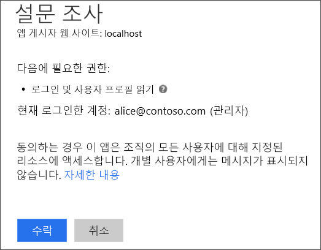
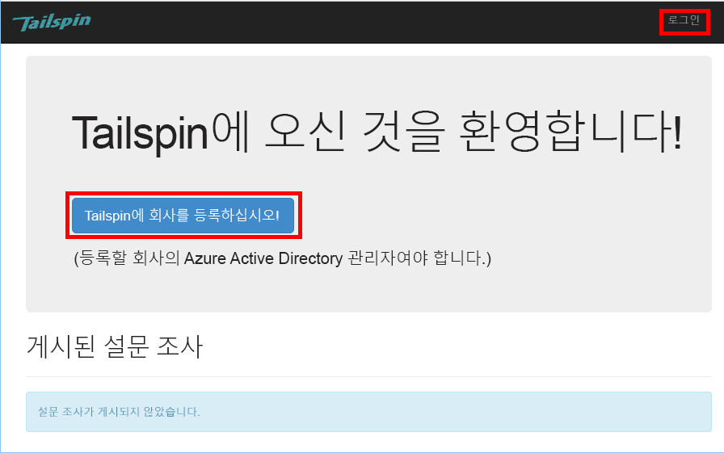
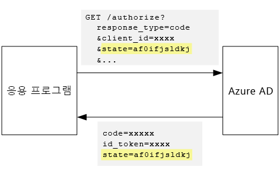

# <a name="tenant-sign-up-and-onboarding"></a><span data-ttu-id="66dc3-103">테넌트 등록 및 온보딩</span><span class="sxs-lookup"><span data-stu-id="66dc3-103">Tenant sign-up and onboarding</span></span>

<span data-ttu-id="66dc3-104">[ 샘플 코드][sample application]</span><span class="sxs-lookup"><span data-stu-id="66dc3-104">[ Sample code][sample application]</span></span>

<span data-ttu-id="66dc3-105">이 문서는 고객이 애플리케이션에 조직을 등록하도록 하는 다중 테넌트 애플리케이션에서 *등록* 프로세스를 구현하는 방법을 설명합니다.</span><span class="sxs-lookup"><span data-stu-id="66dc3-105">This article describes how to implement a *sign-up* process in a multi-tenant application, which allows a customer to sign up their organization for your application.</span></span>
<span data-ttu-id="66dc3-106">등록 프로세스를 구현하는 여러 가지 이유가 있습니다.</span><span class="sxs-lookup"><span data-stu-id="66dc3-106">There are several reasons to implement a sign-up process:</span></span>

* <span data-ttu-id="66dc3-107">AD 관리자가 고객의 전체 조직에 동의하여 애플리케이션을 사용하도록 합니다.</span><span class="sxs-lookup"><span data-stu-id="66dc3-107">Allow an AD admin to consent for the customer's entire organization to use the application.</span></span>
* <span data-ttu-id="66dc3-108">신용 카드 지불 또는 기타 고객 정보를 수집합니다.</span><span class="sxs-lookup"><span data-stu-id="66dc3-108">Collect credit card payment or other customer information.</span></span>
* <span data-ttu-id="66dc3-109">애플리케이션에 필요한 모든 일회성 테넌트별 설치를 수행합니다.</span><span class="sxs-lookup"><span data-stu-id="66dc3-109">Perform any one-time per-tenant setup needed by your application.</span></span>

## <a name="admin-consent-and-azure-ad-permissions"></a><span data-ttu-id="66dc3-110">관리자 동의 및 Azure AD 사용 권한</span><span class="sxs-lookup"><span data-stu-id="66dc3-110">Admin consent and Azure AD permissions</span></span>

<span data-ttu-id="66dc3-111">Azure AD를 인증하려면 애플리케이션은 사용자의 디렉터리에 대한 액세스가 필요합니다.</span><span class="sxs-lookup"><span data-stu-id="66dc3-111">In order to authenticate with Azure AD, an application needs access to the user's directory.</span></span> <span data-ttu-id="66dc3-112">최소한 애플리케이션에서 사용자의 프로필을 읽을 수 있는 권한이 필요합니다.</span><span class="sxs-lookup"><span data-stu-id="66dc3-112">At a minimum, the application needs permission to read the user's profile.</span></span> <span data-ttu-id="66dc3-113">사용자가 처음으로 로그인할 때 Azure AD는 요청되는 권한을 나열하는 동의 페이지를 보여 줍니다.</span><span class="sxs-lookup"><span data-stu-id="66dc3-113">The first time that a user signs in, Azure AD shows a consent page that lists the permissions being requested.</span></span> <span data-ttu-id="66dc3-114">**동의함**을 클릭하여 애플리케이션에 권한을 부여합니다.</span><span class="sxs-lookup"><span data-stu-id="66dc3-114">By clicking **Accept**, the user grants permission to the application.</span></span>

<span data-ttu-id="66dc3-115">기본적으로 동의는 사용자 단위로 부여됩니다.</span><span class="sxs-lookup"><span data-stu-id="66dc3-115">By default, consent is granted on a per-user basis.</span></span> <span data-ttu-id="66dc3-116">로그인하는 모든 사용자에게 동의 페이지가 표시됩니다.</span><span class="sxs-lookup"><span data-stu-id="66dc3-116">Every user who signs in sees the consent page.</span></span> <span data-ttu-id="66dc3-117">그러나 Azure AD는 AD 관리자가 전체 조직에 대한 동의를 허용하는 *관리자 동의*를 지원합니다.</span><span class="sxs-lookup"><span data-stu-id="66dc3-117">However, Azure AD also supports  *admin consent*, which allows an AD administrator to consent for an entire organization.</span></span>

<span data-ttu-id="66dc3-118">관리자 동의 흐름을 사용하면 동의 페이지는 AD 관리자가 전체 테넌트를 대신하여 사용 권한을 부여하는 것을 명시합니다.</span><span class="sxs-lookup"><span data-stu-id="66dc3-118">When the admin consent flow is used, the consent page states that the AD admin is granting permission on behalf of the entire tenant:</span></span>



<span data-ttu-id="66dc3-120">관리자가 **동의함**을 클릭한 후 동일한 테넌트 내의 다른 사용자는 로그인할 수 있고 Azure AD는 동의 화면을 건너뜁니다.</span><span class="sxs-lookup"><span data-stu-id="66dc3-120">After the admin clicks **Accept**, other users within the same tenant can sign in, and Azure AD will skip the consent screen.</span></span>

<span data-ttu-id="66dc3-121">전체 조직을 대신하여 권한을 부여하므로 AD 관리자만이 관리자 동의를 부여할 수 있습니다.</span><span class="sxs-lookup"><span data-stu-id="66dc3-121">Only an AD administrator can give admin consent, because it grants permission on behalf of the entire organization.</span></span> <span data-ttu-id="66dc3-122">관리자가 아닌 사용자가 관리자 동의 흐름으로 인증하려고 하는 경우 Azure AD는 오류를 표시합니다.</span><span class="sxs-lookup"><span data-stu-id="66dc3-122">If a non-administrator tries to authenticate with the admin consent flow, Azure AD displays an error:</span></span>


<span data-ttu-id="66dc3-124">애플리케이션이 나중에 추가 권한이 필요한 경우 고객은 다시 등록하고 업데이트된 사용 권한에 동의해야 합니다.</span><span class="sxs-lookup"><span data-stu-id="66dc3-124">If the application requires additional permissions at a later point, the customer will need to sign up again and consent to the updated permissions.</span></span>

## <a name="implementing-tenant-sign-up"></a><span data-ttu-id="66dc3-125">테넌트 등록 구현</span><span class="sxs-lookup"><span data-stu-id="66dc3-125">Implementing tenant sign-up</span></span>

<span data-ttu-id="66dc3-126">[Tailspin 설문 조사][Tailspin] 애플리케이션의 경우 등록 프로세스에 대한 몇 가지 요구 사항을 정의했습니다.</span><span class="sxs-lookup"><span data-stu-id="66dc3-126">For the [Tailspin Surveys][Tailspin] application,  we defined several requirements for the sign-up process:</span></span>

* <span data-ttu-id="66dc3-127">테넌트는 사용자가 로그인하려면 등록해야 합니다.</span><span class="sxs-lookup"><span data-stu-id="66dc3-127">A tenant must sign up before users can sign in.</span></span>
* <span data-ttu-id="66dc3-128">등록은 관리자 동의 흐름을 사용합니다.</span><span class="sxs-lookup"><span data-stu-id="66dc3-128">Sign-up uses the admin consent flow.</span></span>
* <span data-ttu-id="66dc3-129">등록은 애플리케이션 데이터베이스에 사용자의 테넌트를 추가합니다.</span><span class="sxs-lookup"><span data-stu-id="66dc3-129">Sign-up adds the user's tenant to the application database.</span></span>
* <span data-ttu-id="66dc3-130">테넌트를 등록한 후 애플리케이션은 온보딩 페이지를 보여 줍니다.</span><span class="sxs-lookup"><span data-stu-id="66dc3-130">After a tenant signs up, the application shows an onboarding page.</span></span>

<span data-ttu-id="66dc3-131">이 섹션에서 등록 프로세스의 구현을 안내합니다.</span><span class="sxs-lookup"><span data-stu-id="66dc3-131">In this section, we'll walk through our implementation of the sign-up process.</span></span>
<span data-ttu-id="66dc3-132">"등록" 및 "로그인"은 애플리케이션 개념이라는 점을 이해해야 합니다.</span><span class="sxs-lookup"><span data-stu-id="66dc3-132">It's important to understand that "sign up" versus "sign in" is an application concept.</span></span> <span data-ttu-id="66dc3-133">인증 흐름 중 Azure AD는 사용자가 등록 프로세스에 있는지 여부를 본질적으로 알지 못합니다.</span><span class="sxs-lookup"><span data-stu-id="66dc3-133">During the authentication flow, Azure AD does not inherently know whether the user is in process of signing up.</span></span> <span data-ttu-id="66dc3-134">컨텍스트 추적은 애플리케이션에 달려 있습니다.</span><span class="sxs-lookup"><span data-stu-id="66dc3-134">It's up to the application to keep track of the context.</span></span>

<span data-ttu-id="66dc3-135">익명 사용자가 설문 조사 애플리케이션을 방문하면 하나는 로그인으로 하나는 "회사 등록"(등록)으로 두 개의 단추가 표시됩니다.</span><span class="sxs-lookup"><span data-stu-id="66dc3-135">When an anonymous user visits the Surveys application, the user is shown two buttons, one to sign in, and one to "enroll your company" (sign up).</span></span>



<span data-ttu-id="66dc3-137">이러한 단추는 `AccountController` 클래스에서 작업을 호출합니다.</span><span class="sxs-lookup"><span data-stu-id="66dc3-137">These buttons invoke actions in the `AccountController` class.</span></span>

<span data-ttu-id="66dc3-138">`SignIn` 작업은 OpenID Connect 미들웨어를 인증 엔드포인트로 리디렉션할 수 있게 하는 **ChallegeResult**를 반환합니다.</span><span class="sxs-lookup"><span data-stu-id="66dc3-138">The `SignIn` action returns a **ChallegeResult**, which causes the OpenID Connect middleware to redirect to the authentication endpoint.</span></span> <span data-ttu-id="66dc3-139">이는 ASP.NET Core에서 인증을 트리거하는 기본 방법입니다.</span><span class="sxs-lookup"><span data-stu-id="66dc3-139">This is the default way to trigger authentication in ASP.NET Core.</span></span>

```csharp
[AllowAnonymous]
public IActionResult SignIn()
{
    return new ChallengeResult(
        OpenIdConnectDefaults.AuthenticationScheme,
        new AuthenticationProperties
        {
            IsPersistent = true,
            RedirectUri = Url.Action("SignInCallback", "Account")
        });
}
```

<span data-ttu-id="66dc3-140">이제 `SignUp` 작업을 비교합니다.</span><span class="sxs-lookup"><span data-stu-id="66dc3-140">Now compare the `SignUp` action:</span></span>

```csharp
[AllowAnonymous]
public IActionResult SignUp()
{
    var state = new Dictionary<string, string> { { "signup", "true" }};
    return new ChallengeResult(
        OpenIdConnectDefaults.AuthenticationScheme,
        new AuthenticationProperties(state)
        {
            RedirectUri = Url.Action(nameof(SignUpCallback), "Account")
        });
}
```

<span data-ttu-id="66dc3-141">`SignIn`과 마찬가지로 `SignUp` 작업도 `ChallengeResult`를 반환합니다.</span><span class="sxs-lookup"><span data-stu-id="66dc3-141">Like `SignIn`, the `SignUp` action also returns a `ChallengeResult`.</span></span> <span data-ttu-id="66dc3-142">하지만 이번에 `AuthenticationProperties` in the `ChallengeResult`에 상태 정보의 일부를 추가합니다.</span><span class="sxs-lookup"><span data-stu-id="66dc3-142">But this time, we add a piece of state information to the `AuthenticationProperties` in the `ChallengeResult`:</span></span>

* <span data-ttu-id="66dc3-143">등록: 사용자가 등록 프로세스를 시작했음을 나타내는 부울 플래그입니다.</span><span class="sxs-lookup"><span data-stu-id="66dc3-143">signup: A Boolean flag, indicating that the user has started the sign-up process.</span></span>

<span data-ttu-id="66dc3-144">`AuthenticationProperties` 의 상태 정보는 인증 흐름 중 왕복하는 OpenID Connect [상태] 매개 변수에 추가됩니다.</span><span class="sxs-lookup"><span data-stu-id="66dc3-144">The state information in `AuthenticationProperties` gets added to the OpenID Connect [state] parameter, which round trips during the authentication flow.</span></span>



<span data-ttu-id="66dc3-146">사용자가 Azure AD에서 인증하고 애플리케이션으로 리디렉션된 후 인증 티켓은 상태를 포함합니다.</span><span class="sxs-lookup"><span data-stu-id="66dc3-146">After the user authenticates in Azure AD and gets redirected back to the application, the authentication ticket contains the state.</span></span> <span data-ttu-id="66dc3-147">이 팩트를 사용하여 "등록" 값이 전체 인증 흐름에서 유지되도록 합니다.</span><span class="sxs-lookup"><span data-stu-id="66dc3-147">We are using this fact to make sure the "signup" value persists across the entire authentication flow.</span></span>

## <a name="adding-the-admin-consent-prompt"></a><span data-ttu-id="66dc3-148">관리자 동의 프롬프트 추가</span><span class="sxs-lookup"><span data-stu-id="66dc3-148">Adding the admin consent prompt</span></span>

<span data-ttu-id="66dc3-149">Azure AD에서 관리자 동의 흐름은 "prompt" 매개 변수를 인증 요청의 쿼리 문자열에 추가하여 트리거됩니다.</span><span class="sxs-lookup"><span data-stu-id="66dc3-149">In Azure AD, the admin consent flow is triggered by adding a "prompt" parameter to the query string in the authentication request:</span></span>

<!-- markdownlint-disable MD040 -->

```
/authorize?prompt=admin_consent&...
```

<!-- markdownlint-enable MD040 -->

<span data-ttu-id="66dc3-150">설문 조사 애플리케이션은 `RedirectToAuthenticationEndpoint` 이벤트 중 프롬프트를 추가합니다.</span><span class="sxs-lookup"><span data-stu-id="66dc3-150">The Surveys application adds the prompt during the `RedirectToAuthenticationEndpoint` event.</span></span> <span data-ttu-id="66dc3-151">이 이벤트는 미들웨어가 인증 엔드포인트에 리디렉션하기 직전에 호출됩니다.</span><span class="sxs-lookup"><span data-stu-id="66dc3-151">This event is called right before the middleware redirects to the authentication endpoint.</span></span>

```csharp
public override Task RedirectToAuthenticationEndpoint(RedirectContext context)
{
    if (context.IsSigningUp())
    {
        context.ProtocolMessage.Prompt = "admin_consent";
    }

    _logger.RedirectToIdentityProvider();
    return Task.FromResult(0);
}
```

<span data-ttu-id="66dc3-152">설정 `ProtocolMessage.Prompt`는 “prompt” 매개 변수를 인증 요청에 추가하도록 미들웨어에 알려 줍니다.</span><span class="sxs-lookup"><span data-stu-id="66dc3-152">Setting `ProtocolMessage.Prompt` tells the middleware to add the "prompt" parameter to the authentication request.</span></span>

<span data-ttu-id="66dc3-153">프롬프트는 등록하는 동안만 필요합니다.</span><span class="sxs-lookup"><span data-stu-id="66dc3-153">Note that the prompt is only needed during sign-up.</span></span> <span data-ttu-id="66dc3-154">일반 로그인은 이를 포함하면 안됩니다.</span><span class="sxs-lookup"><span data-stu-id="66dc3-154">Regular sign-in should not include it.</span></span> <span data-ttu-id="66dc3-155">서로 구분하려면 인증 상태에서 `signup` 값을 확인합니다.</span><span class="sxs-lookup"><span data-stu-id="66dc3-155">To distinguish between them, we check for the `signup` value in the authentication state.</span></span> <span data-ttu-id="66dc3-156">다음 확장 메서드는 이러한 조건을 확인합니다.</span><span class="sxs-lookup"><span data-stu-id="66dc3-156">The following extension method checks for this condition:</span></span>

```csharp
internal static bool IsSigningUp(this BaseControlContext context)
{
    Guard.ArgumentNotNull(context, nameof(context));

    string signupValue;
    // Check the HTTP context and convert to string
    if ((context.Ticket == null) ||
        (!context.Ticket.Properties.Items.TryGetValue("signup", out signupValue)))
    {
        return false;
    }

    // We have found the value, so see if it's valid
    bool isSigningUp;
    if (!bool.TryParse(signupValue, out isSigningUp))
    {
        // The value for signup is not a valid boolean, throw

        throw new InvalidOperationException($"'{signupValue}' is an invalid boolean value");
    }

    return isSigningUp;
}
```

## <a name="registering-a-tenant"></a><span data-ttu-id="66dc3-157">테넌트 등록</span><span class="sxs-lookup"><span data-stu-id="66dc3-157">Registering a tenant</span></span>

<span data-ttu-id="66dc3-158">설문 조사 애플리케이션은 애플리케이션 데이터베이스에 각 테넌트 및 사용자에 대한 정보를 저장합니다.</span><span class="sxs-lookup"><span data-stu-id="66dc3-158">The Surveys application stores some information about each tenant and user in the application database.</span></span>


<span data-ttu-id="66dc3-160">테넌트 테이블에서 IssuerValue는 테넌트에 대한 발급자 클레임의 값입니다.</span><span class="sxs-lookup"><span data-stu-id="66dc3-160">In the Tenant table, IssuerValue is the value of the issuer claim for the tenant.</span></span> <span data-ttu-id="66dc3-161">Azure AD의 경우 이는 `https://sts.windows.net/<tentantID>` 이고 테넌트별로 고유한 값을 제공합니다.</span><span class="sxs-lookup"><span data-stu-id="66dc3-161">For Azure AD, this is `https://sts.windows.net/<tentantID>` and gives a unique value per tenant.</span></span>

<span data-ttu-id="66dc3-162">새 테넌트를 등록하면 설문 조사 애플리케이션은 데이터베이스에 테넌트 레코드를 작성합니다.</span><span class="sxs-lookup"><span data-stu-id="66dc3-162">When a new tenant signs up, the Surveys application writes a tenant record to the database.</span></span> <span data-ttu-id="66dc3-163">이는 `AuthenticationValidated` 이벤트 내에서 발생합니다.</span><span class="sxs-lookup"><span data-stu-id="66dc3-163">This happens inside the `AuthenticationValidated` event.</span></span> <span data-ttu-id="66dc3-164">(ID 토큰은 아직 확인되지 않았기 때문에 클레임 값을 신뢰할 수 없으므로 이 이벤트 전에 실행하지 마십시오.</span><span class="sxs-lookup"><span data-stu-id="66dc3-164">(Don't do it before this event, because the ID token won't be validated yet, so you can't trust the claim values.</span></span> <span data-ttu-id="66dc3-165">[인증]을 참조하세요.</span><span class="sxs-lookup"><span data-stu-id="66dc3-165">See [Authentication].</span></span>

<span data-ttu-id="66dc3-166">설문 조사 애플리케이션에서 관련 코드는 다음과 같습니다.</span><span class="sxs-lookup"><span data-stu-id="66dc3-166">Here is the relevant code from the Surveys application:</span></span>

```csharp
public override async Task TokenValidated(TokenValidatedContext context)
{
    var principal = context.AuthenticationTicket.Principal;
    var userId = principal.GetObjectIdentifierValue();
    var tenantManager = context.HttpContext.RequestServices.GetService<TenantManager>();
    var userManager = context.HttpContext.RequestServices.GetService<UserManager>();
    var issuerValue = principal.GetIssuerValue();
    _logger.AuthenticationValidated(userId, issuerValue);

    // Normalize the claims first.
    NormalizeClaims(principal);
    var tenant = await tenantManager.FindByIssuerValueAsync(issuerValue)
        .ConfigureAwait(false);

    if (context.IsSigningUp())
    {
        if (tenant == null)
        {
            tenant = await SignUpTenantAsync(context, tenantManager)
                .ConfigureAwait(false);
        }

        // In this case, we need to go ahead and set up the user signing us up.
        await CreateOrUpdateUserAsync(context.Ticket, userManager, tenant)
            .ConfigureAwait(false);
    }
    else
    {
        if (tenant == null)
        {
            _logger.UnregisteredUserSignInAttempted(userId, issuerValue);
            throw new SecurityTokenValidationException($"Tenant {issuerValue} is not registered");
        }

        await CreateOrUpdateUserAsync(context.Ticket, userManager, tenant)
            .ConfigureAwait(false);
    }
}
```

<span data-ttu-id="66dc3-167">이 코드는 다음을 수행합니다.</span><span class="sxs-lookup"><span data-stu-id="66dc3-167">This code does the following:</span></span>

1. <span data-ttu-id="66dc3-168">테넌트의 발급자 값이 데이터베이스에 이미 있는지 확인합니다.</span><span class="sxs-lookup"><span data-stu-id="66dc3-168">Check if the tenant's issuer value is already in the database.</span></span> <span data-ttu-id="66dc3-169">테넌트를 등록하지 않은 경우 `FindByIssuerValueAsync` 은(는) null을 반환합니다.</span><span class="sxs-lookup"><span data-stu-id="66dc3-169">If the tenant has not signed up, `FindByIssuerValueAsync` returns null.</span></span>
2. <span data-ttu-id="66dc3-170">사용자가 등록하는 경우:</span><span class="sxs-lookup"><span data-stu-id="66dc3-170">If the user is signing up:</span></span>
   1. <span data-ttu-id="66dc3-171">데이터베이스(`SignUpTenantAsync`)에 테넌트를 추가합니다.</span><span class="sxs-lookup"><span data-stu-id="66dc3-171">Add the tenant to the database (`SignUpTenantAsync`).</span></span>
   2. <span data-ttu-id="66dc3-172">데이터베이스(`CreateOrUpdateUserAsync`)에 인증된 사용자를 추가합니다.</span><span class="sxs-lookup"><span data-stu-id="66dc3-172">Add the authenticated user to the database (`CreateOrUpdateUserAsync`).</span></span>
3. <span data-ttu-id="66dc3-173">그렇지 않은 경우 기본 로그인 흐름을 완료합니다.</span><span class="sxs-lookup"><span data-stu-id="66dc3-173">Otherwise complete the normal sign-in flow:</span></span>
   1. <span data-ttu-id="66dc3-174">테넌트의 발급자가 데이터베이스에 없는 경우 테넌트가 등록되지 않았으므로 고객이 등록해야 함을 의미합니다.</span><span class="sxs-lookup"><span data-stu-id="66dc3-174">If the tenant's issuer was not found in the database, it means the tenant is not registered, and the customer needs to sign up.</span></span> <span data-ttu-id="66dc3-175">이 경우 인증에 실패하는 예외를 throw합니다.</span><span class="sxs-lookup"><span data-stu-id="66dc3-175">In that case, throw an exception to cause the authentication to fail.</span></span>
   2. <span data-ttu-id="66dc3-176">그렇지 않은 경우 항목이 없으면 이 사용자에 대한 데이터베이스 레코드를 만듭니다(`CreateOrUpdateUserAsync`).</span><span class="sxs-lookup"><span data-stu-id="66dc3-176">Otherwise, create a database record for this user, if there isn't one already (`CreateOrUpdateUserAsync`).</span></span>

<span data-ttu-id="66dc3-177">다음은 테넌트를 데이터베이스에 추가하는 `SignUpTenantAsync` 메서드입니다.</span><span class="sxs-lookup"><span data-stu-id="66dc3-177">Here is the `SignUpTenantAsync` method that adds the tenant to the database.</span></span>

```csharp
private async Task<Tenant> SignUpTenantAsync(BaseControlContext context, TenantManager tenantManager)
{
    Guard.ArgumentNotNull(context, nameof(context));
    Guard.ArgumentNotNull(tenantManager, nameof(tenantManager));

    var principal = context.Ticket.Principal;
    var issuerValue = principal.GetIssuerValue();
    var tenant = new Tenant
    {
        IssuerValue = issuerValue,
        Created = DateTimeOffset.UtcNow
    };

    try
    {
        await tenantManager.CreateAsync(tenant)
            .ConfigureAwait(false);
    }
    catch(Exception ex)
    {
        _logger.SignUpTenantFailed(principal.GetObjectIdentifierValue(), issuerValue, ex);
        throw;
    }

    return tenant;
}
```

<span data-ttu-id="66dc3-178">다음은 설문 조사 애플리케이션에서 전체 등록 흐름에 대한 요약입니다.</span><span class="sxs-lookup"><span data-stu-id="66dc3-178">Here is a summary of the entire sign-up flow in the Surveys application:</span></span>

1. <span data-ttu-id="66dc3-179">사용자는 **등록** 단추를 클릭합니다.</span><span class="sxs-lookup"><span data-stu-id="66dc3-179">The user clicks the **Sign Up** button.</span></span>
2. <span data-ttu-id="66dc3-180">`AccountController.SignUp` 작업은 challege 결과를 반환합니다.</span><span class="sxs-lookup"><span data-stu-id="66dc3-180">The `AccountController.SignUp` action returns a challege result.</span></span>  <span data-ttu-id="66dc3-181">인증 상태는 "등록" 값을 포함합니다.</span><span class="sxs-lookup"><span data-stu-id="66dc3-181">The authentication state includes "signup" value.</span></span>
3. <span data-ttu-id="66dc3-182">`RedirectToAuthenticationEndpoint` 이벤트에서 `admin_consent` 프롬프트를 추가합니다.</span><span class="sxs-lookup"><span data-stu-id="66dc3-182">In the `RedirectToAuthenticationEndpoint` event, add the `admin_consent` prompt.</span></span>
4. <span data-ttu-id="66dc3-183">OpenID Connect 미들웨어는 Azure AD로 리디렉션하고 사용자는 인증합니다.</span><span class="sxs-lookup"><span data-stu-id="66dc3-183">The OpenID Connect middleware redirects to Azure AD and the user authenticates.</span></span>
5. <span data-ttu-id="66dc3-184">`AuthenticationValidated` 이벤트에서 “등록" 상태를 찾습니다.</span><span class="sxs-lookup"><span data-stu-id="66dc3-184">In the `AuthenticationValidated` event, look for the "signup" state.</span></span>
6. <span data-ttu-id="66dc3-185">데이터베이스에 테넌트를 추가합니다.</span><span class="sxs-lookup"><span data-stu-id="66dc3-185">Add the tenant to the database.</span></span>

<span data-ttu-id="66dc3-186">[**다음**][app roles]</span><span class="sxs-lookup"><span data-stu-id="66dc3-186">[**Next**][app roles]</span></span>

<!-- links -->

[app roles]: app-roles.md
[Tailspin]: tailspin.md

[상태]: https://openid.net/specs/openid-connect-core-1_0.html#AuthRequest
[state]: https://openid.net/specs/openid-connect-core-1_0.html#AuthRequest
[인증]: authenticate.md
[Authentication]: authenticate.md
[sample application]: https://github.com/mspnp/multitenant-saas-guidance
