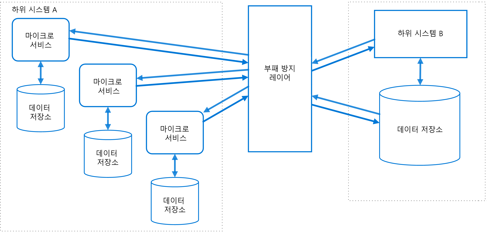

# 손상 방지 레이어 패턴

동일한 의미 체계를 공유하지 않는 다른 하위 시스템 간에 외관 또는 어댑터 레이어를 구현합니다. 이 레이어는 하나의 하위 시스템의 요청을 다른 하위 시스템으로 변환합니다. 이 패턴을 사용하여 응용 프로그램의 디자인이 외부 하위 시스템에 대한 종속성으로 제한되지 않도록 할 수 있습니다. 이 패턴은 *도메인 중심 디자인*에서 Eric Evans가 처음으로 설명했습니다.

## 컨텍스트 및 문제점

대부분의 응용 프로그램은 일부 데이터 또는 기능을 위해 다른 시스템에 의존합니다. 예를 들어 레거시 응용 프로그램을 최신 시스템으로 마이그레이션해도 기존 레거시 리소스가 여전히 필요할 수 있습니다. 새로운 기능은 레거시 시스템을 호출할 수 있어야 합니다. 시간이 지나면서 더 큰 응용 프로그램의 다른 기능을 최신 시스템으로 이동하게 되는 점진적 마이그레이션에서 특히 그렇습니다.

종종 이러한 레거시 시스템에서 복잡한 데이터 스키마 또는 사용되지 않는 API와 같은 품질 문제가 발생합니다. 레거시 시스템에서 사용되는 기능 및 기술은 최신 시스템의 경우와 크게 다를 수 있습니다. 레거시 시스템과 상호 작용하기 위해 새 응용 프로그램은 오래된 인프라, 프로토콜, 데이터 모델, API 또는 최신 응용 프로그램에 추가되지 않은 기타 기능을 지원해야 할 수 있습니다.

새 시스템과 레거시 시스템 간에 액세스를 유지 관리하면 새 시스템이 적어도 레거시 시스템 API의 일부 또는 기타 의미 체계를 강제로 준수할 수 있습니다. 품질 문제가 있는 레거시 기능을 지원하면 완전하게 디자인된 최신 응용 프로그램에 “손상”을 줄 수 있습니다. 

레거시 시스템뿐 아니라 개발 팀이 제어하지 않는 모든 외부 시스템에서 비슷한 문제가 발생할 수 있습니다. 

## 해결 방법

손상 방지 레이어를 다른 하위 시스템 사이에 배치하여 격리합니다. 이 레이어는 두 시스템 간의 통신을 변환하여, 다른 응용 프로그램이 해당 디자인 및 기술 방식을 손상시키지 않도록 하여 해당 시스템을 변경되지 않은 상태로 유지하도록 할 수 있습니다.

 

위의 다이어그램에는 두 개의 하위 시스템을 사용한 응용 프로그램이 나와 있습니다. 하위 시스템 A는 손상 방지 레이어를 통해 하위 시스템 B를 호출합니다. 하위 시스템 A와 손상 방지 레이어 간 통신은 항상 데이터 모델 및 하위 시스템 A의 아키텍처를 사용합니다. 손상 방지 레이어에서 하위 시스템 B로의 호출은 해당 하위 시스템의 데이터 모델 또는 메서드에 아키텍처를 따릅니다. 손상 방지 레이어는 두 시스템 사이의 변환에 필요한 모든 논리를 포함합니다. 이러한 레이어는 응용 프로그램 내의 구성 요소로 또는 독립적인 서비스로 구현할 수 있습니다.

## 문제 및 고려 사항

- 손상 방지 레이어가 있는 경우 두 시스템 간에 수행되는 호출이 지연될 수 있습니다.
- 손상 방지 레이어는 관리 및 유지해야 하는 추가 서비스를 추가합니다.
- 손상 방지 레이어의 크기를 조정하는 방식을 고려합니다.
- 둘 이상의 손상 방지 레이어가 필요한지 고려합니다. 다양한 기술 또는 언어를 사용하여 기능을 여러 서비스로 분해하려고 하거나, 손상 방지 레이어를 분할할 다른 이유가 있을 수 있습니다.
- 다른 응용 프로그램 또는 서비스와의 관계를 고려해서 손상 방지 레이어를 관리하는 방법을 결정합니다. 손상 방지 레이어가 모니터링, 릴리스 및 구성 프로세스에 어떻게 통합될 수 있을까요?
- 트랜잭션 및 데이터 일관성이 유지 관리되고 모니터링할 수 있는지 확인합니다.
- 손상 방지 레이어가 다른 하위 시스템 간의 모든 통신을 처리해야 하는지 또는 기능의 하위 집합만 처리하면 되는지를 고려합니다. 
- 손상 방지 레이어가 응용 프로그램 마이그레이션 전략의 일부인 경우 모든 레거시 기능이 마이그레이션된 후에 영구적인지 또는 사용 중지되는지를 고려합니다.

## 이 패턴을 사용해야 하는 경우

다음 경우에 이 패턴을 사용합니다.

- 마이그레이션이 여러 단계를 통해 진행되도록 계획되어 있지만 새 시스템과 레거시시 스템 간의 통합을 유지 관리해야 하는 경우
- 두 개 또는 그 이상의 하위 시스템이 다른 의미 체계를 갖지만 여전히 통신해야 하는 경우 

새 시스템과 레거시 시스템 간의 큰 의미 체계 차이가 없는 경우에는 이 패턴이 적합하지 않을 수 있습니다. 

## 관련 지침

- [스트랭글러 패턴](./strangler.md)
