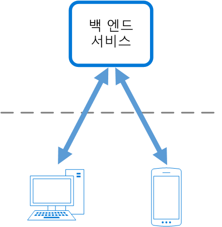
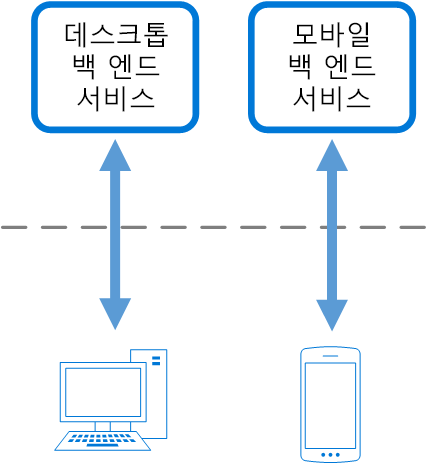

# 프런트 엔드에 대한 백 엔드 패턴

특정 프런트 엔드 애플리케이션 또는 인터페이스에서 사용할 별도의 백 엔드 서비스를 만듭니다. 이 패턴은 단일 백 엔드를 여러 인터페이스에 맞게 사용자 지정하지 않으려는 경우에 유용합니다. 이 패턴은 Sam Newman이 처음으로 설명했습니다.

## 컨텍스트 및 문제점

애플리케이션은 처음에 데스크톱 웹 UI에서 대상으로 지정할 수 있습니다. 일반적으로 해당 UI에 필요한 기능을 제공하는 백 엔드 서비스는 병렬로 개발됩니다. 애플리케이션의 사용자 기반이 확장되면 동일한 백 엔드와 상호 작용해야 하는 모바일 애플리케이션이 개발됩니다. 이 백 엔드 서비스는 데스크톱 및 모바일 인터페이스의 요구 사항을 둘 다 처리하는 범용 백엔드가 됩니다.

하지만 모바일 디바이스의 기능은 화면 크기, 성능 및 디스플레이 제한 측면에서 데스크톱 브라우저와 크게 다릅니다. 결과적으로 모바일 애플리케이션 백 엔드에 대한 요구 사항은 데스크톱 웹 UI와 다릅니다.

이러한 차이점 때문에 백 엔드에 대해 상충되는 요구 사항이 발생하게 됩니다. 백 엔드는 데스크톱 웹 UI 및 모바일 애플리케이션을 둘 다 서비스하기 위해 정기적인 중요한 변경이 필요합니다. 종종 별도의 인터페이스 팀이 각 프런트 엔드에서 작업하므로, 백 엔드가 개발 프로세스의 병목 지점이 될 수 있습니다. 업데이트 요구 사항이 충돌하고, 서비스가 프런트 엔드 둘 다에서 작동되도록 해야 하기 때문에 배포 가능한 단일 리소스에 많은 노력을 투입될 수 있습니다.

개발 활동이 백 엔드 서비스를 중심으로 진행되므로, 백 엔드를 관리하고 유지하기 위한 별도 팀을 만들 수 있습니다. 결과적으로 이로 인해 인터페이스 및 백 엔드 개발 팀 사이에서 연결이 끊어지며, 백 엔드 팀은 여러 다른 UI 팀의 상충하는 요구 사항의 균형을 유지해야 하는 부담을 갖게 됩니다. 한 인터페이스 팀이 백 엔드를 변경해야 할 경우, 해당 변경 내용을 백 엔드에 통합하기 전에 먼저 다른 인터페이스 팀에서도 유효한지 확인해야 합니다.

## 해결 방법

사용자 인터페이스당 하나의 백 엔드를 만듭니다. 다른 프런트 엔드 환경에 영향을 미치지 않고도 프런트 엔드 환경의 요구에 가장 잘 맞도록 각 백 엔드의 동작 및 성능을 미세 조정합니다.

각 백 엔드는 하나의 인터페이스에 맞춰지므로 해당 인터페이스에 대해 최적화할 수 있습니다. 결과적으로 모든 인터페이스의 요구 사항을 충족하는 일반 백 엔드보다 더 작고, 덜 복잡하고, 더 빠를 수 있습니다. 각 인터페이스 팀은 자율적으로 자체 백 엔드를 제어할 수 있으며, 중앙 집중식 백 엔드 개발 팀에 의존하지 않습니다. 이를 통해 인터페이스 팀은 언어 선택, 릴리스 일정, 작업 우선 순위, 백 엔드의 기능 통합 문제를 유연하게 처리할 수 있습니다.

자세한 내용은 [패턴: 프런트 엔드에 대한 백 엔드](https://samnewman.io/patterns/architectural/bff/)를 참조하세요.

## 문제 및 고려 사항

- 배포할 백 엔드 수를 고려합니다.
- 여러 다른 인터페이스(예: 모바일 클라이언트)가 동일한 요청을 수행할 경우 각 인터페이스에 대해 백 엔드를 구현할 필요가 있는지 아니면 단일 백 엔드로 충분한지를 고려합니다.
- 이 패턴을 구현할 때는 서비스 간에 코드가 중복될 가능성이 높습니다.
- 프런트 엔드에 중점을 둔 백 엔드 서비스는 클라이언트별 논리 및 동작만 포함해야 합니다. 일반적인 비즈니스 논리 및 기타 전역 기능은 애플리케이션의 다른 위치에서 관리되어야 합니다.
- 이 패턴이 개발 팀의 업무에 어떻게 반영될 수 있는지 생각해 봅니다.
- 이 패턴을 구현하는 데 걸리는 시간을 고려합니다. 기존 일반 백 엔드를 계속 지원하면서, 새 백 엔드를 구축하면 기술적인 문제가 초래될까요?

## 이 패턴을 사용해야 하는 경우

다음 경우에 이 패턴을 사용합니다.

- 공유 또는 범용 백 엔드 서비스를 유지 관리하는 데 상당량의 개발 오버헤드가 발생합니다.
- 특정 클라이언트 인터페이스의 요구 사항에 맞게 백 엔드를 최적화하려고 할 수 있습니다.
- 범용 백 엔드는 여러 인터페이스를 수용할 수 있게 사용자 지정이 수행됩니다.
- 대체 언어는 다른 사용자 인터페이스의 백 엔드에 좀 더 적합합니다.

다음의 경우에는 이 패턴이 적합하지 않을 수 있습니다.

- 인터페이스가 백 엔드에 대해 동일하거나 유사한 요청 수행하는 경우
- 백 엔드와 상호 작용하는 데 하나의 인터페이스만 사용되는 경우

## 관련 지침

- [게이트웨이 집계 패턴](./gateway-aggregation.md)
- [게이트웨이 오프로딩 패턴](./gateway-offloading.md)
- [게이트웨이 라우팅 패턴](./gateway-routing.md)
