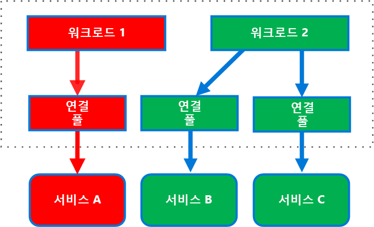
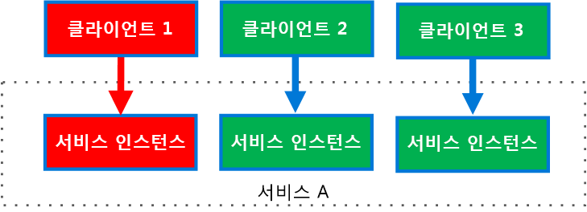

# <a name="bulkhead-pattern"></a><span data-ttu-id="03e21-104">격벽 패턴</span><span class="sxs-lookup"><span data-stu-id="03e21-104">Bulkhead pattern</span></span>

<span data-ttu-id="03e21-105">하나가 고장 나더라도 나머지는 정상적으로 작동하도록 애플리케이션의 요소를 여러 풀에 격리합니다.</span><span class="sxs-lookup"><span data-stu-id="03e21-105">Isolate elements of an application into pools so that if one fails, the others will continue to function.</span></span>

<span data-ttu-id="03e21-106">이 패턴은 구역이 구분된 선체의 파티션과 유사하므로 *격벽*이라고 합니다.</span><span class="sxs-lookup"><span data-stu-id="03e21-106">This pattern is named *Bulkhead* because it resembles the sectioned partitions of a ship's hull.</span></span> <span data-ttu-id="03e21-107">선체가 손상될 경우 손상된 부분만 물로 채워져 배가 가라앉는 것을 방지할 수 있습니다.</span><span class="sxs-lookup"><span data-stu-id="03e21-107">If the hull of a ship is compromised, only the damaged section fills with water, which prevents the ship from sinking.</span></span>

## <a name="context-and-problem"></a><span data-ttu-id="03e21-108">컨텍스트 및 문제점</span><span class="sxs-lookup"><span data-stu-id="03e21-108">Context and problem</span></span>

<span data-ttu-id="03e21-109">클라우드 기반 애플리케이션은 각 서비스에 하나 이상의 소비자가 있는 여러 서비스를 포함할 수 있습니다.</span><span class="sxs-lookup"><span data-stu-id="03e21-109">A cloud-based application may include multiple services, with each service having one or more consumers.</span></span> <span data-ttu-id="03e21-110">서비스의 과도한 로드 또는 실패는 모든 서비스 소비자에게 영향을 미칩니다.</span><span class="sxs-lookup"><span data-stu-id="03e21-110">Excessive load or failure in a service will impact all consumers of the service.</span></span>

<span data-ttu-id="03e21-111">게다가 소비자는 여러 서비스에 동시에 요청을 보낼 수 있으며 각 요청마다 리소스를 사용합니다.</span><span class="sxs-lookup"><span data-stu-id="03e21-111">Moreover, a consumer may send requests to multiple services simultaneously, using resources for each request.</span></span> <span data-ttu-id="03e21-112">소비자가 잘못 구성되거나 응답하지 않는 서비스에 요청을 보내면 클라이언트의 요청으로 사용되는 리소스가 적시에 해제되지 않을 수 있습니다.</span><span class="sxs-lookup"><span data-stu-id="03e21-112">When the consumer sends a request to a service that is misconfigured or not responding, the resources used by the client's request may not be freed in a timely manner.</span></span> <span data-ttu-id="03e21-113">서비스에 계속 요청을 보내면 해당 리소스가 소진될 수 있습니다.</span><span class="sxs-lookup"><span data-stu-id="03e21-113">As requests to the service continue, those resources may be exhausted.</span></span> <span data-ttu-id="03e21-114">예를 들어 클라이언트의 연결 풀이 소진될 수 있습니다.</span><span class="sxs-lookup"><span data-stu-id="03e21-114">For example, the client's connection pool may be exhausted.</span></span> <span data-ttu-id="03e21-115">이로 인해 다른 서비스에 대한 소비자의 요청이 영향을 받습니다.</span><span class="sxs-lookup"><span data-stu-id="03e21-115">At that point, requests by the consumer to other services are impacted.</span></span> <span data-ttu-id="03e21-116">결국 소비자는 원래 응답하지 않는 서비스뿐만 아니라 다른 서비스에도 더 이상 요청을 보낼 수 없습니다.</span><span class="sxs-lookup"><span data-stu-id="03e21-116">Eventually the consumer can no longer send requests to other services, not just the original unresponsive service.</span></span>

<span data-ttu-id="03e21-117">동일한 리소스 소진 문제가 여러 소비자가 있는 서비스에 영향을 줍니다.</span><span class="sxs-lookup"><span data-stu-id="03e21-117">The same issue of resource exhaustion affects services with multiple consumers.</span></span> <span data-ttu-id="03e21-118">하나의 클라이언트에서 발생한 많은 요청은 서비스에서 사용 가능한 리소스를 소진할 수 있습니다.</span><span class="sxs-lookup"><span data-stu-id="03e21-118">A large number of requests originating from one client may exhaust available resources in the service.</span></span> <span data-ttu-id="03e21-119">다른 소비자가 더 이상 서비스를 사용할 수 없어 실패가 연속되는 결과를 야기합니다.</span><span class="sxs-lookup"><span data-stu-id="03e21-119">Other consumers are no longer able to consume the service, causing a cascading failure effect.</span></span>

## <a name="solution"></a><span data-ttu-id="03e21-120">해결 방법</span><span class="sxs-lookup"><span data-stu-id="03e21-120">Solution</span></span>

<span data-ttu-id="03e21-121">소비자 부하 및 가용성 요구 사항에 따라 서로 다른 그룹으로 서비스 인스턴스를 분할합니다.</span><span class="sxs-lookup"><span data-stu-id="03e21-121">Partition service instances into different groups, based on consumer load and availability requirements.</span></span> <span data-ttu-id="03e21-122">이렇게 디자인하면 실패를 격리하여 실패가 발생하더라도 일부 소비자에 대한 서비스 기능을 유지할 수 있습니다.</span><span class="sxs-lookup"><span data-stu-id="03e21-122">This design helps to isolate failures, and allows you to sustain service functionality for some consumers, even during a failure.</span></span>

<span data-ttu-id="03e21-123">또한 소비자는 한 서비스를 호출하는 데 사용되는 리소스가 다른 서비스 호출에 사용되는 리소스에 영향을 주지 않도록 리소스를 분할할 수 있습니다.</span><span class="sxs-lookup"><span data-stu-id="03e21-123">A consumer can also partition resources, to ensure that resources used to call one service don't affect the resources used to call another service.</span></span> <span data-ttu-id="03e21-124">예를 들어 여러 서비스를 호출하는 소비자에게 각 서비스에 대한 연결 풀을 할당할 수 있습니다.</span><span class="sxs-lookup"><span data-stu-id="03e21-124">For example, a consumer that calls multiple services may be assigned a connection pool for each service.</span></span> <span data-ttu-id="03e21-125">서비스가 실패하게 되면 해당 서비스에 할당된 연결 풀에만 적용되어 소비자는 계속해서 다른 서비스를 사용할 수 있습니다.</span><span class="sxs-lookup"><span data-stu-id="03e21-125">If a service begins to fail, it only affects the connection pool assigned for that service, allowing the consumer to continue using the other services.</span></span>

<span data-ttu-id="03e21-126">이 패턴의 이점은 다음과 같습니다.</span><span class="sxs-lookup"><span data-stu-id="03e21-126">The benefits of this pattern include:</span></span>

- <span data-ttu-id="03e21-127">소비자 및 서비스를 연속 실패로부터 격리합니다.</span><span class="sxs-lookup"><span data-stu-id="03e21-127">Isolates consumers and services from cascading failures.</span></span> <span data-ttu-id="03e21-128">소비자 또는 서비스에 영향을 주는 문제는 자체 격벽 내에 격리하여 전체 솔루션의 실패를 방지할 수 있습니다.</span><span class="sxs-lookup"><span data-stu-id="03e21-128">An issue affecting a consumer or service can be isolated within its own bulkhead, preventing the entire solution from failing.</span></span>
- <span data-ttu-id="03e21-129">서비스 실패가 발생할 경우 일부 기능을 보존할 수 있습니다.</span><span class="sxs-lookup"><span data-stu-id="03e21-129">Allows you to preserve some functionality in the event of a service failure.</span></span> <span data-ttu-id="03e21-130">애플리케이션의 다른 서비스 및 기능은 계속 작동합니다.</span><span class="sxs-lookup"><span data-stu-id="03e21-130">Other services and features of the application will continue to work.</span></span>
- <span data-ttu-id="03e21-131">다른 품질의 소비 애플리케이션 서비스를 제공하는 서비스를 배포할 수 있습니다.</span><span class="sxs-lookup"><span data-stu-id="03e21-131">Allows you to deploy services that offer a different quality of service for consuming applications.</span></span> <span data-ttu-id="03e21-132">우선 순위가 높은 소비자 풀은 우선 순위가 높은 서비스를 사용하도록 구성할 수 있습니다.</span><span class="sxs-lookup"><span data-stu-id="03e21-132">A high-priority consumer pool can be configured to use high-priority services.</span></span>

<span data-ttu-id="03e21-133">다음 다이어그램은 개별 서비스를 호출하는 연결 풀 주위의 격벽 구조를 보여 줍니다.</span><span class="sxs-lookup"><span data-stu-id="03e21-133">The following diagram shows bulkheads structured around connection pools that call individual services.</span></span> <span data-ttu-id="03e21-134">서비스 A가 실패하거나 약간의 다른 문제를 야기하는 경우 연결 풀이 격리되어 있으므로 서비스 A에 할당된 스레드 풀을 사용하는 워크로드만 영향을 받습니다.</span><span class="sxs-lookup"><span data-stu-id="03e21-134">If Service A fails or causes some other issue, the connection pool is isolated, so only workloads using the thread pool assigned to Service A are affected.</span></span> <span data-ttu-id="03e21-135">서비스 B와 C를 사용하는 워크로드는 영향을 받지 않고 중단 없이 계속 작업할 수 있습니다.</span><span class="sxs-lookup"><span data-stu-id="03e21-135">Workloads that use Service B and C are not affected and can continue working without interruption.</span></span>



<span data-ttu-id="03e21-137">다음 다이어그램은 단일 서비스를 호출하는 여러 클라이언트를 보여 줍니다.</span><span class="sxs-lookup"><span data-stu-id="03e21-137">The next diagram shows multiple clients calling a single service.</span></span> <span data-ttu-id="03e21-138">각 클라이언트를 별도 서비스 인스턴스에 할당합니다.</span><span class="sxs-lookup"><span data-stu-id="03e21-138">Each client is assigned a separate service instance.</span></span> <span data-ttu-id="03e21-139">클라이언트 1의 너무 많은 요청으로 해당 인스턴스가 과부하됩니다.</span><span class="sxs-lookup"><span data-stu-id="03e21-139">Client 1 has made too many requests and overwhelmed its instance.</span></span> <span data-ttu-id="03e21-140">각 서비스 인스턴스는 서로 격리되어 있으므로 다른 클라이언트는 호출 작업을 계속할 수 있습니다.</span><span class="sxs-lookup"><span data-stu-id="03e21-140">Because each service instance is isolated from the others, the other clients can continue making calls.</span></span>



## <a name="issues-and-considerations"></a><span data-ttu-id="03e21-142">문제 및 고려 사항</span><span class="sxs-lookup"><span data-stu-id="03e21-142">Issues and considerations</span></span>

- <span data-ttu-id="03e21-143">애플리케이션의 비즈니스 및 기술 요구 사항과 관련하여 파티션을 정의합니다.</span><span class="sxs-lookup"><span data-stu-id="03e21-143">Define partitions around the business and technical requirements of the application.</span></span>
- <span data-ttu-id="03e21-144">서비스 또는 소비자를 격벽으로 분할할 때 비용, 성능 및 관리 효율성 측면에서의 오버헤드뿐만 아니라 기술에서 제공되는 격리 수준을 고려합니다.</span><span class="sxs-lookup"><span data-stu-id="03e21-144">When partitioning services or consumers into bulkheads, consider the level of isolation offered by the technology as well as the overhead in terms of cost, performance and manageability.</span></span>
- <span data-ttu-id="03e21-145">보다 정교한 오류 처리 방법을 제공하려면 다시 시도, 회로 차단기 및 패턴 제한을 조합한 격벽을 사용하는 것이 좋습니다.</span><span class="sxs-lookup"><span data-stu-id="03e21-145">Consider combining bulkheads with retry, circuit breaker, and throttling patterns to provide more sophisticated fault handling.</span></span>
- <span data-ttu-id="03e21-146">격벽으로 소비자를 분할할 때 프로세스, 스레드 풀 및 세마포를 사용하는 것이 좋습니다.</span><span class="sxs-lookup"><span data-stu-id="03e21-146">When partitioning consumers into bulkheads, consider using processes, thread pools, and semaphores.</span></span> <span data-ttu-id="03e21-147">[Netflix Hystrix][hystrix] 및 [Polly][polly]와 같은 프로젝트는 소비자 격벽을 만들기 위한 프레임워크를 제공합니다.</span><span class="sxs-lookup"><span data-stu-id="03e21-147">Projects like [Netflix Hystrix][hystrix] and [Polly][polly] offer a framework for creating consumer bulkheads.</span></span>
- <span data-ttu-id="03e21-148">격벽으로 서비스를 분할할 때 별도의 가상 머신, 컨테이너 또는 프로세스에 배포하는 것이 좋습니다.</span><span class="sxs-lookup"><span data-stu-id="03e21-148">When partitioning services into bulkheads, consider deploying them into separate virtual machines, containers, or processes.</span></span> <span data-ttu-id="03e21-149">컨테이너는 리소스 오버헤드가 매우 낮은 적절히 균형 잡힌 리소스 격리를 제공합니다.</span><span class="sxs-lookup"><span data-stu-id="03e21-149">Containers offer a good balance of resource isolation with fairly low overhead.</span></span>
- <span data-ttu-id="03e21-150">비동기 메시지를 사용하여 통신하는 서비스는 다른 큐 집합을 통해 격리할 수 있습니다.</span><span class="sxs-lookup"><span data-stu-id="03e21-150">Services that communicate using asynchronous messages can be isolated through different sets of queues.</span></span> <span data-ttu-id="03e21-151">각 큐에는 메시지를 처리하는 전용 인스턴스 집합 또는 큐에서 제거하고 처리를 디스패치하는 알고리즘을 사용하는 단일 인스턴스 집합을 포함할 수 있습니다.</span><span class="sxs-lookup"><span data-stu-id="03e21-151">Each queue can have a dedicated set of instances processing messages on the queue, or a single group of instances using an algorithm to dequeue and dispatch processing.</span></span>
- <span data-ttu-id="03e21-152">격벽에 대한 세분성 수준을 결정합니다.</span><span class="sxs-lookup"><span data-stu-id="03e21-152">Determine the level of granularity for the bulkheads.</span></span> <span data-ttu-id="03e21-153">예를 들어 여러 파티션에 테넌트를 배포할 경우 각 테넌트를 별도의 파티션에 배치하거나 여러 테넌트를 하나의 파티션에 배치할 수 있습니다.</span><span class="sxs-lookup"><span data-stu-id="03e21-153">For example, if you want to distribute tenants across partitions, you could place each tenant into a separate partition, or put several tenants into one partition.</span></span>
- <span data-ttu-id="03e21-154">각 파티션의 성능 및 SLA를 모니터링합니다.</span><span class="sxs-lookup"><span data-stu-id="03e21-154">Monitor each partition’s performance and SLA.</span></span>

## <a name="when-to-use-this-pattern"></a><span data-ttu-id="03e21-155">이 패턴을 사용해야 하는 경우</span><span class="sxs-lookup"><span data-stu-id="03e21-155">When to use this pattern</span></span>

<span data-ttu-id="03e21-156">다음 경우에 이 패턴을 사용합니다.</span><span class="sxs-lookup"><span data-stu-id="03e21-156">Use this pattern to:</span></span>

- <span data-ttu-id="03e21-157">백 엔드 서비스 집합을 사용하는 데 필요한 리소스를 격리하는 경우 특히 서비스 중 하나가 응답하지 않는 경우에도 애플리케이션이 일정 수준의 기능을 제공할 수 있는 경우</span><span class="sxs-lookup"><span data-stu-id="03e21-157">Isolate resources used to consume a set of backend services, especially if the application can provide some level of functionality even when one of the services is not responding.</span></span>
- <span data-ttu-id="03e21-158">표준 소비자로부터 중요한 소비자를 격리하는 경우</span><span class="sxs-lookup"><span data-stu-id="03e21-158">Isolate critical consumers from standard consumers.</span></span>
- <span data-ttu-id="03e21-159">연속 실패로부터 애플리케이션을 보호하는 경우</span><span class="sxs-lookup"><span data-stu-id="03e21-159">Protect the application from cascading failures.</span></span>

<span data-ttu-id="03e21-160">다음 경우에는 이 패턴이 적합하지 않을 수 있습니다.</span><span class="sxs-lookup"><span data-stu-id="03e21-160">This pattern may not be suitable when:</span></span>

- <span data-ttu-id="03e21-161">프로젝트에서 리소스 사용 효율성이 떨어지면 안 되는 경우</span><span class="sxs-lookup"><span data-stu-id="03e21-161">Less efficient use of resources may not be acceptable in the project.</span></span>
- <span data-ttu-id="03e21-162">복잡성을 추가할 필요가 없는 경우</span><span class="sxs-lookup"><span data-stu-id="03e21-162">The added complexity is not necessary</span></span>

## <a name="example"></a><span data-ttu-id="03e21-163">예</span><span class="sxs-lookup"><span data-stu-id="03e21-163">Example</span></span>

<span data-ttu-id="03e21-164">다음 Kubernetes 구성 파일은 자체 CPU 및 메모리 리소스와 제한을 사용하여 단일 서비스를 실행하는 격리된 컨테이너를 만듭니다.</span><span class="sxs-lookup"><span data-stu-id="03e21-164">The following Kubernetes configuration file creates an isolated container to run a single service, with its own CPU and memory resources and limits.</span></span>

```yml
apiVersion: v1
kind: Pod
metadata:
  name: drone-management
spec:
  containers:
  - name: drone-management-container
    image: drone-service
    resources:
      requests:
        memory: "64Mi"
        cpu: "250m"
      limits:
        memory: "128Mi"
        cpu: "1"
```

## <a name="related-guidance"></a><span data-ttu-id="03e21-165">관련 지침</span><span class="sxs-lookup"><span data-stu-id="03e21-165">Related guidance</span></span>

- [<span data-ttu-id="03e21-166">Azure용 복원 애플리케이션 디자인</span><span class="sxs-lookup"><span data-stu-id="03e21-166">Designing resilient applications for Azure</span></span>](../resiliency/index.md)
- [<span data-ttu-id="03e21-167">회로 차단기 패턴</span><span class="sxs-lookup"><span data-stu-id="03e21-167">Circuit Breaker pattern</span></span>](./circuit-breaker.md)
- [<span data-ttu-id="03e21-168">재시도 패턴</span><span class="sxs-lookup"><span data-stu-id="03e21-168">Retry pattern</span></span>](./retry.md)
- [<span data-ttu-id="03e21-169">제한 패턴</span><span class="sxs-lookup"><span data-stu-id="03e21-169">Throttling pattern</span></span>](./throttling.md)

<!-- links -->

[hystrix]: https://github.com/Netflix/Hystrix
[polly]: https://github.com/App-vNext/Polly
