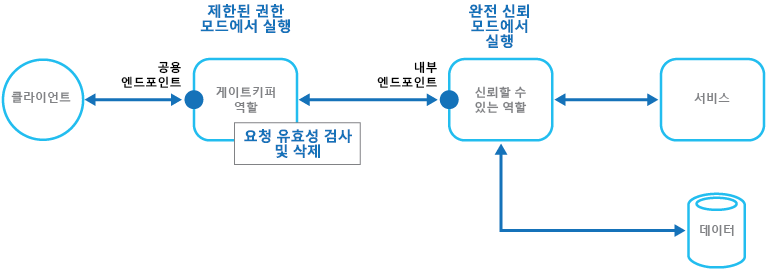

# 게이트키퍼 패턴

[!INCLUDE [header](../_includes/header.md)]

클라이언트와 응용 프로그램 또는 서비스 간 브로커 역할을 하며, 요청을 검사 및 정리하고, 요청 및 데이터를 전달하는 전용 호스트 인스턴스를 사용하여 응용 프로그램 및 서비스를 보호합니다. 이를 통해 보안의 추가적인 계층을 제공하고 공격에 노출되는 시스템 부분을 제한할 수 있습니다.

## 컨텍스트 및 문제점

응용 프로그램은 요청을 수락하고 처리하면서 고객에게 해당 기술을 노출합니다. 클라우드 호스팅 시나리오에서 응용 프로그램은 클라이언트가 연결하였고, 일반적으로 클라이언트의 요청을 처리하는 코드를 포함하는 끝점을 노출합니다. 이 코드는 인증 및 유효성 검사, 일부 또는 모든 요청 처리를 수행하고 클라이언트 대신 저장소 및 기타 서비스에 액세스할 가능성이 있습니다.

악의적인 사용자가 시스템을 손상하고 응용 프로그램의 호스팅 환경에 액세스할 수 있는 경우, 자격 증명 및 저장소 키와 같이 응용 프로그램에서 사용하는 보안 메커니즘을 비롯하여 응용 프로그램이 액세스하는 서비스 및 데이터가 노출됩니다. 따라서 악의적인 사용자가 중요한 정보 및 다른 서비스에 쉽게 액세스할 수 있습니다.

## 해결 방법

클라이언트가 중요한 정보 및 서비스에 액세스하는 위험을 최소화하려면 공용 끝점을 노출하는 호스트 또는 작업을 요청을 처리하고 저장소에 액세스하는 코드와 분리합니다. 클라이언트와 상호 작용한 다음 요청을 처리할 호스트 또는 작업에 요청을 전달(분리된 인터페이스를 통해)하는 외관 또는 전용 작업을 사용하여 이 작업을 수행할 수 있습니다. 그림에 이 패턴의 대략적인 개요가 나와 있습니다.

게이트키퍼 패턴은 저장소를 보호하는 간단한 방법으로 사용하거나 응용 프로그램의 모든 기능을 보호하기 위한 더 포괄적인 외관으로 사용할 수 있습니다. 중요한 요인은 다음과 같습니다.

- **제어된 유효성 검사.** 게이트 키퍼는 모든 요청의 유효성을 검사하고 유효성 검사 요구 사항을 충족하지 않는 요청을 거부합니다.
- **제한된 위험 및 노출.** 게이트 키퍼는 신뢰할 수 있는 호스트가 저장소 및 서비스에 액세스하는 데 사용하는 자격 증명 또는 키에 액세스하지 않습니다. 게이트 키퍼가 손상되면 공격자가 이러한 자격 증명 또는 키에 액세스하지 않습니다.
- **적절한 보안.** 게이트 키퍼는 나머지 응용 프로그램이 저장소 및 서비스 액세스에 요구되는 완전 신뢰 모드에서 실행되는 동안 제한된 권한 모드에서 실행됩니다. 게이트 키퍼가 손상되면 응용 프로그램 서비스 또는 데이터에 직접 액세스할 수 없습니다.

이 패턴은 일반적인 네트워크 토폴로지의 방화벽과 같은 역할을 합니다. 이를 통해 게이트 키퍼가 요청을 검사하고, 필요한 작업을 수행하는 신뢰할 수 있는 호스트(키마스터라고도 함)에 요청을 전달할지 여부를 결정할 수 있습니다.  이 결정에는 일반적으로 요청 콘텐츠를 신뢰할 수 있는 호스트에 전달하기 전에 유효성을 검사하고 정리하기 위해 게이트 키퍼가 필요합니다.

## 문제 및 고려 사항

이 패턴을 구현할 방법을 결정할 때 다음 사항을 고려하세요.

- 신뢰할 수 있는 호스트의 게이트 키퍼가 요청을 전달하여 내부 또는 보호된 끝점만 노출하고 게이트 키퍼에만 연결하는지 확인합니다. 신뢰할 수 있는 호스트는 외부 끝점 또는 인터페이스를 노출해서는 안 됩니다.
- 게이트 키퍼를 제한된 권한 모드로 실행해야 합니다. 일반적으로 게이트 키퍼와 신뢰할 수 있는 호스트를 개별 호스팅된 서비스 또는 가상 머신에서 실행하는 것을 의미합니다.
- 게이트 키퍼는 응용 프로그램 또는 서비스와 관련된 처리를 수행하거나 어떠한 데이터에도 액세스해서는 안 됩니다. 순수하게 유효성을 검사하고 요청을 정리하는 기능만 합니다. 신뢰할 수 있는 호스트에서 추가 유효성 검사를 수행해야 할 수도 있지만, 핵심적인 유효성 검사는 게이트 키퍼가 수행해야 합니다.
- 게이트 키퍼와 신뢰할 수 있는 호스트 또는 가능한 작업 간의 보안 통신 채널(HTTPS, SSL 또는 TLS)을 사용합니다. 그러나 일부 호스팅 환경은 내부 끝점에 HTTPS를 지원하지 않습니다.
- 게이트 키퍼 패턴을 구현하는 응용 프로그램에 추가 계층을 더하면 그에 따른 추가적인 처리 및 네트워크 통신으로 인해 성능에 어느 정도 영향을 미칠 가능성이 높습니다.
- 게이트 키퍼 인스턴스는 단일 실패 지점일 수 있습니다. 오류의 영향을 최소화하려면 추가 인스턴스를 배포하고, 용량이 가용성을 유지할 수 있는지 확인하는 자동 크기 조정 메커니즘을 사용하는 것이 좋습니다.

## 이 패턴을 사용해야 하는 경우

이 패턴은 다음과 같은 경우에 유용합니다.

- 중요한 정보를 처리하거나, 악의적인 공격으로부터 높은 보호 수준이 필수인 서비스를 노출하거나, 중단되어서는 안 되는 중요 업무용 작업을 수행하는 응용 프로그램.
- 주요 작업에서 별도로 요청 유효성 검사를 수행하거나, 유지 관리 및 관리를 간소화하기 위해 이 유효성 검사를 중앙 집중화할 필요가 있는 분산 응용 프로그램.

## 예

클라우드 호스팅 시나리오에서는 게이트 키퍼 역할 또는 가상 머신을 응용 프로그램의 신뢰할 수 있는 역할 및 서비스와 분리하여 이 패턴을 구현할 수 있습니다. 이는 내부 끝점, 큐 또는 저장소를 중간 통신 메커니즘으로 사용하면 수행할 수 있습니다. 이 그림에서는 내부 끝점을 사용하는 모습을 보여 줍니다.

## 관련된 패턴

[Valet 키 패턴](valet-key.md)은 게이트 키퍼 패턴을 구현하는 경우와 관련될 수도 있습니다. 이는 게이트 키퍼와 신뢰할 수 있는 역할 사이에서 통신할 때 리소스에 대한 액세스 사용 권한을 제한하는 키 또는 토큰을 사용하여 보안을 강화하기에 좋은 사례입니다. 클라이언트에 특정 리소스 또는 서비스에 대한 제한된 직접 액세스를 제공하는 토큰 또는 키를 사용하는 방법을 설명합니다.
