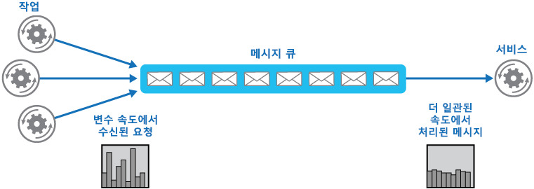
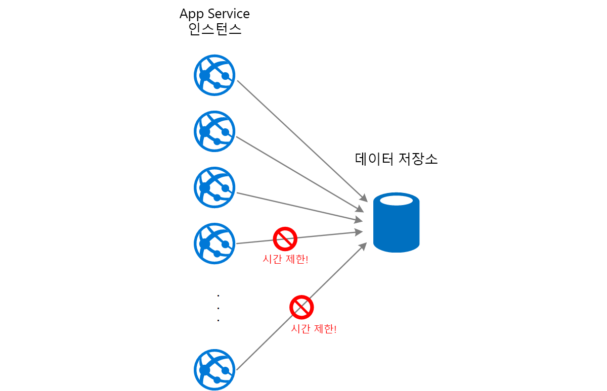
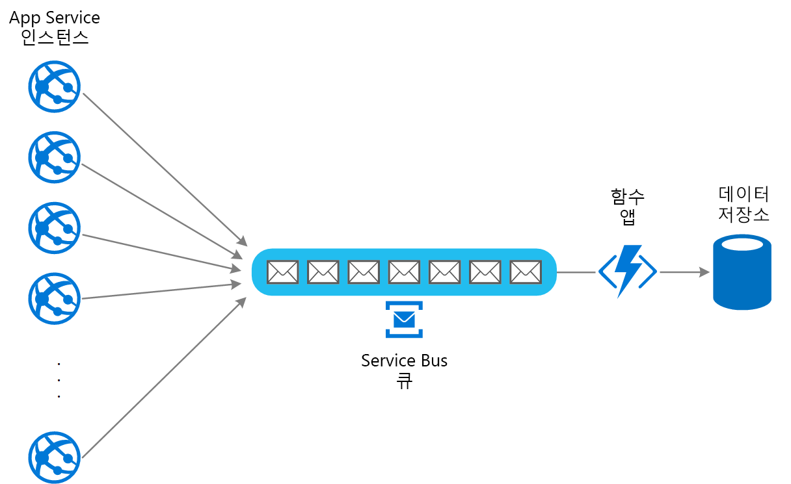

# 큐 기반 부하 평준화 패턴Queue-Based Load Leveling pattern

서비스 장애 또는 작업의 시간 초과를 야기할 수 있는 일시적 과부하를 원활히 처리하기 위해 작업과 그 작업이 호출하는 서비스 사이에서 버퍼 역할을 하는 큐를 사용합니다. 그러면 요구 급증이 작업 및 서비스의 가용성과 응답성에 미치는 영향을 최소화할 수 있습니다.Use a queue that acts as a buffer between a task and a service it invokes in order to smooth intermittent heavy loads that can cause the service to fail or the task to time out. This can help to minimize the impact of peaks in demand on availability and responsiveness for both the task and the service.

## 컨텍스트 및 문제점Context and problem

클라우드의 다양한 솔루션에는 서비스 호출 작업을 실행하는 것이 포함됩니다.Many solutions in the cloud involve running tasks that invoke services. 이러한 환경에서 서비스가 일시적 과부하를 받게 되면 성능 또는 신뢰성 문제가 야기될 수 있습니다.In this environment, if a service is subjected to intermittent heavy loads, it can cause performance or reliability issues.

서비스는 이를 사용하는 작업과 동일한 솔루션의 일부이거나 캐시, 저장소 서비스 등 자주 사용하는 리소스에 대한 액세스를 제공하는 타사 서비스일 수도 있습니다.A service could be part of the same solution as the tasks that use it, or it could be a third-party service providing access to frequently used resources such as a cache or a storage service. 동시에 실행되는 여러 작업에서 동일한 서비스를 사용할 경우 임의 시점에 서비스에 대한 요청 규모를 예측하는 것은 어려울 수 있습니다.If the same service is used by a number of tasks running concurrently, it can be difficult to predict the volume of requests to the service at any time.

서비스 요구가 급증할 수 있고 이는 오버로드를 야기하여 적시에 요청에 대응하는 것을 불가능하게 만들 수 있습니다.A service might experience peaks in demand that cause it to overload and be unable to respond to requests in a timely manner. 동시에 여러 요청이 서비스에 쇄도하면 이러한 요청으로 야기되는 경합을 처리할 수 없을 경우 서비스 장애로 이어질 수도 있습니다.Flooding a service with a large number of concurrent requests can also result in the service failing if it's unable to handle the contention these requests cause.

## 해결 방법Solution

솔루션을 리팩터링하고 작업과 서비스 간에 큐를 도입합니다.Refactor the solution and introduce a queue between the task and the service. 작업과 서비스가 비동기적으로 실행됩니다.The task and the service run asynchronously. 작업은 서비스가 큐에 요구하는 데이터가 포함된 메시지를 게시합니다.The task posts a message containing the data required by the service to a queue. 큐는 버퍼 역할을 하며 서비스가 검색할 때까지 메시지를 저장합니다.The queue acts as a buffer, storing the message until it's retrieved by the service. 서비스가 큐의 메시지를 검색하고 처리합니다.The service retrieves the messages from the queue and processes them. 매우 다양한 속도로 생성될 수 있는 여러 작업의 요청을 동일한 메시지 큐를 통해 서비스에 전달할 수 있습니다.Requests from a number of tasks, which can be generated at a highly variable rate, can be passed to the service through the same message queue. 아래 그림은 큐를 사용하여 서비스의 부하를 평준화하는 것을 보여 줍니다.This figure shows using a queue to level the load on a service.

큐는 작업을 서비스로부터 분리하고, 서비스는 동시 작업의 요청 규모에 관계없이 자체 속도로 메시지를 처리할 수 있습니다.The queue decouples the tasks from the service, and the service can handle the messages at its own pace regardless of the volume of requests from concurrent tasks. 또한 큐에 메시지를 게시하는 시점에 서비스를 사용할 수 없는 경우에도 작업이 지연되지 않습니다.Additionally, there's no delay to a task if the service isn't available at the time it posts a message to the queue.

이 패턴은 다음과 같은 이점을 제공합니다.This pattern provides the following benefits:

- 가용성을 최대화하는 데 도움이 됩니다. 왜냐하면 서비스에 발생하는 지연이 애플리케이션에 즉각적이고 직접적인 영향을 주지 않고, 서비스를 이용할 수 없거나 현재 메시지를 처리할 수 없는 상태에서도 메시지를 큐에 계속 게시할 수 있기 때문입니다.It can help to maximize availability because delays arising in services won't have an immediate and direct impact on the application, which can continue to post messages to the queue even when the service isn't available or isn't currently processing messages.
- 요구를 충족하도록 큐 수와 서비스 수를 모두 변경할 수 있기 때문에 가용성을 최대화할 수 있습니다.It can help to maximize scalability because both the number of queues and the number of services can be varied to meet demand.
- 배포되는 서비스 인스턴스의 수가 최대 부하가 아닌 평균 부하만 충족하도록 적절한 수준이면 되므로 비용을 조절하는 데 도움이 됩니다.It can help to control costs because the number of service instances deployed only have to be adequate to meet average load rather than the peak load.

    >  요구가 시스템 장애를 야기할 수준의 임계값에 도달할 경우 일부 서비스는 제한을 적용합니다.Some services implement throttling when demand reaches a threshold beyond which the system could fail. 제한은 이용 가능한 기능을 축소할 수 있습니다.Throttling can reduce the functionality available. 이 임계값에 도달하지 않도록 하기 위해 이 서비스를 사용하여 부하 평준화를 구현할 수 있습니다.You can implement load leveling with these services to ensure that this threshold isn't reached.

## 문제 및 고려 사항Issues and considerations

이 패턴을 구현할 방법을 결정할 때 다음 사항을 고려하세요.Consider the following points when deciding how to implement this pattern:

- 대상 리소스의 과부하를 피하기 위해 서비스의 메시지 처리 속도를 제어하는 애플리케이션 논리를 구현할 필요가 있습니다.It's necessary to implement application logic that controls the rate at which services handle messages to avoid overwhelming the target resource. 요구 급증이 시스템의 다음 단계로 전달되지 않도록 합니다.Avoid passing spikes in demand to the next stage of the system. 부하 상태에서 시스템을 테스트하여 필요한 평준화 기능을 제공하는지 확인하고, 이를 달성하기 위해 메시지를 처리하는 서비스 인스턴스 수와 큐 수를 조정합니다.Test the system under load to ensure that it provides the required leveling, and adjust the number of queues and the number of service instances that handle messages to achieve this.
- 메시지 큐는 단방향 통신 메커니즘입니다.Message queues are a one-way communication mechanism. 작업이 서비스로부터 회신을 예상할 경우 서비스가 응답 전송을 위해 사용할 수 있는 메커니즘을 구현하는 것이 필요합니다.If a task expects a reply from a service, it might be necessary to implement a mechanism that the service can use to send a response. 자세한 내용은 [비동기 메시징 입문서](https://msdn.microsoft.com/library/dn589781.aspx)를 참조하세요.For more information, see the [Asynchronous Messaging Primer](https://msdn.microsoft.com/library/dn589781.aspx).
- 큐의 요청을 수신하는 서비스에 자동 크기 조정을 적용할 경우 주의해야 합니다.Be careful if you apply autoscaling to services that are listening for requests on the queue. 해당 서비스가 공유하는 모든 리소스의 경합이 증가되고, 부하 평준화를 위해 큐를 사용하는 효과가 축소될 수 있습니다.This can result in increased contention for any resources that these services share and diminish the effectiveness of using the queue to level the load.

## 이 패턴을 사용해야 하는 경우When to use this pattern

이 패턴은 오버로드가 발생하는 서비스를 사용하는 모든 애플리케이션에 유용합니다.This pattern is useful to any application that uses services that are subject to overloading.

애플리케이션이 최소 대기 시간으로 서비스로부터 응답을 받을 것으로 예상되는 경우에는 이 패턴이 유용하지 않습니다.This pattern isn't useful if the application expects a response from the service with minimal latency.

## 예Example

웹앱은 외부 데이터 저장소에 데이터를 씁니다.A web app writes data to an external data store. 다수의 웹앱의 인스턴스가 동시에 실행되는 경우 데이터 저장소가 요청에 충분히 빨리 응답하지 못해 시간이 초과되거나, 스로틀되거나, 실패할 수도 있습니다.If a large number of instances of the web app run concurrently, the data store might be unable to respond to requests quickly enough, causing requests to time out, be throttled, or otherwise fail. 다음 다이어그램은 애플리케이션의 인스턴스로부터 다수의 동시 요청을 받아 과부하가 걸린 데이터 저장소를 보여줍니다.The following diagram shows a data store being overwhelmed by a large number of concurrent requests from instances of an application.

이 문제를 해결하기 위해 큐를 사용하여 애플리케이션 인스턴스와 데이터 저장소 간의 부하를 평준화할 수 있습니다.To resolve this, you can use a queue to level the load between the application instances and the data store. Azure Functions 앱은 큐에서 메시지를 읽고 데이터 저장소에 대한 읽기/쓰기 요청을 수행합니다.An Azure Functions app reads the messages from the queue and performs the read/write requests to the data store. 함수 앱의 애플리케이션 논리는 저장소의 과부하 방지를 위해 데이터 저장소에 요청을 전달하는 속도를 제어할 수 있습니다.The application logic in the function app can control the rate at which it passes requests to the data store, to prevent the store from being overwhelmed. (그렇지 않으면 함수 앱은 백 엔드에서 동일한 문제가 다시 제기됩니다.)(Otherwise the function app will just re-introduce the same problem at the back end.)

## 관련 패턴 및 지침Related patterns and guidance

이 패턴을 구현할 때 다음 패턴 및 지침도 관련이 있을 수 있습니다.The following patterns and guidance might also be relevant when implementing this pattern:

- [비동기 메시징 입문](https://msdn.microsoft.com/library/dn589781.aspx).[Asynchronous Messaging Primer](https://msdn.microsoft.com/library/dn589781.aspx). 메시지 큐는 본질적으로 비동기 방식입니다.Message queues are inherently asynchronous. 서비스와 직접 통신하는 것에서 메시지 큐를 사용하는 것으로 조정하려면 애플리케이션 논리를 다시 디자인해야 할 수 있습니다.It might be necessary to redesign the application logic in a task if it's adapted from communicating directly with a service to using a message queue. 마찬가지로 메시지 큐에서 요청을 받으려면 서비스를 리팩터링해야 할 수 있습니다.Similarly, it might be necessary to refactor a service to accept requests from a message queue. 또는 예에서 설명한 것처럼 프록시 서비스를 구현하는 것도 가능할 수 있습니다.Alternatively, it might be possible to implement a proxy service, as described in the example.

- [경쟁 소비자 패턴](./competing-consumers.md).[Competing Consumers pattern](./competing-consumers.md). 부하 평준화 큐에서 각각 메시지 소비자 역할을 하는 다수의 서비스 인스턴스를 실행하는 것이 가능할 수 있습니다.It might be possible to run multiple instances of a service, each acting as a message consumer from the load-leveling queue. 이 접근 방식을 사용하여 메시지를 수신하고 서비스로 전달하는 속도를 조정할 수 있습니다.You can use this approach to adjust the rate at which messages are received and passed to a service.

- [제한 패턴](./throttling.md).[Throttling pattern](./throttling.md). 서비스로 제한을 구현하는 간단한 방법은 큐 기반 부하 평준화를 사용하여 모든 요청을 메시지 큐를 통해 서비스로 라우트하는 것입니다.A simple way to implement throttling with a service is to use queue-based load leveling and route all requests to a service through a message queue. 서비스는 서비스가 요구하는 리소스가 소진되지 않고 발생 가능한 경합 수량을 줄이는 속도로 요청을 처리할 수 있습니다.The service can process requests at a rate that ensures that resources required by the service aren't exhausted, and to reduce the amount of contention that could occur.

- [Azure 메시징 서비스 간 선택](/azure/event-grid/compare-messaging-services).[Choose between Azure messaging services](/azure/event-grid/compare-messaging-services). Azure 애플리케이션에서 메시징 및 큐 메커니즘 선택에 관한 정보입니다.Information about choosing a messaging and queuing mechanism in Azure applications.

- [Azure 웹 애플리케이션에서 확장성 향상](../reference-architectures/app-service-web-app/scalable-web-app.md).[Improve scalability in an Azure web application](../reference-architectures/app-service-web-app/scalable-web-app.md). 이 참조 아키텍처는 아키텍처의 일부로 큐 기반 부하 평준화를 포함합니다.This reference architecture includes queue-based load leveling as part of the architecture.
