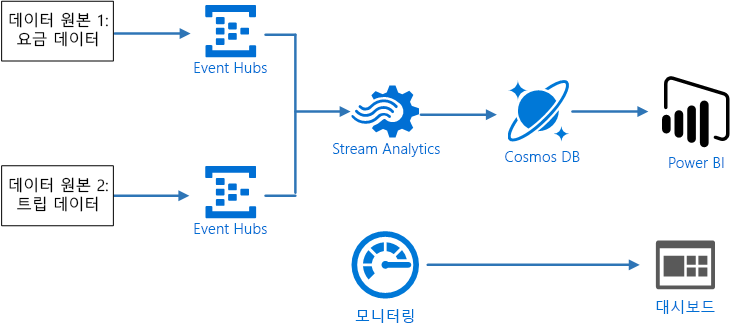
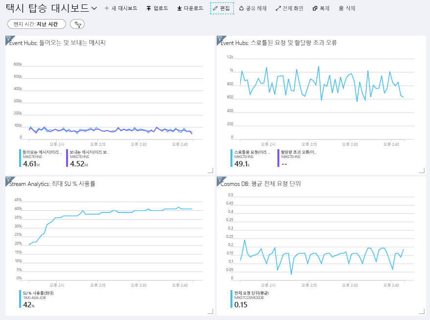
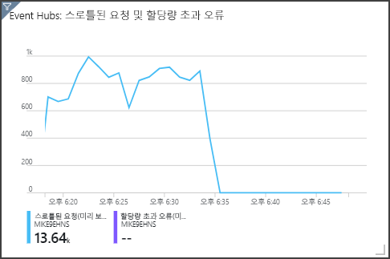

# <a name="create-a-stream-processing-pipeline-with-azure-stream-analytics"></a>Azure Stream Analytics를 사용하는 스트림 처리 파이프라인 만들기

이 참조 아키텍처는 엔드투엔드 [스트림 처리](/azure/architecture/data-guide/big-data/real-time-processing) 파이프라인을 보여줍니다. 파이프라인은 두 원본에서 데이터를 수집하고, 두 스트림에 있는 레코드의 상관 관계를 만들고, 시간 범위에서 이동 평균을 계산합니다. 추가 분석을 위해 결과가 저장됩니다.

이 아키텍처에 대한 참조 구현은 [GitHub][github]에서 사용할 수 있습니다.



**시나리오**: 한 택시 회사에서 각 택시 운행 데이터를 수집합니다. 이 시나리오의 경우 두 개의 별도 디바이스가 데이터를 전송하고 있다고 가정합니다. 택시에는 각 승객 &mdash; 기간, 거리, 승차 및 하차 위치에 대한 정보를 전송하는 미터가 있습니다. 별도 디바이스는 고객의 지불을 수락하고 요금에 대한 데이터를 보냅니다. 택시 회사는 추세를 파악하기 위해 실시간으로 마일당 평균 팁을 계산하려고 합니다.

## <a name="architecture"></a>아키텍처

이 아키텍처는 다음 구성 요소로 구성됩니다.

**데이터 원본**. 이 아키텍처에는 실시간으로 데이터 스트림을 생성하는 두 개의 데이터 원본이 있습니다. 첫 번째 스트림에는 승객 정보가 포함되고 두 번째 스트림에는 요금 정보가 포함됩니다. 참조 아키텍처에는 정적 파일 집합을 읽고 Event Hubs에 데이터를 푸시하는 시뮬레이트된 데이터 생성기가 포함됩니다. 실제 애플리케이션에서 데이터 원본은 택시에 설치된 장치입니다.

**Azure Event Hubs** - [Event Hubs](/azure/event-hubs/)는 이벤트 수집 서비스입니다. 이 아키텍처는 각 데이터 원본에 대해 하나씩 두 개의 이벤트 허브 인스턴스를 사용합니다. 각 데이터 원본은 연결된 이벤트 허브에 데이터 스트림을 보냅니다.

**Azure Stream Analytics** - [Stream Analytics](/azure/stream-analytics/)는 이벤트 처리 엔진입니다. Stream Analytics 작업은 두 개의 이벤트 허브에서 데이터 스트림을 읽고 스트림 처리를 수행합니다.

**Cosmos DB** Stream Analytics 작업의 출력은 일련의 레코드이며 JSON 문서로 Cosmos DB 문서 데이터베이스에 기록됩니다.

**Microsoft Power BI** Power BI는 비즈니스 정보에 대한 데이터를 분석하는 비즈니스 분석 도구 제품군입니다. 이 아키텍처에서는 Cosmos DB에서 데이터를 로드합니다. 따라서 사용자가 수집된 기록 데이터의 전체 집합을 분석할 수 있습니다. 데이터의 실시간 보기에 대해 Stream Analytics에서 Power BI로 직접 결과를 스트리밍할 수도 있습니다. 자세한 내용은 [Power BI의 실시간 스트리밍](/power-bi/service-real-time-streaming)을 참조하세요.

**Azure Monitor** [Azure Monitor](/azure/monitoring-and-diagnostics/)는 솔루션에 배포된 Azure 서비스에 대한 성능 메트릭을 수집합니다. 대시보드에서 이를 시각화하여 솔루션의 상태에 대한 인사이트를 얻을 수 있습니다.

## <a name="data-ingestion"></a>데이터 수집

<!-- markdownlint-disable MD033 -->

데이터 원본을 시뮬레이션하기 위해 이 참조 아키텍처는 [뉴욕시 택시 데이터](https://uofi.app.box.com/v/NYCtaxidata/folder/2332218797) 데이터 세트<sup>[[1]](#note1)</sup>를 사용합니다. 이 데이터 세트에는 4년(2010 &ndash; 2013) 동안 뉴욕시의 택시 여정에 대한 데이터가 포함됩니다. 두 가지 유형의 레코드를 포함합니다. 그것은 바로 승객 데이터와 요금 데이터입니다. 승객 데이터에는 여정 기간, 여정 거리 및 승차 및 하차 위치가 포함됩니다. 요금 데이터에는 요금, 세금 및 팁 금액이 포함됩니다. 레코드 형식 모두의 공통 필드에는 등록 번호, 택시 라이선스 및 공급 업체 ID가 포함됩니다. 이러한 세 필드는 택시와 드라이버를 고유하게 식별합니다. 데이터가 CSV 형식으로 저장됩니다.

<span id="note1">[1]</span> Donovan, Brian; Work, Dan (2016): 뉴욕시 택시 운행 데이터(2010-2013). University of Illinois at Urbana-Champaign https://doi.org/10.13012/J8PN93H8

<!-- markdownlint-enable MD033 -->

데이터 생성기는 레코드를 읽고 Azure Event Hubs로 전송하는 .NET Core 애플리케이션입니다. 생성기는 승객 데이터를 JSON 형식으로 보내고, 요금 데이터를 CSV 형식으로 전송합니다.

Event Hubs는 [파티션](/azure/event-hubs/event-hubs-features#partitions)을 사용하여 데이터를 분할합니다. 파티션을 사용하면 소비자가 각 파티션을 병렬로 읽을 수 있습니다. Event Hubs에 데이터를 보낼 때 파티션 키를 명시적으로 지정할 수 있습니다. 그렇지 않으면 레코드는 라운드 로빈 방식으로 파티션에 할당됩니다.

이 특정 시나리오에서 승객 데이터 및 요금 데이터는 지정된 택시에 대해 동일한 파티션 ID를 사용해야 합니다. 그러면 Stream Analytics에서 두 스트림의 상관 관계를 만드는 경우 병렬 처리 수준을 적용할 수 있습니다. 승객 데이터의 *n* 파티션에 있는 레코드는 요금 데이터의 *n* 파티션에 있는 레코드와 일치합니다.


데이터 생성기에서 두 레코드 형식에 대한 공통 데이터 모델에는 `Medallion`, `HackLicense` 및 `VendorId`의 연결인 `PartitionKey` 속성이 있습니다.

```csharp
public abstract class TaxiData
{
    public TaxiData()
    {
    }

    [JsonProperty]
    public long Medallion { get; set; }

    [JsonProperty]
    public long HackLicense { get; set; }

    [JsonProperty]
    public string VendorId { get; set; }

    [JsonProperty]
    public DateTimeOffset PickupTime { get; set; }

    [JsonIgnore]
    public string PartitionKey
    {
        get => $"{Medallion}_{HackLicense}_{VendorId}";
    }
```

이 속성을 사용하여 Event Hubs로 전송하는 경우 명시적인 파티션 키를 제공합니다.

```csharp
using (var client = pool.GetObject())
{
    return client.Value.SendAsync(new EventData(Encoding.UTF8.GetBytes(
        t.GetData(dataFormat))), t.PartitionKey);
}
```

## <a name="stream-processing"></a>스트림 처리

스트림 처리 작업은 일부 고유 단계를 포함한 SQL 쿼리를 사용하여 정의됩니다. 처음 두 단계는 단순히 두 개의 입력 스트림에서 레코드를 선택합니다.

```sql
WITH
Step1 AS (
    SELECT PartitionId,
           TRY_CAST(Medallion AS nvarchar(max)) AS Medallion,
           TRY_CAST(HackLicense AS nvarchar(max)) AS HackLicense,
           VendorId,
           TRY_CAST(PickupTime AS datetime) AS PickupTime,
           TripDistanceInMiles
    FROM [TaxiRide] PARTITION BY PartitionId
),
Step2 AS (
    SELECT PartitionId,
           medallion AS Medallion,
           hack_license AS HackLicense,
           vendor_id AS VendorId,
           TRY_CAST(pickup_datetime AS datetime) AS PickupTime,
           tip_amount AS TipAmount
    FROM [TaxiFare] PARTITION BY PartitionId
),
```

다음 단계는 두 개의 입력 스트림을 조인하여 각 스트림에서 일치하는 레코드를 선택합니다.

```sql
Step3 AS (
  SELECT
         tr.Medallion,
         tr.HackLicense,
         tr.VendorId,
         tr.PickupTime,
         tr.TripDistanceInMiles,
         tf.TipAmount
    FROM [Step1] tr
    PARTITION BY PartitionId
    JOIN [Step2] tf PARTITION BY PartitionId
      ON tr.Medallion = tf.Medallion
     AND tr.HackLicense = tf.HackLicense
     AND tr.VendorId = tf.VendorId
     AND tr.PickupTime = tf.PickupTime
     AND tr.PartitionId = tf.PartitionId
     AND DATEDIFF(minute, tr, tf) BETWEEN 0 AND 15
)
```

이 쿼리는 일치하는 레코드를 고유하게 식별하는 필드 집합의 레코드를 조인합니다(Medallion, HackLicense, VendorId 및 PickupTime). `JOIN` 문에는 파티션 ID도 포함됩니다. 언급했듯이 여기서는 일치하는 레코드에 항상 이 시나리오에서 동일한 파티션 ID가 있다는 사실을 활용합니다.

Stream Analytics에서 조인은 *일시적*입니다. 즉, 레코드가 특정 기간 내에 조인됩니다. 그렇지 않으면 작업이 일치 항목을 무기한 대기해야 합니다. [DATEDIFF](https://msdn.microsoft.com/azure/stream-analytics/reference/join-azure-stream-analytics) 함수는 일치 항목에서 시간 내에 일치하는 두 개의 레코드를 분리할 수 있는 거리를 지정합니다.

작업의 마지막 단계는 5분이라는 도약 창에서 그룹화되는 마일당 평균 팁을 계산합니다.

```sql
SELECT System.Timestamp AS WindowTime,
       SUM(tr.TipAmount) / SUM(tr.TripDistanceInMiles) AS AverageTipPerMile
  INTO [TaxiDrain]
  FROM [Step3] tr
  GROUP BY HoppingWindow(Duration(minute, 5), Hop(minute, 1))
```

Stream Analytics에서는 몇 가지 [기간 함수](/azure/stream-analytics/stream-analytics-window-functions)를 제공합니다. 도약 창은 고정된 기간별로(이 경우에 도약당 1분) 시간 내에서 앞으로 이동합니다. 결과는 지난 5분 동안 이동 평균을 계산하는 것입니다.

여기에 표시된 아키텍처에서 Stream Analytics 작업의 결과만 Cosmos DB에 저장됩니다. 빅 데이터 시나리오의 경우 [Event Hubs 캡처](/azure/event-hubs/event-hubs-capture-overview)를 사용하여 원시 이벤트 데이터를 Azure Blob Storage에 저장하는 것이 좋습니다. 원시 데이터를 유지하면 데이터에서 새로운 인사이트를 파생하기 위해 나중에 기록 데이터에 대해 일괄 처리 쿼리를 실행할 수 있습니다.

## <a name="scalability-considerations"></a>확장성 고려 사항

### <a name="event-hubs"></a>Event Hubs

Event Hubs의 처리량 용량은 [처리량 단위](/azure/event-hubs/event-hubs-features#throughput-units)로 제어됩니다. [자동 팽창](/azure/event-hubs/event-hubs-auto-inflate)을 사용하도록 설정하여 이벤트 허브를 자동 크기 조정할 수 있습니다. 그러면 트래픽에 따라 처리량 단위를 구성된 최댓값까지 자동으로 크기 조정합니다.

### <a name="stream-analytics"></a>Stream Analytics

Stream Analytics의 경우 작업에 할당된 컴퓨팅 리소스는 스트리밍 단위로 측정됩니다. 작업을 병렬 처리할 수 있는 경우 Stream Analytics 작업은 크기를 조정하는 것이 최선입니다. 이런 방식으로 Stream Analytics는 여러 계산 노드에서 작업을 배포할 수 있습니다.

Event Hubs 입력의 경우 `PARTITION BY` 키워드를 사용하여 Stream Analytics 작업을 분할합니다. 데이터는 Event Hubs 파티션에 따라 하위 집합으로 구분됩니다.

기간 이동 함수 및 일시 조인에는 추가 SU가 필요합니다. 사용 가능한 경우 `PARTITION BY`를 사용하여 각 파티션에서 개별적으로 처리됩니다. 자세한 내용은 [스트리밍 단위 이해 및 조정](/azure/stream-analytics/stream-analytics-streaming-unit-consumption#windowed-aggregates)을 참조하세요.

전체 Stream Analytics 작업을 병렬 처리할 수 없는 경우 하나 이상의 병렬 단계부터 여러 단계로 작업을 중단하려고 합니다. 따라서 첫 번째 단계는 병렬로 실행할 수 있습니다. 예를 들어 이 참조 아키텍처에서:

- 1 및 2단계는 단순히 단일 파티션 내에서 레코드를 선택하는 `SELECT` 문입니다.
- 3단계에서는 두 입력 스트림에 분할된 조인을 수행합니다. 이 단계에서는 일치하는 레코드가 동일한 파티션 키를 공유한다는 사실을 활용하므로 각 입력 스트림에서 같은 파티션 ID를 갖도록 보장됩니다.
- 4단계에서는 모든 파티션을 통해 집계합니다. 이 단계는 병렬 처리될 수 없습니다.

Stream Analytics [작업 다이어그램](/azure/stream-analytics/stream-analytics-job-diagram-with-metrics)을 사용하여 작업에서 각 단계에 할당되는 파티션 수를 확인합니다. 다음 다이어그램은 이 참조 아키텍처에 대한 작업 다이어그램을 보여줍니다.


### <a name="cosmos-db"></a>Cosmos DB

Cosmos DB에 대한 처리량 용량은 RU([요청 단위](/azure/cosmos-db/request-units))로 측정됩니다. 10,000RU를 넘는 Cosmos DB 컨테이너의 크기를 조정하려면 컨테이너를 만들 때 [파티션 키](/azure/cosmos-db/partition-data)를 지정하고, 모든 문서에서 파티션 키를 포함해야 합니다.

이 참조 아키텍처에서는 새 문서가 분당 한 번씩 만들어지므로(도약 창 간격) 처리량 요구 사항이 매우 낮습니다. 따라서 이 시나리오에서는 파티션 키를 할당할 필요가 없습니다.

## <a name="monitoring-considerations"></a>모니터링 고려 사항

스트림 처리 솔루션을 사용하여 시스템의 성능 및 상태를 모니터링해야 합니다. [Azure Monitor](/azure/monitoring-and-diagnostics/)는 아키텍처에 사용된 Azure 서비스에 대한 메트릭 및 진단 로그를 수집합니다. Azure Monitor는 Azure 플랫폼에 빌드되고 애플리케이션에서 추가 코드를 필요로 하지 않습니다.

다음 경고 신호는 관련 Azure 리소스를 확장해야 함을 나타냅니다.

- Event Hubs가 요청을 제한하거나 일일 메시지 할당량에 가깝습니다.
- Stream Analytics 작업은 지속적으로 할당된 SU(스트리밍 단위)의 80%를 초과하여 사용합니다.
- Cosmos DB는 요청을 제한하기 시작합니다.

참조 아키텍처에는 Azure Portal에 배포되는 사용자 지정 대시보드가 포함됩니다. 아키텍처를 배포하면 [Azure Portal](https://portal.azure.com)을 열고 대시보드 목록에서 `TaxiRidesDashboard`를 선택하여 대시보드를 볼 수 있습니다. Azure Portal에서 사용자 지정 대시보드를 만들고 배포하는 방법에 대한 자세한 내용은 [Azure 대시보드를 프로그래밍 방식으로 만들기](/azure/azure-portal/azure-portal-dashboards-create-programmatically)를 참조하세요.

다음 이미지에서는 약 1시간 동안 Stream Analytics 작업을 실행한 후에 대시보드를 표시합니다.



왼쪽 아래의 패널에서는 처음 15분 동안 Stream Analytics 작업에 대한 SU 사용이 증가한 다음, 감소된다고 표시합니다. 작업이 안정된 상태에 도달하는 경우 일반적인 패턴입니다.

Event Hubs가 오른쪽 위 패널에 표시된 대로 요청을 제한합니다. 제한 오류를 수신할 때 Event Hubs 클라이언트 SDK가 자동으로 다시 시도하기 때문에 필요에 따른 제한된 요청은 문제가 되지 않습니다. 그러나 일관된 제한 오류가 표시되는 경우 이벤트 허브에 추가 처리량 단위가 필요합니다. 다음 그래프에서는 Event Hubs 자동 팽창 기능을 사용하는 테스트 실행을 보여줍니다. 여기서는 필요에 따라 처리량 단위를 자동으로 확장합니다.



자동 팽창은 6시 35분경에 설정되었습니다. Event Hubs가 최대 3개의 처리량 단위로 자동으로 강화되면 제한된 요청에서 삭제가 표시됩니다.

흥미롭게도 Stream Analytics 작업에서 SU 사용률이 증가하는 부작용이 있었습니다. 제한으로 인해 Event Hubs는 Stream Analytics 작업에 대한 수집 속도를 인위적으로 감소시켰습니다. 실제로 하나의 성능 병목 상태를 해결하면 다른 병목 상태가 발생하는 경우가 많습니다. 이 경우에 Stream Analytics 작업에 대한 추가 SU를 할당하면 문제가 해결되었습니다.

## <a name="deploy-the-solution"></a>솔루션 배포

참조 구현을 배포하고 실행하려면 [GitHub readme][github]의 단계를 따릅니다.

## <a name="related-resources"></a>관련 리소스

동일한 기술 중 일부를 사용하여 특정 솔루션을 보여주는 다음 [Azure 예제 시나리오](/azure/architecture/example-scenario)를 검토해 보세요.

- [건축 산업에서 IoT 및 데이터 분석](/azure/architecture/example-scenario/data/big-data-with-iot)
- [실시간 사기 감지](/azure/architecture/example-scenario/data/fraud-detection)

<!-- links -->

[github]: https://github.com/mspnp/azure-stream-analytics-data-pipeline

