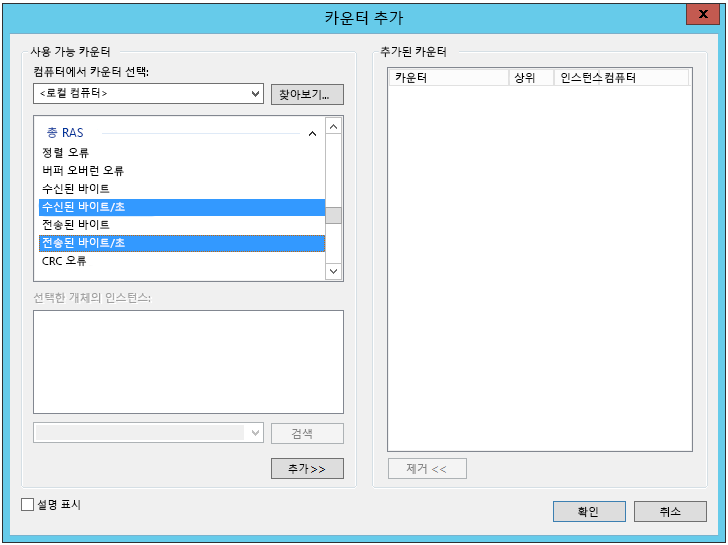
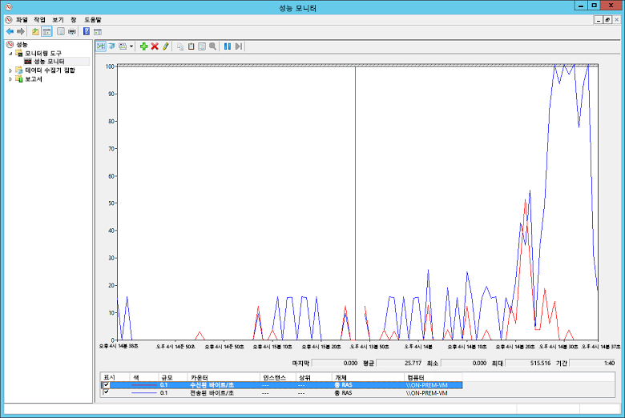

# <a name="troubleshoot-a-hybrid-vpn-connection"></a>하이브리드 VPN 컬렉션 문제 해결

이 문서에서는 온-프레미스 네트워크와 Azure 간의 VPN 게이트웨이 연결 문제를 해결하는 몇 가지 팁을 제공합니다. 일반적인 VPN 관련 오류를 해결하려면 [일반적인 VPN 관련 오류 해결][troubleshooting-vpn-errors]을 참조하세요.

## <a name="verify-the-vpn-appliance-is-functioning-correctly"></a>VPN 어플라이언스가 올바르게 작동하는지 확인

온-프레미스 VPN 어플라이언스가 올바르게 작동하고 있는지 확인할 때 다음과 같은 권장 사항이 유용합니다.

**VPN 어플라이언스에 의해 생성된 로그 파일에 오류나 장애가 있는지 확인합니다.** 이렇게 하면 VPN 어플라이언스가 올바르게 작동하고 있는지 판단하는 데 도움이 됩니다. 이 정보가 저장된 위치는 사용 중인 어플라이언스에 따라 다릅니다. 예를 들어 Windows Server 2012에서 RRAS를 사용하는 경우에는 다음 PowerShell 명령을 사용하여 RRAS 서비스의 오류 이벤트 정보를 표시할 수 있습니다.

```PowerShell
Get-EventLog -LogName System -EntryType Error -Source RemoteAccess | Format-List -Property *
```

각 항목의 *Message* 속성은 오류에 대한 설명을 제공합니다. 몇 가지 일반적인 예는 다음과 같습니다.

- RRAS VPN 네트워크 인터페이스 구성에서 Azure VPN 게이트웨이에 지정된 IP 주소가 잘못되어 연결할 수 없습니다.

  ```console
  EventID            : 20111
  MachineName        : on-premises-vm
  Data               : {41, 3, 0, 0}
  Index              : 14231
  Category           : (0)
  CategoryNumber     : 0
  EntryType          : Error
  Message            : RoutingDomainID- {00000000-0000-0000-0000-000000000000}: A demand dial connection to the remote
                          interface AzureGateway on port VPN2-4 was successfully initiated but failed to complete
                          successfully because of the  following error: The network connection between your computer and
                          the VPN server could not be established because the remote server is not responding. This could
                          be because one of the network devices (for example, firewalls, NAT, routers, and so on) between your computer
                          and the remote server is not configured to allow VPN connections. Please contact your
                          Administrator or your service provider to determine which device may be causing the problem.
  Source             : RemoteAccess
  ReplacementStrings : {{00000000-0000-0000-0000-000000000000}, AzureGateway, VPN2-4, The network connection between
                          your computer and the VPN server could not be established because the remote server is not
                          responding. This could be because one of the network devices (for example, firewalls, NAT, routers, and so on)
                          between your computer and the remote server is not configured to allow VPN connections. Please
                          contact your Administrator or your service provider to determine which device may be causing the
                          problem.}
  InstanceId         : 20111
  TimeGenerated      : 3/18/2016 1:26:02 PM
  TimeWritten        : 3/18/2016 1:26:02 PM
  UserName           :
  Site               :
  Container          :
  ```

- RRAS VPN 네트워크 인터페이스 구성에서 잘못된 공유 키가 지정되었습니다.

  ```console
  EventID            : 20111
  MachineName        : on-premises-vm
  Data               : {233, 53, 0, 0}
  Index              : 14245
  Category           : (0)
  CategoryNumber     : 0
  EntryType          : Error
  Message            : RoutingDomainID- {00000000-0000-0000-0000-000000000000}: A demand dial connection to the remote
                          interface AzureGateway on port VPN2-4 was successfully initiated but failed to complete
                          successfully because of the  following error: Internet key exchange (IKE) authentication credentials are unacceptable.

  Source             : RemoteAccess
  ReplacementStrings : {{00000000-0000-0000-0000-000000000000}, AzureGateway, VPN2-4, IKE authentication credentials are
                          unacceptable.
                          }
  InstanceId         : 20111
  TimeGenerated      : 3/18/2016 1:34:22 PM
  TimeWritten        : 3/18/2016 1:34:22 PM
  UserName           :
  Site               :
  Container          :
  ```

다음 PowerShell 명령을 사용하여 RRAS 서비스를 통해 연결하려는 시도에 대한 이벤트 로그 정보를 얻을 수 있습니다.

```powershell
Get-EventLog -LogName Application -Source RasClient | Format-List -Property *
```

연결 장애가 발생하면 이 로그에 다음과 비슷한 오류가 포함됩니다.

```console
EventID            : 20227
MachineName        : on-premises-vm
Data               : {}
Index              : 4203
Category           : (0)
CategoryNumber     : 0
EntryType          : Error
Message            : CoId={B4000371-A67F-452F-AA4C-3125AA9CFC78}: The user SYSTEM dialed a connection named
                        AzureGateway that has failed. The error code returned on failure is 809.
Source             : RasClient
ReplacementStrings : {{B4000371-A67F-452F-AA4C-3125AA9CFC78}, SYSTEM, AzureGateway, 809}
InstanceId         : 20227
TimeGenerated      : 3/18/2016 1:29:21 PM
TimeWritten        : 3/18/2016 1:29:21 PM
UserName           :
Site               :
Container          :
```

## <a name="verify-connectivity"></a>연결 확인

**VPN 게이트웨이의 연결 및 라우팅을 확인합니다.** VPN 어플라이언스가 Azure VPN 게이트웨이를 통해 트래픽을 올바르게 라우팅하지 않고 있을 수 있습니다. [PsPing][psping]과 같은 도구를 사용하여 VPN 게이트웨이의 연결 및 라우팅을 확인합니다. 예를 들어 온-프레미스 머신에서 VNet에 위치한 웹 서버로의 연결을 테스트하려면 다음 명령을 실행합니다(`<<web-server-address>>`를 웹 서버의 주소로 대체합니다).

```console
PsPing -t <<web-server-address>>:80
```

온-프레미스 머신이 웹 서버로 트래픽을 올바르게 라우팅하고 있다면 다음과 같은 출력이 표시됩니다.

```console
D:\PSTools>psping -t 10.20.0.5:80

PsPing v2.01 - PsPing - ping, latency, bandwidth measurement utility
Copyright (C) 2012-2014 Mark Russinovich
Sysinternals - www.sysinternals.com

TCP connect to 10.20.0.5:80:
Infinite iterations (warmup 1) connecting test:
Connecting to 10.20.0.5:80 (warmup): 6.21ms
Connecting to 10.20.0.5:80: 3.79ms
Connecting to 10.20.0.5:80: 3.44ms
Connecting to 10.20.0.5:80: 4.81ms

    Sent = 3, Received = 3, Lost = 0 (0% loss),
    Minimum = 3.44ms, Maximum = 4.81ms, Average = 4.01ms
```

온-프레미스 머신이 해당 목적지와 올바르게 통신하지 못하고 있다면 다음과 같은 메시지가 표시됩니다.

```console
D:\PSTools>psping -t 10.20.1.6:80

PsPing v2.01 - PsPing - ping, latency, bandwidth measurement utility
Copyright (C) 2012-2014 Mark Russinovich
Sysinternals - www.sysinternals.com

TCP connect to 10.20.1.6:80:
Infinite iterations (warmup 1) connecting test:
Connecting to 10.20.1.6:80 (warmup): This operation returned because the timeout period expired.
Connecting to 10.20.1.6:80: This operation returned because the timeout period expired.
Connecting to 10.20.1.6:80: This operation returned because the timeout period expired.
Connecting to 10.20.1.6:80: This operation returned because the timeout period expired.
Connecting to 10.20.1.6:80:
    Sent = 3, Received = 0, Lost = 3 (100% loss),
    Minimum = 0.00ms, Maximum = 0.00ms, Average = 0.00ms
```

**온-프레미스 방화벽이 VPN 트래픽이 통과할 수 있도록 허용하고 있으며 올바른 포트가 열려 있는지 확인합니다.**

**온-프레미스 VPN 어플라이언스가 Azure VPN 게이트웨이와 호환되는 암호화 방법을 사용하고 있는지 확인합니다.** 정책 기반 라우팅의 경우 Azure VPN 게이트웨이는 AES256, AES128 및 3DES 암호화 알고리즘을 지원합니다. 경로 기반 게이트웨이의 경우 AES256 및 3DES를 지원합니다. 자세한 내용은 [사이트 간 VPN Gateway 연결에 대한 VPN 디바이스 및 IPsec/IKE 매개 변수 정보][vpn-appliance]를 참조하세요.

## <a name="check-for-problems-with-the-azure-vpn-gateway"></a>Azure VPN 게이트웨이 문제 확인

Azure VPN 게이트웨이에 문제가 있는지 판단할 때 다음과 같은 권장 사항이 유용합니다.

**Azure VPN 게이트웨이 진단 로그에 잠재적인 문제가 없는지 검사합니다.** [단계별 과정: Azure Resource Manager VNET 게이트웨이 진단 로그 캡처][gateway-diagnostic-logs]를 참조하세요.

**Azure VPN 게이트웨이와 온-프레미스 VPN 어플라이언스가 동일한 공유 인증 키로 구성되어 있는지 확인합니다.** 다음 Azure CLI 명령을 사용하여 Azure VPN 게이트웨이에 저장된 공유 키를 확인할 수 있습니다.

```azurecli
azure network vpn-connection shared-key show <<resource-group>> <<vpn-connection-name>>
```

사용 중인 온-프레미스 VPN 어플라이언스에 적합한 명령을 사용하여 해당 어플라이언스에 구성된 공유 키를 표시합니다.

Azure VPN 게이트웨이가 속한 *GatewaySubnet* 서브넷이 NSG에 연결되어 있지 않은지 확인합니다.

다음 Azure CLI 명령을 사용하여 서브넷 정보를 확인할 수 있습니다.

```azurecli
azure network vnet subnet show -g <<resource-group>> -e <<vnet-name>> -n GatewaySubnet
```

*네트워크 보안 그룹 ID*라는 이름의 데이터 필드가 없어야 합니다. 다음은 NSG가 할당된 *GatewaySubnet* 의 인스턴스의 결과입니다(*VPN-Gateway-Group*). 이렇게 구성되어 있으면 이 NSG에 대해 규칙이 정의되어 있는 경우 게이트웨이가 올바르게 작동하지 않을 수 있습니다.

```console
C:\>azure network vnet subnet show -g profx-prod-rg -e profx-vnet -n GatewaySubnet
    info:    Executing command network vnet subnet show
    + Looking up virtual network "profx-vnet"
    + Looking up the subnet "GatewaySubnet"
    data:    Id                              : /subscriptions/########-####-####-####-############/resourceGroups/profx-prod-rg/providers/Microsoft.Network/virtualNetworks/profx-vnet/subnets/GatewaySubnet
    data:    Name                            : GatewaySubnet
    data:    Provisioning state              : Succeeded
    data:    Address prefix                  : 10.20.3.0/27
    data:    Network Security Group id       : /subscriptions/########-####-####-####-############/resourceGroups/profx-prod-rg/providers/Microsoft.Network/networkSecurityGroups/VPN-Gateway-Group
    info:    network vnet subnet show command OK
```

**Azure VNet의 가상 머신이 VNet 외부로부터 수신되는 트래픽을 허용되도록 구성되어 있는지 확인합니다.** 이러한 가상 머신이 속한 서브넷에 연결된 NSG 규칙이 있는지 확인합니다. 다음 Azure CLI 명령을 사용하여 모든 NSG 규칙을 확인할 수 있습니다.

```azurecli
azure network nsg show -g <<resource-group>> -n <<nsg-name>>
```

**Azure VPN 게이트웨이가 연결되어 있는지 확인합니다.** 다음 Azure PowerShell 명령을 사용하여 Azure VPN 연결의 현재 상태를 확인할 수 있습니다. `<<connection-name>>` 매개 변수는 가상 네트워크 게이트웨이와 로컬 게이트웨이를 연결하는 Azure VPN 연결의 이름입니다.

```powershell
Get-AzureRmVirtualNetworkGatewayConnection -Name <<connection-name>> - ResourceGroupName <<resource-group>>
```

다음 스니펫에서는 게이트웨이가 연결되어 있는 경우(첫 번째 예제)와 연결이 해제된 경우(두 번째 예제)에 생성되는 출력을 보여줍니다.

```powershell
PS C:\> Get-AzureRmVirtualNetworkGatewayConnection -Name profx-gateway-connection -ResourceGroupName profx-prod-rg

AuthorizationKey           :
VirtualNetworkGateway1     : Microsoft.Azure.Commands.Network.Models.PSVirtualNetworkGateway
VirtualNetworkGateway2     :
LocalNetworkGateway2       : Microsoft.Azure.Commands.Network.Models.PSLocalNetworkGateway
Peer                       :
ConnectionType             : IPsec
RoutingWeight              : 0
SharedKey                  : ####################################
ConnectionStatus           : Connected
EgressBytesTransferred     : 55254803
IngressBytesTransferred    : 32227221
ProvisioningState          : Succeeded
...
```

```powershell
PS C:\> Get-AzureRmVirtualNetworkGatewayConnection -Name profx-gateway-connection2 -ResourceGroupName profx-prod-rg

AuthorizationKey           :
VirtualNetworkGateway1     : Microsoft.Azure.Commands.Network.Models.PSVirtualNetworkGateway
VirtualNetworkGateway2     :
LocalNetworkGateway2       : Microsoft.Azure.Commands.Network.Models.PSLocalNetworkGateway
Peer                       :
ConnectionType             : IPsec
RoutingWeight              : 0
SharedKey                  : ####################################
ConnectionStatus           : NotConnected
EgressBytesTransferred     : 0
IngressBytesTransferred    : 0
ProvisioningState          : Succeeded
...
```

## <a name="miscellaneous-issues"></a>기타 문제

호스트 VM 구성, 네트워크 대역폭 사용 현황 또는 애플리케이션 성능에 문제가 있는지 판단할 때 다음과 같은 권장 사항이 유용합니다.

**방화벽 구성 확인.** 서브넷에 속한 Azure VM에서 실행 중인 게스트 운영 체제의 방화벽이 온-프레미스 IP 범위로부터 수신되는 허용된 트래픽을 허용하도록 올바르게 구성되어 있는지 확인합니다.

**트래픽의 양이 Azure VPN 게이트웨이에서 사용할 수 있는 대역폭의 제한에 가깝지 않은지 확인합니다.** 이것을 확인하는 방법은 온-프레미스에서 실행 중인 VPN 어플라이언스에 따라 달라집니다. 예를 들어 Windows Server 2012에서 RRAS를 사용하고 있는 경우 Performance Monitor를 사용하여 VPN 연결을 통해 송수신되고 있는 데이터의 양을 추적할 수 있습니다. *RAS 총계* 개체를 사용하여 *수신된 바이트/초* 카운터와 *송신된 바이트/초* 카운터를 선택합니다.



결과를 VPN 게이트웨이에 제공되는 대역폭(100Mbps의 기본 SKU부터 1.25Gbps의 VpnGw3 SKU까지)과 비교합니다.



**애플리케이션 부하에 맞는 올바른 VM 개수와 크기를 배포했는지 확인합니다.** Azure VNet의 가상 머신 중 느리게 실행되고 있는 VM은 없는지 확인합니다. 느리게 실행되고 있는 VM이 있다면 과부하되었거나 부하를 처리할 VM이 너무 적거나 부하 분산 장치가 올바르게 구성되어 있지 않은 것일 수 있습니다. 원인을 알아내려면 [진단 정보를 캡처 및 분석][azure-vm-diagnostics]합니다. 결과는 Azure Portal을 사용하여 검사할 수 있으며, 그 밖에도 다양한 타사 도구를 사용하여 성능 데이터를 자세히 검사할 수 있습니다.

**애플리케이션이 클라우드 리소스를 효율적으로 사용하고 있는지 확인합니다.** 각 VM에서 실행 중인 애플리케이션 코드를 이용하여 각 애플리케이션에서 리소스를 최대한 효율적으로 사용하고 있는지 확인합니다. [Application Insights][application-insights]와 같은 도구를 사용할 수 있습니다.

<!-- links -->

[application-insights]: /azure/application-insights/app-insights-overview-usage
[azure-vm-diagnostics]: https://azure.microsoft.com/blog/windows-azure-virtual-machine-monitoring-with-wad-extension/
[gateway-diagnostic-logs]: https://blogs.technet.microsoft.com/keithmayer/2016/10/12/step-by-step-capturing-azure-resource-manager-arm-vnet-gateway-diagnostic-logs/
[psping]: https://technet.microsoft.com/sysinternals/jj729731.aspx
[troubleshooting-vpn-errors]: https://blogs.technet.microsoft.com/rrasblog/2009/08/12/troubleshooting-common-vpn-related-errors/
[vpn-appliance]: /azure/vpn-gateway/vpn-gateway-about-vpn-devices
