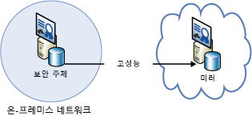
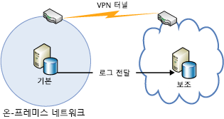

[!INCLUDE [header](../_includes/header.md)]
# Azure 복원 기술 지침: 온프레미스에서 Azure로 복구
Azure는 고가용성 및 재해 복구 목적으로 온프레미스 데이터센터를 Azure로 확장하는 것을 가능케 하는 종합적 서비스 모음을 제공합니다.

* **네트워킹**: 가상 개인 네트워크를 사용하면 온프레미스 네트워크를 클라우드로 안전하게 확장할 수 있습니다.
* **컴퓨팅**: Hyper-V 온프레미스를 사용하는 고객들은 기존 가상 컴퓨터(VM)을 Azure로 이동/전환할 수 있습니다.
* **저장소**: StorSimple은 여러분의 파일 시스템을 Azure Storage로 연장할 수 있습니다. Azure Backup 서비스는 파일과 SQL 데이터베이스를 Azure Storage에 백업하는 것을 지원합니다.
* **데이터베이스 복제**: SQL Server 2014(이후 버전) 가용성 그룹을 사용하여 온프레미스 데이터에 대한 고가용성 및 재해 복구 방안을 구현할 수 있습니다.

## 네트워킹
Azure 가상 네트워크를 사용하여 Azure에 논리적으로 분리된 섹션을 만들고, IPsec 연결을 사용하여 이를 온프레미스 데이터센터 또는 단일 클라이언트 컴퓨터에 안전하게 연결할 수 있습니다. 가상 네트워크를 통해서 Azure의 확장 가능한 온디맨드 인프라를 활용할 수 있고 아울러 Windows Server, 메인프레임 및 UNIX에서 실행되는 시스템을 포함하여 온프레미스 데이터 및 응용 프로그램에 연결할 수 있습니다. 자세한 내용은 [Azure 네트워킹 설명서](/azure/virtual-network/virtual-networks-overview/)를 참조하십시오.

## 컴퓨팅
Hyper-V 온프레미스를 사용하고 있을 경우, VM을 변경하거나 VM 형식을 변환하지 않고서도 기존 가상 컴퓨터를 Azure 및 Windows Server 2012 이후 버전을 실행하는 서비스 제공자로 이동/전환할 수 있습니다. 자세한 내용은 [Azure 가상 컴퓨터를 위한 디스크 및 VHD 정보](/azure/virtual-machines/virtual-machines-linux-about-disks-vhds/?toc=%2fazure%2fvirtual-machines%2flinux%2ftoc.json)를 참조하십시오.

## Azure Site Recovery
서비스형 재해 복구(disaster recovery as a service, DRaaS)를 원할 경우 Azure는 [Azure Site Recovery](https://azure.microsoft.com/services/site-recovery/)를 제공합니다 Azure Site Recovery는 VMware, Hyper-V 및 물리적 서버를 위한 종합적 보호 방안입니다. Azure Site Recovery를 이용하면 다른 온프레미스 서버나 Azure를 복구 사이트로 사용할 수 있습니다. Azure Site Recovery에 관한 자세한 내용은 [Azure Site Recovery 설명서](https://azure.microsoft.com/documentation/services/site-recovery/)를 참조하십시오.

## 저장소
Azure를 온프레미스 데이터용 백업 사이트로 사용하기 위한 몇 가지 옵션이 있습니다.

### StorSimple
StorSimple은 온프레미스 응용 프로그램들을 위해 클라우드 저장소를 안전하고 투명하게 통합합니다. 또한 고성능 계층형 로컬 저장소 및 클라우드 저장소, 라이브 보관, 클라우드 기반 데이터 보호 및 재해 복구를 지원하는 단일 어플라이언스를 제공합니다. 자세한 내용은 [StorSimple 제품 페이지](https://azure.microsoft.com/services/storsimple/)를 참조하십시오.

### Azure Backup
Azure Backup은 Windows Server 2012 이상, Windows Server 2012 Essentials 이상, System Center 2012 Data Protection Manager 이상 버전에 있는 친숙한 백업 도구를 사용하여 클라우드 백업을 지원합니다. 이들 도구는 로컬 디스크 또는 Azure Storage에 관계 없이 백업 저장 위치와는 독립적인 백업 관리 워크플로를 제공합니다. 데이터를 클라우드에 백업하고 나면, 공인된 사용자들은 원하는 서버에 백업을 쉽게 복구할 수 있습니다.

증분 백업을 통해서 파일의 변경 내용만 클라우드로 전송됩니다. 따라서 저장소 공간을 효율적으로 사용하고, 대역폭 소비를 줄이고, 여러 데이터 버전을 지정 시간에 복구하는 것을 지원합니다. 또한 데이터 보존 정책, 데이터 압축 및 데이터 전송 제한 등 추가적인 기능을 선택할 수도 있습니다. Azure를 백업 위치로 사용하면 백업이 자동으로 "오프사이트"로 지정되는 분명한 이점이 있습니다. 그러면 온사이트 백업 미디어를 확보하여 보호해야 하는 추가적 요구 사항이 없어집니다.

자세한 내용은 [Azure Backup이 무엇입니까?](/azure/backup/backup-introduction-to-azure-backup/) 및 [DPM 데이터용 Azure Backup 구성](https://technet.microsoft.com/library/jj728752.aspx)을 참조하십시오.

## 데이터베이스
AlwaysOn 가용성 그룹, 데이터베이스 미러링, 로그 전달, Azure Blob 저장소를 이용한 백업 및 복원을 사용하여 하이브리드 IT 환경에서 SQL Server 데이터베이스를 위한 재해 복구 솔루션을 보유할 수 있습니다. 이들 솔루션은 모두 Azure 가상 컴퓨터에서 실행되는 SQL Server를 이용합니다.

AlwaysOn 가용성 그룹은, 데이터베이스 복제본이 온프레미스 및 클라우드에 모두 있는 하이브리드 IT 환경에서 사용할 수 있습니다. 그 내용이 다음 다이어그램에 표시되어 있습니다.

데이터베이스 미러링도 온프레미스 서버와 인증서 기반 설정의 클라우드를 포함할 수 있습니다. 다음 다이어그램에서는 그 개념을 보여주고 있습니다.

로그 전달은 온프레미스 데이터베이스를 Azure 가상 컴퓨터에 있는 SQL Server 데이터베이스와 동기화하는 데 사용할 수 있습니다.

마지막으로 온프레미스 데이터베이스를 Azure Blob 저장소에 직접 백업할 수 있습니다.

자세한 내용은 [Azure 가상 컴퓨터의 SQL Server를 위한 고가용성 및 재해 복구](/azure/virtual-machines/windows/sql/virtual-machines-windows-sql-high-availability-dr/) 및 [Azure 가상 컴퓨터의 SQL Server를 위한 백업 및 복원](/azure/virtual-machines/windows/sql/virtual-machines-windows-sql-backup-recovery/)을 참조하십시오.

## Microsoft Azure의 온프레미스 복구를 위한 체크리스트
### 네트워킹
1. 이 문서의 네트워킹 섹션을 검토합니다.
2. 온프레미스를 클라우드에 안전하게 연결하기 위해 가상 네트워크를 사용합니다.

### 컴퓨팅
1. 이 문서의 컴퓨팅 섹션을 검토합니다.
2. VM을 Hyper-V와 Azure 사이에 재배치합니다.

### 저장소
1. 이 문서의 저장소 섹션을 검토합니다.
2. 클라우드 저장소 사용을 위해 StorSimple 서비스를 활용합니다.
3. Azure Backup 서비스를 이용합니다.

### 데이터베이스
1. 이 문서의 데이터베이스 섹션을 검토합니다.
2. Azure VM의 SQL Server를 백업으로 사용하는 것을 고려합니다.
3. AlwaysOn 가용성 그룹을 설정합니다.
4. 인증서 기반 데이터베이스 미러링을 구성합니다.
5. 로그 전달을 사용합니다.
6. 온프레미스 데이터베이스를 Azure Blob 저장소에 백업합니다.

