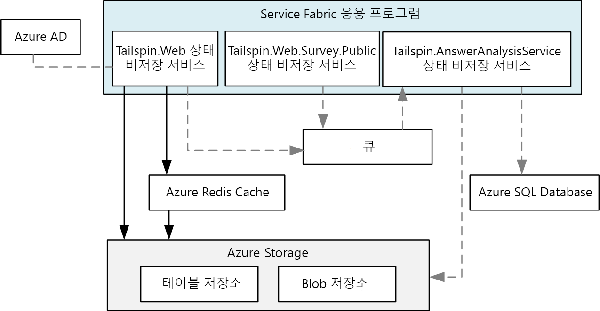
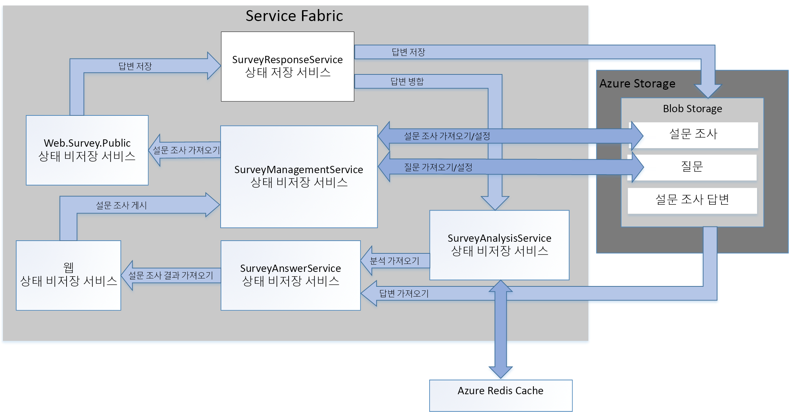

# <a name="refactor-an-azure-service-fabric-application-migrated-from-azure-cloud-services"></a>Azure Cloud Services에서 마이그레이션된 Azure Service Fabric 응용 프로그램 리팩터링

[ 샘플 코드][sample-code]

이 문서에서는 기존 Azure Service Fabric 응용 프로그램을 더 세부적인 아키텍처로 리팩터링하는 방법에 대해 설명합니다. 이 문서에서는 리팩터링된 Service Fabric 응용 프로그램의 디자인, 패키징, 성능 및 배포 고려 사항에 중점을 둡니다.

## <a name="scenario"></a>시나리오

이전의 [Azure Service Fabric으로 Azure Cloud Services 응용 프로그램 마이그레이션][migrate-from-cloud-services] 문서에서 설명한 대로, 패턴 및 실습 팀은 2012년 Azure에서 Cloud Services 응용 프로그램을 설계하고 구현하는 프로세스를 문서화한 한 권의 책을 저술했습니다. 이 책에서는 **설문 조사**라는 Cloud Services 응용 프로그램을 만들려는 Tailspin이라는 가상의 회사에 대해 설명합니다. 설문 조사 응용 프로그램을 사용하면 일반 사람들이 답변할 수 있는 설문 조사를 만들고 게시할 수 있습니다. 다음 다이어그램에서는 이 버전의 설문 조사 응용 프로그램의 아키텍처를 보여 줍니다.


**Tailspin.Web** 웹 역할은 Tailspin 고객이 다음 작업을 수행하는 데 사용하는 ASP.NET MVC 웹 사이트를 호스팅합니다.
* 설문 조사 응용 프로그램에 등록
* 단일 설문 조사 만들기 또는 삭제
* 단일 설문 조사 결과 보기
* 설문 조사 결과를 SQL로 내보내도록 요청
* 집계된 설문 조사 결과 및 분석 보기

또한 **Tailspin.Web.Survey.Public** 웹 역할은 일반 사람이 설문 조사를 작성하기 위해 방문하는 ASP.NET MVC 사이트를 호스팅합니다. 이러한 응답은 큐에 배치되어 저장됩니다.

**Tailspin.Workers.Survey** 작업자 역할은 여러 큐에서 요청을 선택하여 백그라운드 처리를 수행합니다.

패턴 & 실습 팀은 이 응용 프로그램을 Azure Service Fabric으로 이식하기 위한 새 프로젝트를 만들었습니다. 이 프로젝트의 목표는 Azure Service Fabric 클러스터에서 실행되는 응용 프로그램을 가져오는 데 필요한 코드만 변경하는 것이었습니다. 결과적으로 원래의 웹 및 작업자 역할은 더 세부적인 아키텍처로 분해되지 않았습니다. 결과 아키텍처는 Cloud Services 버전의 응용 프로그램과 매우 비슷합니다.



**Tailspin.Web** 서비스는 원래의 *Tailspin.Web* 웹 역할에서 이식되었습니다.

**Tailspin.Web.Survey.Public** 서비스는 원래의 *Tailspin.Web.Survey.Public* 웹 역할에서 이식되었습니다.

**Tailspin.AnswerAnalysisService** 서비스는 원래의 *Tailspin.Workers.Survey* 작업자 역할에서 이식되었습니다.

> [!NOTE] 
> 코드는 웹 및 작업자 역할별로 최소한으로 변경되었지만, **Tailspin.Web** 및 **Tailspin.Web.Survey.Public**은 [Kestrel] 웹 서버를 자체 호스팅하도록 수정되었습니다. 이전의 설문 조사 응용 프로그램은 IIS(인터넷 정보 서비스)를 사용하여 호스팅된 ASP.NET 응용 프로그램이지만, Service Fabric에서 IIS를 서비스로 실행할 수 없습니다. 따라서 모든 웹 서버는 [Kestrel]과 같이 자체 호스팅될 수 있어야 합니다. Service Fabric의 컨테이너에서 IIS를 실행할 수 있는 경우도 있습니다. 자세한 내용은 [컨테이너 사용 시나리오][container-scenarios]를 참조하세요.  

이제 Tailspin은 설문 조사 응용 프로그램을 더 세부적인 아키텍처로 리팩터링합니다. 리팩터링에 대한 Tailspin의 동기 부여는 설문 조사 응용 프로그램을 더 쉽게 개발, 빌드 및 배포할 수 있도록 하는 것입니다. Tailspin은 기존 웹 및 작업자 역할을 더 세부적인 아키텍처로 분해하여 이러한 역할 간에 밀접하게 결합된 기존의 통신 및 데이터 종속성을 제거하려고 합니다.

Tailspin에서 설문 조사 응용 프로그램을 더 세부적인 아키텍처로 전환하는 데 있어 확인되는 다른 이점은 다음과 같습니다.
* 각 서비스는 소규모 팀에서 관리할 수 있을 만큼 작은 범위의 독립적인 프로젝트로 패키지할 수 있습니다.
* 각 서비스는 독립적으로 버전을 지정하고 배포할 수 있습니다.
* 각 서비스는 해당 서비스에 가장 적합한 기술을 사용하여 구현할 수 있습니다. 예를 들어 Service Fabric 클러스터에는 .Net Frameworks, Java 또는 다른 언어(예: C 또는 C++)의 다양한 버전을 사용하여 빌드된 서비스가 포함될 수 있습니다.
* 각 서비스의 크기는 부하의 증감에 반응하도록 독립적으로 조정할 수 있습니다.

> [!NOTE] 
> 다중 테넌트는 이 응용 프로그램의 리팩터링에 대한 범위를 벗어납니다. Tailspin은 다중 테넌트를 지원하는 몇 가지 옵션을 가지고 있으며, 나중에 초기 디자인에 영향을 주지 않고 이러한 디자인 결정을 내릴 수 있습니다. 예를 들어 Tailspin은 클러스터 내의 각 테넌트에 대한 서비스의 개별 인스턴스를 만들거나 각 테넌트마다 별도의 클러스터를 만들 수 있습니다.

## <a name="design-considerations"></a>디자인 고려 사항
 
다음 다이어그램에서는 더 세부적인 아키텍처로 리팩터링된 설문 조사 응용 프로그램의 아키텍처를 보여 줍니다.



**Tailspin.Web**은 Tailspin 고객이 설문 조사를 만들고 설문 조사 결과를 보기 위해 방문하는 ASP.NET MVC 응용 프로그램을 자체 호스팅하는 상태 비저장 서비스입니다. 이 서비스는 대부분의 코드를 이식된 Service Fabric 응용 프로그램의 *Tailspin.Web* 서비스와 공유합니다. 앞에서 언급했듯이, 이 서비스는 ASP.NET Core 및 웹 프런트 엔드로 Kestrel을 사용하여 WebListener를 구현하는 스위치를 사용합니다.

**Tailspin.Web.Survey.Public**은 ASP.NET MVC 사이트를 자체 호스팅하는 상태 비저장 서비스입니다. 사용자는 이 사이트를 방문하여 목록에서 설문 조사를 선택한 다음, 작성합니다. 이 서비스는 대부분의 코드를 이식된 Service Fabric 응용 프로그램의 *Tailspin.Web.Survey.Public* 서비스와 공유합니다. 또한 이 서비스는 ASP.NET Core를 사용하고, Kestrel을 웹 프런트 엔드로 사용하는 방식에서 WebListener를 구현하는 방식으로 전환합니다.

**Tailspin.SurveyResponseService**는 Azure Blob Storage에 설문 조사 응답을 저장하는 상태 저장 서비스입니다. 또한 응답을 설문 조사 분석 데이터에 병합합니다. 이 서비스는 [ReliableConcurrentQueue][reliable-concurrent-queue]를 사용하여 설문 조사 응답을 일괄적으로 처리하므로 상태 저장 서비스로 구현됩니다. 이 기능은 원래 이식된 Service Fabric 응용 프로그램의 *Tailspin.AnswerAnalysisService* 서비스에서 구현되었습니다.

**Tailspin.SurveyManagementService**는 설문 조사 및 설문 조사 질문을 저장하고 검색하는 상태 비저장 서비스입니다. 이 서비스는 Azure Blob Storage를 사용합니다. 이 기능도 원래 이식된 Service Fabric 응용 프로그램의 *Tailspin.Web* 및 *Tailspin.Web.Survey.Public* 서비스의 데이터 액세스 구성 요소에서 구현되었습니다. Tailspin은 원래의 기능을 이 서비스로 리팩터링하여 크기를 독립적으로 조정할 수 있도록 했습니다.

**Tailspin.SurveyAnswerService**는 설문 조사 응답 및 설문 조사 분석을 검색하는 상태 비저장 서비스입니다. 이 서비스도 Azure Blob Storage를 사용합니다. 이 기능도 원래 이식된 Service Fabric 응용 프로그램의 *Tailspin.Web* 서비스의 데이터 액세스 구성 요소에서 구현되었습니다. Tailspin은 부하를 줄이고 더 적은 수의 인스턴스를 사용하여 리소스를 절약할 필요가 있어 원래의 기능을 이 서비스로 리팩터링했습니다.

**Tailspin.SurveyAnalysisService**는 설문 조사 응답 요약 데이터를 빠르게 검색할 수 있도록 이 데이터를 Redis 캐시에 유지하는 상태 비저장 서비스입니다. 이 서비스는 설문 조사에 응답하고 새 설문 조사 응답 데이터를 요약 데이터에 병합할 때마다 *Tailspin.SurveyResponseService*에서 호출됩니다. 이 서비스는 이식된 Service Fabric 응용 프로그램의 *Tailspin.AnswerAnalysisService* 서비스에서 구현된 기능을 포함합니다.

## <a name="stateless-versus-stateful-services"></a>상태 저장 및 상태 비저장 서비스

Azure Service Fabric에서 지원하는 프로그래밍 모델은 다음과 같습니다.
* 게스트 실행 파일 모델을 사용하면 모든 실행 파일을 서비스로 패키지하고 Service Fabric 클러스터에 배포할 수 있습니다. Service Fabric은 게스트 실행 파일의 실행을 오케스트레이션하고 관리합니다.
* 컨테이너 모델을 사용하면 서비스를 컨테이너 이미지에 배포할 수 있습니다. Service Fabric은 Windows Server 컨테이너 외에도 Linux 커널에 기반한 컨테이너의 만들기 및 관리를 지원합니다. 
* 신뢰할 수 있는 서비스 프로그래밍 모델을 사용하면 모든 Service Fabric 플랫폼 기능과 통합되는 상태 저장 또는 상태 비저장 서비스를 만들 수 있습니다. 상태 저장 서비스는 복제 상태가 Service Fabric 클러스터에 저장되도록 합니다. 상태 비저장 서비스는 그렇지 않습니다.
* 신뢰할 수 있는 행위자 프로그래밍 모델을 사용하면 가상 행위자 패턴을 구현하는 서비스를 만들 수 있습니다.

설문 조사 응용 프로그램의 모든 서비스는 *Tailspin.SurveyResponseService* 서비스를 제외하고는 신뢰할 수 있는 상태 비저장 서비스입니다. 이 서비스는 설문 조사 응답을 받을 때 이를 처리하기 위해 [ReliableConcurrentQueue][reliable-concurrent-queue]를 구현합니다. ReliableConcurrentQueue의 응답은 Azure Blob Storage에 저장되고, *Tailspin.SurveyAnalysisService*로 전달되어 분석됩니다. Tailspin은 Azure Service Bus와 같은 큐에서 제공하는 엄격한 FIFO(선입 선출) 순서를 요구하지 않으므로 ReliableConcurrentQueue를 선택합니다. 또한 ReliableConcurrentQueue는 큐에 넣기 및 큐에서 제거 작업에 대해 높은 처리량과 짧은 대기 시간을 제공하도록 설계되었습니다.

큐에서 제거된 항목을 ReliableConcurrentQueue에서 유지하는 작업은 원칙적으로 idempotent(멱등원)여야 합니다. 큐에서 항목을 처리하는 중에 예외가 throw되면 동일한 항목이 두 번 이상 처리될 수 있습니다. 설문 조사 응용 프로그램에서 설문 조사 분석 데이터는 분석 데이터에 대한 현재 스냅숏일 뿐이며 일관성이 필요하지 않으므로, 설문 조사 응답을 *Tailspin.SurveyAnalysisService*에 병합하는 작업은 idempotent가 아닙니다. 결국에는 Azure Blob Storage에 저장된 설문 조사 응답이 일관되므로 최종적인 설문 조사 분석은 항상 이 데이터에서 정확하게 다시 계산할 수 있습니다.

## <a name="communication-framework"></a>통신 프레임워크

설문 조사 응용 프로그램의 각 서비스는 RESTful 웹 API를 사용하여 통신합니다. RESTful API는 다음과 같은 이점을 제공합니다.
* 사용 편의성: 각 서비스는 웹 API 만들기를 기본적으로 지원하는 ASP.NET Core MVC를 사용하여 빌드됩니다.
* 보안: 각 서비스는 SSL을 요구하지 않지만, Tailspin은 각 서비스에 대해 이를 요구할 수 있습니다. 
* 버전 관리: 특정 버전의 웹 API에 대해 클라이언트를 작성하고 테스트할 수 있습니다.

설문 조사 응용 프로그램의 서비스는 Service Fabric에서 구현된 [역방향 프록시][reverse-proxy]를 사용합니다. 역방향 프록시는 Service Fabric 클러스터의 각 노드에서 실행되고, 엔드포인트 확인과 자동 다시 시도를 제공하고, 다른 유형의 연결 실패를 처리하는 서비스입니다. 역방향 프록시를 사용하려면 미리 정의된 역방향 프록시 포트를 사용하여 특정 서비스에 대한 각 RESTful API를 호출해야 합니다.  예를 들어 역방향 프록시 포트가 **19081**로 설정된 경우 *Tailspin.SurveyAnswerService*에 대한 호출은 다음과 같이 만들 수 있습니다.

```csharp
static SurveyAnswerService()
{
    httpClient = new HttpClient
    {
        BaseAddress = new Uri("http://localhost:19081/Tailspin/SurveyAnswerService/")
    };
}
```
역방향 프록시를 사용하도록 설정하려면 Service Fabric 클러스터를 만드는 동안 역방향 프록시 포트를 지정합니다. 자세한 내용은 Azure Service Fabric의 [역방향 프록시][reverse-proxy]를 참조하세요.

## <a name="performance-considerations"></a>성능 고려 사항

Tailspin은 Visual Studio 템플릿을 사용하여 *Tailspin.Web* 및 *Tailspin.Web.Surveys.Public*에 대한 ASP.NET Core 서비스를 만들었습니다. 기본적으로 이러한 템플릿에는 콘솔에 대한 로깅이 포함되어 있습니다. 개발 및 디버깅 중에 콘솔에 대한 로깅을 수행할 수 있지만, 응용 프로그램을 프로덕션 환경에 배포할 때는 콘솔에 대한 모든 로깅을 제거해야 합니다.

> [!NOTE]
> 프로덕션 환경에서 실행되는 Service Fabric 응용 프로그램에 대한 모니터링 및 진단을 설정하는 방법에 대한 자세한 내용은 Azure Service Fabric에 대한 [모니터링 및 진단][monitoring-diagnostics]을 참조하세요.

예를 들어 웹 프런트 엔드 서비스 각각에 대한 *startup.cs*에 있는 다음 줄을 주석으로 처리해야 합니다.

```csharp
// This method gets called by the runtime. Use this method to configure the HTTP request pipeline.
public void Configure(IApplicationBuilder app, IHostingEnvironment env, ILoggerFactory loggerFactory)
{
    //loggerFactory.AddConsole(Configuration.GetSection("Logging"));
    //loggerFactory.AddDebug();

    app.UseMvc();
}
```

> [!NOTE]
> 이러한 줄은 게시할 때 Visual Studio가 "릴리스"로 설정된 경우 조건부로 제외될 수 있습니다.

마지막으로 Tailspin에서 Tailspin 응용 프로그램을 프로덕션 환경에 배포하면 Visual Studio가 **릴리스** 모드로 전환됩니다.

## <a name="deployment-considerations"></a>배포 고려 사항

리팩터링된 설문 조사 응용 프로그램은 5개의 상태 비저장 서비스와 1개의 상태 저장 서비스로 구성되므로, 클러스터 계획에서는 올바른 VM 크기 및 노드 수를 결정하도록 제한됩니다. 클러스터를 설명하는 *applicationmanifest.xml* 파일에서 Tailspin은 각 서비스에 대해 *StatelessService* 태그의 *InstanceCount* 특성을 -1로 설정합니다. -1 값은 Service Fabric에서 서비스의 인스턴스를 클러스터의 각 노드에 만들도록 합니다.

> [!NOTE]
> 상태 저장 서비스에는 데이터에 대해 올바른 수의 파티션과 복제본을 계획하는 추가 단계가 필요합니다.

Tailspin은 Azure Portal을 사용하여 클러스터를 배포합니다. Service Fabric 클러스터 리소스 종류는 VM 확장 집합 및 부하 분산 장치를 포함하여 필요한 인프라를 모두 배포합니다. 권장되는 VM 크기는 Service Fabric 클러스터에 대한 프로비전 프로세스 중에 Azure Portal에 표시됩니다. VM은 VM 확장 집합에 배포되므로 사용자 로드가 증가함에 따라 강화되고 확장될 수 있습니다.

> [!NOTE]
> 앞에서 설명한 대로, 마이그레이션된 버전의 설문 조사 응용 프로그램에서 두 웹 프런트 엔드는 ASP.NET Core 및 웹 서버로 Kestrel을 사용하여 자체 호스팅되었습니다. 마이그레이션된 버전의 설문 조사 응용 프로그램은 역방향 프록시를 사용하지 않지만, IIS, Nginx 또는 Apache와 같은 역방향 프록시를 사용하는 것이 좋습니다. 자세한 내용은 [ASP.NET Core에서 Kestrel 웹 서버 구현에 대한 소개][kestrel-intro]를 참조하세요.
> 리팩터링된 설문 조사 응용 프로그램에서 두 웹 프런트 엔드는 [WebListener][weblistener]가 있는 ASP.NET Core를 웹 서버로 사용하여 자체 호스팅되므로 역방향 프록시가 필요하지 않습니다.

## <a name="next-steps"></a>다음 단계

설문 조사 응용 프로그램 코드는 [GitHub][sample-code]에서 사용할 수 있습니다.

[Azure Service Fabric][service-fabric]을 처음 시작하는 경우, 먼저 개발 환경을 설정한 다음, 최신 [Azure SDK][azure-sdk] 및 [Azure Service Fabric SDK][service-fabric-sdk]를 다운로드합니다. SDK에는 OneBox 클러스터 관리자가 포함되어 있으므로 F5 전체 디버깅을 사용하여 설문 조사 응용 프로그램을 로컬로 배포하고 테스트할 수 있습니다.

<!-- links -->
[azure-sdk]: https://azure.microsoft.com/downloads/archive-net-downloads/
[container-scenarios]: /azure/service-fabric/service-fabric-containers-overview
[kestrel]: https://docs.microsoft.com/aspnet/core/fundamentals/servers/kestrel?tabs=aspnetcore2x
[kestrel-intro]: https://docs.microsoft.com/aspnet/core/fundamentals/servers/kestrel?tabs=aspnetcore1x
[migrate-from-cloud-services]: migrate-from-cloud-services.md
[monitoring-diagnostics]: /azure/service-fabric/service-fabric-diagnostics-overview
[reliable-concurrent-queue]: /azure/service-fabric/service-fabric-reliable-services-reliable-concurrent-queue
[reverse-proxy]: /azure/service-fabric/service-fabric-reverseproxy
[sample-code]: https://github.com/mspnp/cloud-services-to-service-fabric/tree/master/servicefabric-phase-2
[service-fabric]: /azure/service-fabric/service-fabric-get-started
[service-fabric-sdk]: /azure/service-fabric/service-fabric-get-started
[weblistener]: https://docs.microsoft.com/aspnet/core/fundamentals/servers/weblistener
